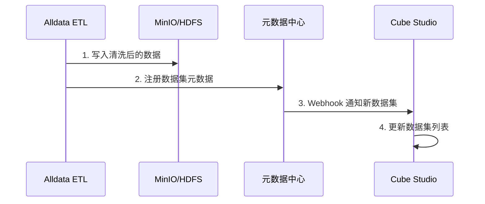
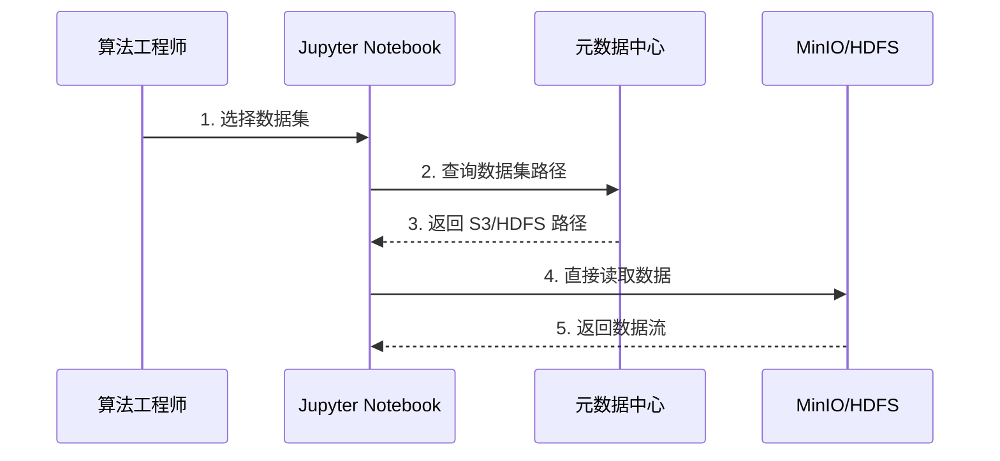

# Alldata 与 Cube Studio 集成方案

## 集成目标

打通**数据底座**与**模型引擎**之间的连接，实现：
- 数据集自动注册
- 训练任务无缝访问数据
- 数据血缘全链路追踪

## 架构图

```
┌──────────────────────────────────────────────────────────────┐
│                         Alldata                              │
│  ┌─────────┐   ┌─────────┐   ┌──────────────┐               │
│  │ 数据源  │──→│  ETL    │──→│  元数据中心   │               │
│  └─────────┘   └─────────┘   └──────┬───────┘               │
│                              │ 注册 Dataset                 │
└──────────────────────────────┼──────────────────────────────┘
                               │ API 调用
                               ↓
┌──────────────────────────────────────────────────────────────┐
│                       Cube Studio                            │
│  ┌──────────────┐   ┌──────────────┐   ┌──────────────┐     │
│  │ 元数据中心   │←──│  训练任务    │←──│   Notebook   │     │
│  │  (同步)      │   │  (挂载数据)  │   │   (开发)     │     │
│  └──────────────┘   └──────┬───────┘   └──────────────┘     │
│                            │ 加载数据                         │
└────────────────────────────┼─────────────────────────────────┘
                             │
                             ↓
                    ┌─────────────────┐
                    │  MinIO / HDFS   │
                    │   共享存储      │
                    └─────────────────┘
```

## 核心流程

### 1. 数据集注册流程



### 2. 训练任务数据加载



## API 规范

### Alldata 侧：数据集注册

```http
POST /api/v1/datasets/register
Content-Type: application/json

{
  "dataset_id": "sales_training_2024_01",
  "name": "销售数据训练集 v1.0",
  "storage_path": "s3://etl-output/sales/2024-01/",
  "format": "parquet",
  "size_bytes": 5368709120,
  "row_count": 10000000,
  "schema": {
    "columns": [
      {"name": "order_id", "type": "bigint"},
      {"name": "amount", "type": "decimal(10,2)"},
      {"name": "created_at", "type": "timestamp"}
    ]
  },
  "tags": ["sales", "cleansed", "training-ready"],
  "metadata": {
    "etl_job_id": "etl_sales_001",
    "completed_at": "2024-01-15T10:30:00Z",
    "data_quality_score": 0.98
  }
}
```

### Cube Studio 侧：数据集查询

```http
GET /api/v1/datasets/{dataset_id}
Accept: application/json

{
  "dataset_id": "sales_training_2024_01",
  "name": "销售数据训练集 v1.0",
  "storage": {
    "protocol": "s3",
    "endpoint": "minio.kubeflow.svc.cluster.local",
    "bucket": "etl-output",
    "path": "sales/2024-01/",
    "access_via": "mount|s3_sdk"
  },
  "schema": {...},
  "mount_command": "mount_dataset.sh sales_training_2024_01 /mnt/data"
}
```

## SDK 使用示例

### Python SDK (Cube Studio)

```python
from cube_sdk import Dataset, TrainingJob

# 获取已注册的数据集
dataset = Dataset.get("sales_training_2024_01")

# 方式1：直接读取（推荐）
df = dataset.read()  # 自动处理 S3 认证和分区

# 方式2：获取挂载路径
mount_path = dataset.mount("/mnt/data")
# /mnt/data 现在包含数据集的所有文件

# 使用数据集进行训练
job = TrainingJob(
    name="sales_forecast_v1",
    dataset_id="sales_training_2024_01",
    model_type="lstm",
    hyperparameters={...}
)
job.submit()
```

## 数据血缘扩展

### 血缘记录格式

```json
{
  "entity_type": "dataset",
  "entity_id": "sales_training_2024_01",
  "lineage": {
    "upstream": {
      "source_tables": [
        "raw_db.orders",
        "raw_db.customers"
      ],
      "etl_jobs": [
        "etl_sales_001"
      ]
    },
    "downstream": {
      "training_jobs": [
        "cube_job_sales_forecast_v1"
      ],
      "models": [
        "sales_forecast_lstm_v1.0"
      ]
    }
  }
}
```

## 配置清单

### Alldata 配置

```yaml
# Alldata 配置文件
cube_studio:
  enabled: true
  api_endpoint: http://cube-studio-api.kubeflow.svc.cluster.local
  api_key: ${CUBE_API_KEY}
  auto_register_datasets: true
  dataset_tags:
    - training-ready
    - cube-sync
```

### Cube Studio 配置

```yaml
# Cube Studio 配置文件
alldata:
  enabled: true
  api_endpoint: http://alldata-api.default.svc.cluster.local
  webhook_secret: ${ALDATA_WEBHOOK_SECRET}
  dataset_sync:
    enabled: true
    sync_interval: 300s
```

## 验证测试

```bash
# 1. 验证数据集注册
curl -X POST http://alldata-api/api/v1/datasets/test-register

# 2. 验证 Cube Studio 能获取数据集
curl http://cube-studio-api/api/v1/datasets

# 3. 验证 Notebook 能读取数据
python -c "
from cube_sdk import Dataset
ds = Dataset.get('test_dataset')
print(ds.read().head())
"
```

## 故障排查

| 问题 | 可能原因 | 解决方案 |
|------|----------|----------|
| 数据集未同步 | Webhook 失败 | 检查网络连通性和 API Key |
| 无法挂载数据 | PVC 权限问题 | 检查 StorageClass 和 RBAC |
| 读取速度慢 | 跨网络传输 | 使用同集群存储或挂载方式 |
