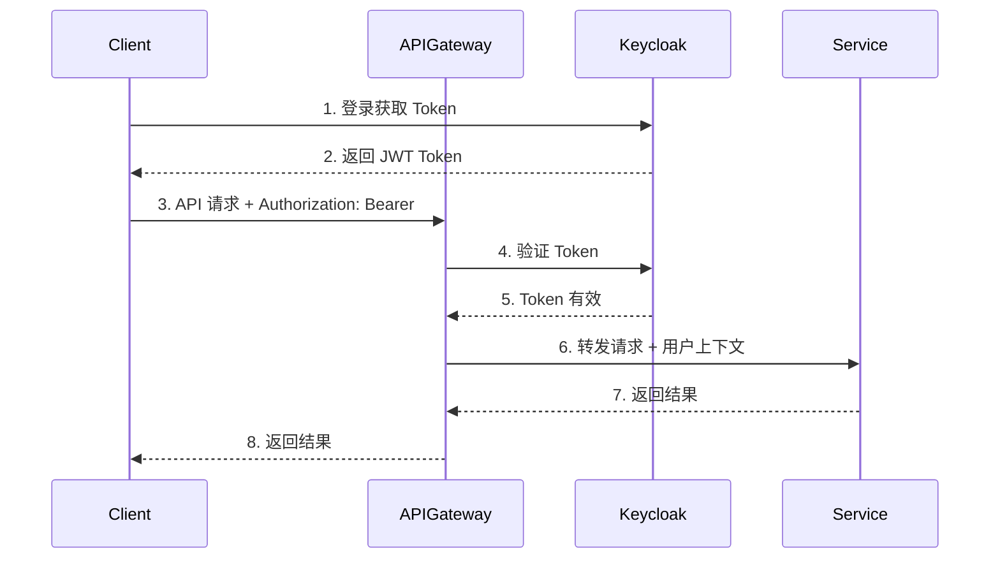

# API 规范设计

本文档定义 ONE-DATA-STUDIO 平台各层之间的 API 接口规范，确保 Data、Model 和 Agent 三个平台能够无缝协作。

---

## API 设计原则

| 原则 | 说明 |
|------|------|
| **RESTful 风格** | 遵循 REST 架构风格，资源导向设计 |
| **版本管理** | 所有 API 通过 `/api/v{version}` 路径进行版本控制 |
| **统一响应格式** | 使用标准的 JSON 响应结构 |
| **错误处理** | 使用标准 HTTP 状态码和错误码 |
| **安全认证** | 所有 API 需要通过统一认证网关 |
| **幂等性** | 写操作保证幂等性 |

---

## 统一响应格式

### 成功响应

```json
{
    "code": 0,
    "message": "success",
    "data": { ... },
    "request_id": "req-123456789",
    "timestamp": "2024-01-23T10:30:00Z"
}
```

### 错误响应

```json
{
    "code": 40001,
    "message": "参数验证失败",
    "details": {
        "field": "dataset_name",
        "reason": "不能为空"
    },
    "request_id": "req-123456789",
    "timestamp": "2024-01-23T10:30:00Z"
}
```

### 标准错误码

| 错误码 | HTTP 状态 | 说明 |
|--------|-----------|------|
| 0 | 200 | 成功 |
| 40001 | 400 | 参数验证失败 |
| 40101 | 401 | 未认证 |
| 40301 | 403 | 无权限 |
| 40401 | 404 | 资源不存在 |
| 40901 | 409 | 资源冲突 |
| 42901 | 429 | 请求过于频繁 |
| 50001 | 500 | 服务器内部错误 |
| 50301 | 503 | 服务不可用 |

---

## 集成点一：Data → Model

### 1.1 数据集注册 API

#### 注册数据集

```http
POST /api/v1/datasets
Content-Type: application/json
Authorization: Bearer {token}
```

**请求体：**

```json
{
    "name": "sales_data_v1.0",
    "description": "销售数据清洗结果",
    "storage_type": "s3",
    "storage_path": "s3://etl-output/sales/2024-01/",
    "format": "parquet",
    "schema": {
        "columns": [
            {"name": "id", "type": "INT64", "description": "记录ID"},
            {"name": "amount", "type": "DECIMAL(10,2)", "description": "金额"},
            {"name": "created_at", "type": "TIMESTAMP", "description": "创建时间"}
        ]
    },
    "statistics": {
        "row_count": 1000000,
        "size_bytes": 52428800
    },
    "tags": ["sales", "cleansed", "2024q1"],
    "metadata": {
        "etl_job_id": "etl-123",
        "source_table": "raw_sales"
    }
}
```

**响应：**

```json
{
    "code": 0,
    "message": "success",
    "data": {
        "dataset_id": "ds-20240123-001",
        "name": "sales_data_v1.0",
        "status": "active",
        "created_at": "2024-01-23T10:30:00Z"
    }
}
```

#### 查询数据集

```http
GET /api/v1/datasets/{dataset_id}
Authorization: Bearer {token}
```

**响应：**

```json
{
    "code": 0,
    "message": "success",
    "data": {
        "dataset_id": "ds-20240123-001",
        "name": "sales_data_v1.0",
        "description": "销售数据清洗结果",
        "storage_type": "s3",
        "storage_path": "s3://etl-output/sales/2024-01/",
        "format": "parquet",
        "schema": { ... },
        "statistics": { ... },
        "tags": ["sales", "cleansed", "2024q1"],
        "status": "active",
        "created_at": "2024-01-23T10:30:00Z",
        "updated_at": "2024-01-23T10:30:00Z"
    }
}
```

#### 列出数据集

```http
GET /api/v1/datasets?tags=sales&status=active&page=1&page_size=20
Authorization: Bearer {token}
```

#### 更新数据集

```http
PUT /api/v1/datasets/{dataset_id}
Content-Type: application/json
Authorization: Bearer {token}
```

#### 删除数据集

```http
DELETE /api/v1/datasets/{dataset_id}
Authorization: Bearer {token}
```

### 1.2 数据集访问凭证 API

#### 获取临时访问凭证

```http
POST /api/v1/datasets/{dataset_id}/credentials
Authorization: Bearer {token}
```

**请求体：**

```json
{
    "purpose": "training",
    "duration_seconds": 3600
}
```

**响应：**

```json
{
    "code": 0,
    "message": "success",
    "data": {
        "access_key": "tmp-access-key",
        "secret_key": "tmp-secret-key",
        "session_token": "tmp-session-token",
        "expires_at": "2024-01-23T11:30:00Z"
    }
}
```

---

## 集成点二：Model → Agent

### 2.1 模型服务 API（OpenAI 兼容）

#### 列出可用模型

```http
GET /v1/models
Authorization: Bearer {api_key}
```

**响应：**

```json
{
    "object": "list",
    "data": [
        {
            "id": "qwen-14b-chat",
            "object": "model",
            "created": 1705992000,
            "owned_by": "model-studio",
            "permission": [],
            "root": "qwen-14b-chat",
            "parent": null
        },
        {
            "id": "llama3-70b-instruct",
            "object": "model",
            "created": 1705992000,
            "owned_by": "model-studio",
            "permission": [],
            "root": "llama3-70b-instruct",
            "parent": null
        }
    ]
}
```

#### 聊天补全 API

```http
POST /v1/chat/completions
Content-Type: application/json
Authorization: Bearer {api_key}
```

**请求体：**

```json
{
    "model": "qwen-14b-chat",
    "messages": [
        {"role": "system", "content": "你是一个智能助手。"},
        {"role": "user", "content": "你好，请介绍一下自己。"}
    ],
    "temperature": 0.7,
    "top_p": 0.9,
    "max_tokens": 2048,
    "stream": false,
    "extra_params": {
        "stop": ["<|endoftext|>"]
    }
}
```

**响应：**

```json
{
    "id": "chatcmpl-123456789",
    "object": "chat.completion",
    "created": 1705992000,
    "model": "qwen-14b-chat",
    "choices": [
        {
            "index": 0,
            "message": {
                "role": "assistant",
                "content": "你好！我是基于 Qwen 模型的智能助手..."
            },
            "finish_reason": "stop"
        }
    ],
    "usage": {
        "prompt_tokens": 20,
        "completion_tokens": 50,
        "total_tokens": 70
    }
}
```

#### 流式聊天补全

```http
POST /v1/chat/completions
Content-Type: application/json
Authorization: Bearer {api_key}
```

**请求体（stream=true）：**

```json
{
    "model": "qwen-14b-chat",
    "messages": [
        {"role": "user", "content": "请写一首关于春天的诗"}
    ],
    "stream": true
}
```

**响应（SSE 流）：**

```
data: {"id":"chatcmpl-123","choices":[{"delta":{"content":"春"}}]}
data: {"id":"chatcmpl-123","choices":[{"delta":{"content":"风"}}]}
...
data: [DONE]
```

#### 文本补全 API

```http
POST /v1/completions
Content-Type: application/json
Authorization: Bearer {api_key}
```

**请求体：**

```json
{
    "model": "qwen-14b-chat",
    "prompt": "人工智能是",
    "max_tokens": 100,
    "temperature": 0.7
}
```

### 2.2 嵌入向量 API

```http
POST /v1/embeddings
Content-Type: application/json
Authorization: Bearer {api_key}
```

**请求体：**

```json
{
    "model": "bge-large-zh",
    "input": ["这是一段测试文本", "这是另一段文本"]
}
```

**响应：**

```json
{
    "object": "list",
    "data": [
        {
            "object": "embedding",
            "embedding": [0.0012, -0.0034, ...],
            "index": 0
        },
        {
            "object": "embedding",
            "embedding": [0.0023, -0.0012, ...],
            "index": 1
        }
    ],
    "model": "bge-large-zh",
    "usage": {
        "prompt_tokens": 20,
        "total_tokens": 20
    }
}
```

### 2.3 模型管理 API

#### 部署模型

```http
POST /api/v1/models/deploy
Content-Type: application/json
Authorization: Bearer {token}
```

**请求体：**

```json
{
    "model_name": "qwen-14b-chat",
    "model_path": "s3://models/qwen-14b/",
    "replicas": 2,
    "resources": {
        "gpu": {"type": "A100", "count": 1},
        "cpu": "4",
        "memory": "16Gi"
    },
    "params": {
        "tensor_parallel_size": 1,
        "max_model_len": 4096
    }
}
```

#### 获取模型状态

```http
GET /api/v1/models/{model_id}/status
Authorization: Bearer {token}
```

**响应：**

```json
{
    "code": 0,
    "message": "success",
    "data": {
        "model_id": "model-123",
        "model_name": "qwen-14b-chat",
        "status": "running",
        "endpoint": "http://model-serving/v1",
        "replicas": {
            "ready": 2,
            "total": 2
        },
        "created_at": "2024-01-23T10:00:00Z"
    }
}
```

---

## 集成点三：Data → Agent

### 3.1 元数据查询 API

#### 获取数据库列表

```http
GET /api/v1/metadata/databases
Authorization: Bearer {token}
```

**响应：**

```json
{
    "code": 0,
    "message": "success",
    "data": {
        "databases": [
            {
                "name": "sales_dw",
                "description": "销售数据仓库",
                "owner": "data_team"
            }
        ]
    }
}
```

#### 获取表列表

```http
GET /api/v1/metadata/databases/{database}/tables
Authorization: Bearer {token}
```

**响应：**

```json
{
    "code": 0,
    "message": "success",
    "data": {
        "tables": [
            {
                "name": "orders",
                "description": "订单表",
                "row_count": 10000000,
                "updated_at": "2024-01-23T09:00:00Z"
            },
            {
                "name": "customers",
                "description": "客户表",
                "row_count": 1000000,
                "updated_at": "2024-01-23T09:00:00Z"
            }
        ]
    }
}
```

#### 获取表详情（含 Schema）

```http
GET /api/v1/metadata/databases/{database}/tables/{table}
Authorization: Bearer {token}
```

**响应：**

```json
{
    "code": 0,
    "message": "success",
    "data": {
        "table_name": "orders",
        "description": "订单表",
        "database": "sales_dw",
        "columns": [
            {
                "name": "id",
                "type": "BIGINT",
                "nullable": false,
                "description": "订单ID",
                "primary_key": true
            },
            {
                "name": "customer_id",
                "type": "BIGINT",
                "nullable": false,
                "description": "客户ID",
                "foreign_key": {"table": "customers", "column": "id"}
            },
            {
                "name": "amount",
                "type": "DECIMAL(10,2)",
                "nullable": false,
                "description": "订单金额（元）"
            },
            {
                "name": "status",
                "type": "VARCHAR(20)",
                "nullable": false,
                "description": "订单状态",
                "enum": ["pending", "paid", "shipped", "completed", "cancelled"]
            },
            {
                "name": "created_at",
                "type": "TIMESTAMP",
                "nullable": false,
                "description": "创建时间"
            }
        ],
        "indexes": [
            {"name": "idx_customer_id", "columns": ["customer_id"]},
            {"name": "idx_created_at", "columns": ["created_at"]}
        ],
        "relations": [
            {
                "type": "many_to_one",
                "from_table": "orders",
                "from_column": "customer_id",
                "to_table": "customers",
                "to_column": "id"
            }
        ],
        "sample_data": [
            {"id": 1, "customer_id": 1001, "amount": 299.99, "status": "paid", "created_at": "2024-01-01T10:00:00Z"}
        ]
    }
}
```

#### 智能表搜索

```http
POST /api/v1/metadata/tables/search
Content-Type: application/json
Authorization: Bearer {token}
```

**请求体：**

```json
{
    "query": "销售订单",
    "limit": 10
}
```

**响应：**

```json
{
    "code": 0,
    "message": "success",
    "data": {
        "results": [
            {
                "table": "orders",
                "database": "sales_dw",
                "relevance_score": 0.95,
                "matched_columns": ["amount", "status"]
            }
        ]
    }
}
```

### 3.2 SQL 执行 API

#### 执行查询

```http
POST /api/v1/query/execute
Content-Type: application/json
Authorization: Bearer {token}
```

**请求体：**

```json
{
    "database": "sales_dw",
    "sql": "SELECT COUNT(*) as total, SUM(amount) as sum FROM orders WHERE created_at >= '2024-01-01'",
    "timeout_seconds": 30
}
```

**响应：**

```json
{
    "code": 0,
    "message": "success",
    "data": {
        "query_id": "query-123",
        "status": "completed",
        "rows": [
            {"total": 50000, "sum": 1250000.00}
        ],
        "columns": ["total", "sum"],
        "row_count": 1,
        "execution_time_ms": 150
    }
}
```

#### 验证 SQL（不执行）

```http
POST /api/v1/query/validate
Content-Type: application/json
Authorization: Bearer {token}
```

**请求体：**

```json
{
    "database": "sales_dw",
    "sql": "SELECT * FROM orders WHERE id = ?"
}
```

**响应：**

```json
{
    "code": 0,
    "message": "success",
    "data": {
        "valid": true,
        "parameters": [{"index": 1, "type": "BIGINT"}],
        "estimated_rows": 1
    }
}
```

---

## 统一认证/鉴权规范

### 认证方式

| 方式 | 说明 | 适用场景 |
|------|------|----------|
| **Bearer Token** | JWT 格式访问令牌 | 服务间调用 |
| **API Key** | 固定密钥 | 外部应用接入 |
| **mTLS** | 双向 TLS 认证 | 高安全场景 |

### Token 传递机制



### 请求头规范

```http
Authorization: Bearer {jwt_token}
X-Request-ID: {unique_request_id}
X-User-ID: {user_id}
X-Tenant-ID: {tenant_id}
```

---

## API 版本管理

### 版本策略

- **URL 版本**：通过路径 `/api/v{version}` 区分
- **主版本**：不兼容的 API 变更
- **次版本**：向后兼容的功能增加
- **弃用通知**：通过响应头 `X-API-Deprecated` 通知

### 版本生命周期

```
v1 (当前) → v2 (候选) → v3 (实验)
    ↓           ↓
  维护期      测试期
```

---

## 限流与配额

### 限流策略

| API 类型 | 限制 | 窗口 |
|----------|------|------|
| 模型推理 | 100 req/min | 滑动窗口 |
| 数据查询 | 60 req/min | 固定窗口 |
| 元数据查询 | 200 req/min | 滑动窗口 |

### 响应头

```http
X-RateLimit-Limit: 100
X-RateLimit-Remaining: 95
X-RateLimit-Reset: 1705992000
```

---

## Webhook 通知

### 事件类型

| 事件类型 | 触发条件 |
|----------|----------|
| `dataset.created` | 新数据集注册 |
| `dataset.updated` | 数据集更新 |
| `model.deployed` | 模型部署完成 |
| `model.failed` | 模型部署失败 |
| `query.completed` | 长时间查询完成 |

### Webhook Payload

```json
{
    "event_type": "model.deployed",
    "timestamp": "2024-01-23T10:30:00Z",
    "data": {
        "model_id": "model-123",
        "model_name": "qwen-14b-chat",
        "endpoint": "http://model-serving/v1"
    }
}
```

---

## 更新记录

| 日期 | 版本 | 更新内容 | 更新人 |
|------|------|----------|--------|
| 2024-01-23 | v1.0 | 初始版本，定义三大集成点 API 规范 | Claude |
