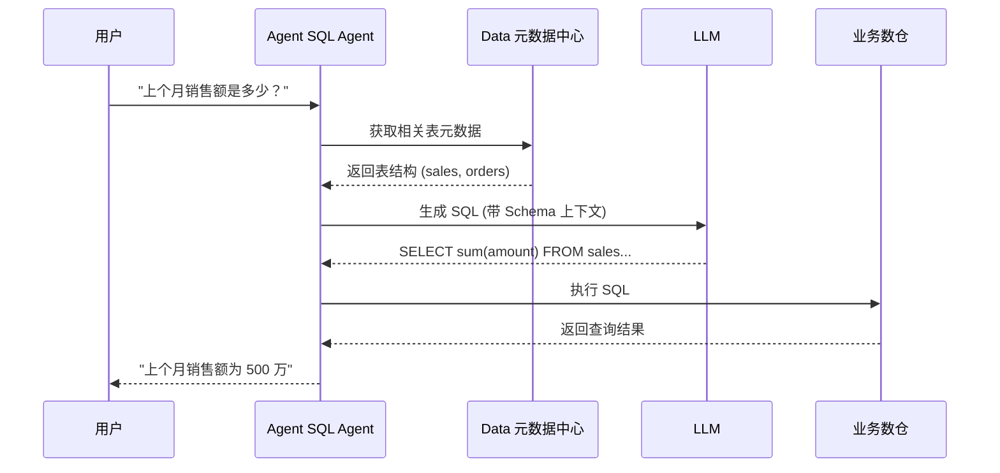
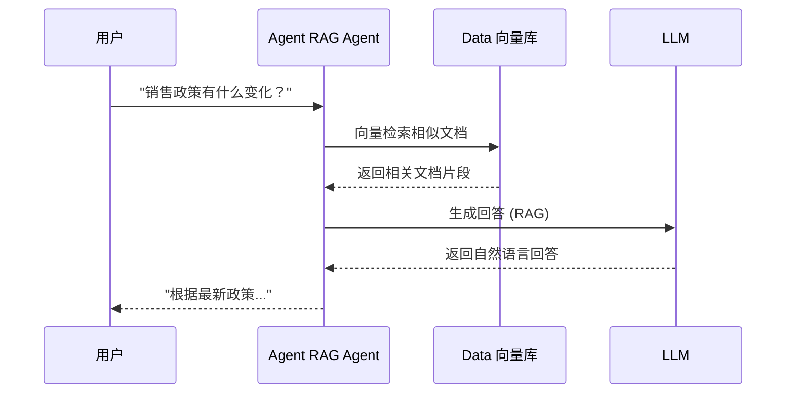
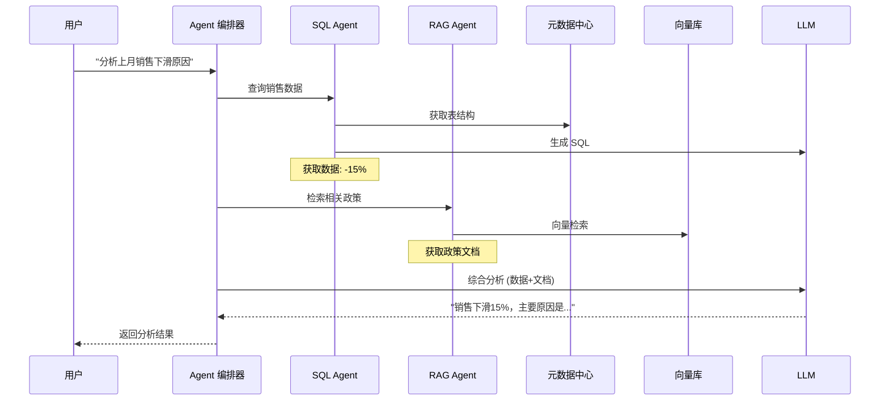

# Data 与 Agent 平台集成方案

## 集成目标

打通**数据底座**与**应用编排**之间的连接，实现：
- 基于元数据的 Text-to-SQL
- 向量知识库检索 (RAG)
- 结构化与非结构化数据统一查询

## 架构图

```
┌──────────────────────────────────────────────────────────────┐
│                       Agent 平台 (L4)                         │
│  ┌─────────────────────────────────────────────────────┐    │
│  │                    应用编排层                        │    │
│  │  ┌─────────────┐   ┌─────────────┐   ┌───────────┐ │    │
│  │  │ SQL Agent   │   │ RAG Agent   │   │ 用户输入  │ │    │
│  │  └──────┬──────┘   └──────┬──────┘   └─────┬─────┘ │    │
│  └─────────┼──────────────────┼────────────────┼────────┘    │
└────────────┼──────────────────┼────────────────┼─────────────┘
             │                  │                │
        元数据查询          向量检索          SQL 执行
             │                  │                │
             ↓                  ↓                ↓
┌──────────────────────────────────────────────────────────────┐
│                       Data 平台 (L2)                          │
│  ┌─────────────┐   ┌─────────────┐   ┌───────────────────┐  │
│  │ 元数据中心   │   │ 向量数据库  │   │   业务数仓        │  │
│  │  (Metadata) │   │ (Vector DB) │   │  (Doris/Hive)    │  │
│  └─────────────┘   └─────────────┘   └───────────────────┘  │
└──────────────────────────────────────────────────────────────┘
```

## 核心场景

### 场景一：Text-to-SQL（结构化数据查询）



### 场景二：RAG 检索（非结构化知识）



### 场景三：混合查询（RAG + SQL）



## API 规范

### 元数据查询接口

```http
GET /api/v1/metadata/tables?keywords=sales,orders
Accept: application/json

{
  "tables": [
    {
      "database": "business_db",
      "table": "sales",
      "description": "销售事实表",
      "columns": [
        {
          "name": "order_id",
          "type": "bigint",
          "comment": "订单ID",
          "nullable": false
        },
        {
          "name": "amount",
          "type": "decimal(18,2)",
          "comment": "订单金额",
          "nullable": false
        },
        {
          "name": "order_date",
          "type": "date",
          "comment": "订单日期",
          "nullable": false
        }
      ],
      "relations": [
        {
          "type": "foreign_key",
          "ref_table": "customers",
          "ref_column": "customer_id"
        }
      ],
      "sample_data": [
        {"order_id": 1, "amount": 100.00, "order_date": "2024-01-01"}
      ]
    }
  ]
}
```

### SQL 执行接口

```http
POST /api/v1/query/execute
Content-Type: application/json

{
  "sql": "SELECT sum(amount) as total FROM sales WHERE order_date >= '2024-01-01'",
  "database": "business_db",
  "timeout": 30,
  "limit": 10000
}

{
  "success": true,
  "data": [
    {"total": 5000000.00}
  ],
  "rows": 1,
  "duration_ms": 125
}
```

### 向量检索接口

```http
POST /api/v1/vector/search
Content-Type: application/json

{
  "query": "销售政策有哪些变化",
  "collection": "enterprise_docs",
  "top_k": 5,
  "filters": {
    "doc_type": "policy",
    "date": ">= 2024-01-01"
  }
}

{
  "results": [
    {
      "id": "doc_001",
      "content": "2024年销售政策更新：...",
      "metadata": {
        "doc_type": "policy",
        "title": "2024年销售政策",
        "date": "2024-01-15"
      },
      "score": 0.92
    }
  ]
}
```

## Text-to-SQL 实现

### Prompt 模板

```python
TEXT_TO_SQL_PROMPT = """
你是一个 SQL 专家。请根据以下信息生成 SQL 查询。

## 可用表结构

{table_schemas}

## 表关联关系

{table_relations}

## 用户问题

{user_question}

## 要求

1. 只返回 SQL 语句，不要解释
2. 使用标准 SQL 语法
3. 如果需要 JOIN，请在 WHERE 子句中明确关联条件
4. 注意日期格式的处理

## SQL 查询

```sql
"""
```

### 代码示例

```python
from agent_platform.agents import SQLAgent
from data_client import MetadataClient, QueryClient

class DataSQLAgent(SQLAgent):
    def __init__(self):
        self.metadata_client = MetadataClient()
        self.query_client = QueryClient()
        self.llm = self.get_llm()

    def query(self, question: str) -> str:
        # 1. 获取相关表元数据
        tables = self.metadata_client.search_tables(question)

        # 2. 构建 Prompt
        prompt = self.build_prompt(question, tables)

        # 3. 生成 SQL
        sql = self.llm.generate(prompt)

        # 4. 执行查询
        result = self.query_client.execute(sql)

        # 5. 自然语言解释
        answer = self.llm.explain(result, question)

        return answer
```

## RAG 实现

### 代码示例

```python
from agent_platform.agents import RAGAgent
from data_client import VectorClient

class DataRAGAgent(RAGAgent):
    def __init__(self):
        self.vector_client = VectorClient()
        self.llm = self.get_llm()

    def query(self, question: str) -> str:
        # 1. 向量检索
        docs = self.vector_client.search(
            query=question,
            collection="enterprise_docs",
            top_k=5
        )

        # 2. 构建 RAG Prompt
        context = "\n".join([d["content"] for d in docs])
        prompt = f"""
参考以下文档回答问题：

{context}

问题：{question}

回答：
"""

        # 3. 生成回答
        answer = self.llm.generate(prompt)

        return answer
```

## 配置清单

### Agent 平台配置

```yaml
# config/data_integration.yaml
data_platform:
  enabled: true
  api_endpoint: http://data-api.default.svc.cluster.local
  api_key: ${DATA_API_KEY}
  timeout: 30

  metadata:
    enabled: true
    cache_ttl: 3600

  query:
    enabled: true
    max_rows: 10000
    timeout: 30

  vector:
    enabled: true
    endpoint: http://data-vector.default.svc.cluster.local
    top_k: 5
```

### 元数据同步配置

```yaml
# Data 平台侧配置
agent_integration:
  metadata_sync:
    enabled: true
    sync_interval: 300s
    include_databases:
      - business_db
      - warehouse_db
    exclude_tables:
      - temp_*
      - test_*
```

## 测试用例

```python
def test_text_to_sql():
    agent = DataSQLAgent()
    result = agent.query("上个月销售额是多少？")
    assert "500万" in result

def test_rag():
    agent = DataRAGAgent()
    result = agent.query("销售政策有什么变化？")
    assert len(result) > 0

def test_hybrid_query():
    agent = HybridAgent()
    result = agent.query("分析上月销售下滑原因")
    assert "原因" in result
```

## 故障排查

| 问题 | 可能原因 | 解决方案 |
|------|----------|----------|
| SQL 语法错误 | Schema 信息不完整 | 检查元数据注册完整性 |
| 检索结果不相关 | 向量模型不适配 | 针对领域数据微调 Embedding 模型 |
| 查询超时 | 数据量大 | 添加查询限制，优化索引 |
