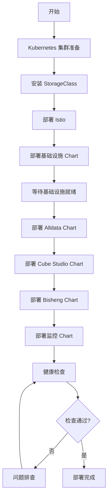

# 部署架构设计

本文档定义 ONE-DATA-STUDIO 平台的 Kubernetes 部署架构，包括命名空间划分、存储配置、网关设置和 Helm Chart 组织结构。

---

## 部署架构概览

```
┌───────────────────────────────────────────────────────────────────────┐
│                         Kubernetes Cluster                            │
│                                                                       │
│  ┌─────────────────────────────────────────────────────────────┐     │
│  │                    Ingress / Gateway Layer                   │     │
│  │                    (Nginx / Istio Gateway)                   │     │
│  └─────────────────────────────────────────────────────────────┘     │
│                              │                                       │
│  ┌─────────────────────────────────────────────────────────────┐     │
│  │                      System Layer                            │     │
│  │  Keycloak | Vault | Prometheus | Grafana | Loki             │     │
│  └─────────────────────────────────────────────────────────────┘     │
│                              │                                       │
│  ┌─────────────────────────────────────────────────────────────┐     │
│  │                    Application Layer                         │     │
│  │  ┌──────────────┐  ┌──────────────┐  ┌──────────────┐       │     │
│  │  │   Alldata    │  │  Cube Studio │  │   Bisheng    │       │     │
│  │  │  (L2 数据层) │  │  (L3 模型层) │  │ (L4 应用层)  │       │     │
│  │  └──────────────┘  └──────────────┘  └──────────────┘       │     │
│  └─────────────────────────────────────────────────────────────┘     │
│                              │                                       │
│  ┌─────────────────────────────────────────────────────────────┐     │
│  │                    Storage Layer                             │     │
│  │  MinIO | MySQL | Redis | VectorDB (Milvus/PgVector)         │     │
│  └─────────────────────────────────────────────────────────────┘     │
│                                                                       │
└───────────────────────────────────────────────────────────────────────┘
```

---

## 一、Namespace 划分

### 1.1 命名空间设计

```
one-data-system          # 系统组件（认证、监控、网关）
├── Keycloak
├── Vault
├── Istio Control Plane
├── Prometheus
├── Grafana
└── Loki

one-data-infra           # 基础设施（存储、中间件）
├── MinIO
├── MySQL (主集群)
├── Redis
├── Milvus / PgVector
├── Kafka / RabbitMQ
└── Harbor (镜像仓库)

one-data-alldata         # Alldata 平台
├── alldata-api
├── alldata-etl
├── alldata-metadata
├── alldata-frontend
└── alldata-jobs

one-data-cube            # Cube Studio 平台
├── cube-api
├── cube-scheduler
├── jupyterhub
├── cube-model-serving
└── cube-training-jobs

one-data-bisheng         # Bisheng 平台
├── bisheng-api
├── bisheng-frontend
├── bisheng-workflow
└── bisheng-knowledgebase

tenant-{id}              # 租户命名空间（可选多租户隔离）
├── tenant-{id}-alldata
├── tenant-{id}-cube
└── tenant-{id}-bisheng
```

### 1.2 Namespace 配置

#### 系统命名空间

```yaml
apiVersion: v1
kind: Namespace
metadata:
  name: one-data-system
  labels:
    name: one-data-system
    pod-security.kubernetes.io/enforce: baseline
    pod-security.kubernetes.io/audit: baseline
    pod-security.kubernetes.io/warn: restricted
```

#### 租户命名空间

```yaml
apiVersion: v1
kind: Namespace
metadata:
  name: tenant-001
  labels:
    tenant: "001"
    environment: production
  annotations:
    quota.cpu: "32"
    quota.memory: "128Gi"
    quota.gpu: "4"
```

### 1.3 资源配额

#### 平台级配额

```yaml
apiVersion: v1
kind: ResourceQuota
metadata:
  name: platform-quota
  namespace: one-data-cube
spec:
  hard:
    requests.cpu: "64"
    requests.memory: "256Gi"
    limits.cpu: "128"
    limits.memory: "512Gi"
    requests.nvidia.com/gpu: "8"
    persistentvolumeclaims: "50"
```

#### 租户级配额

```yaml
apiVersion: v1
kind: ResourceQuota
metadata:
  name: tenant-quota
  namespace: tenant-001
spec:
  hard:
    requests.cpu: "16"
    requests.memory: "64Gi"
    limits.cpu: "32"
    limits.memory: "128Gi"
    requests.nvidia.com/gpu: "2"
    persistentvolumeclaims: "10"
```

---

## 二、存储 Class 选择

### 2.1 StorageClass 定义

#### 高性能 SSD（数据库）

```yaml
apiVersion: storage.k8s.io/v1
kind: StorageClass
metadata:
  name: fast-ssd
provisioner: csi.driver.amazonaws.com  # 示例：AWS EBS
parameters:
  type: gp3
  iops: "3000"
  throughput: "125"
  encrypted: "true"
volumeBindingMode: WaitForFirstConsumer
allowVolumeExpansion: true
```

#### 标准 HDD（数据湖）

```yaml
apiVersion: storage.k8s.io/v1
kind: StorageClass
metadata:
  name: standard-hdd
provisioner: csi.driver.alibabacloud.com  # 示例：阿里云
parameters:
  type: cloud_ssd
  region: cn-hangzhou
volumeBindingMode: Immediate
allowVolumeExpansion: true
```

#### NVMe 本地存储（模型权重）

```yaml
apiVersion: storage.k8s.io/v1
kind: StorageClass
metadata:
  name: nvme-local
provisioner: kubernetes.io/no-provisioner
volumeBindingMode: WaitForFirstConsumer
```

### 2.2 PVC 配置示例

#### MinIO 数据卷

```yaml
apiVersion: v1
kind: PersistentVolumeClaim
metadata:
  name: minio-data
  namespace: one-data-infra
spec:
  accessModes:
    - ReadWriteOnce
  storageClassName: standard-hdd
  resources:
    requests:
      storage: 1Ti
```

#### MySQL 数据卷

```yaml
apiVersion: v1
kind: PersistentVolumeClaim
metadata:
  name: mysql-data
  namespace: one-data-infra
spec:
  accessModes:
    - ReadWriteOnce
  storageClassName: fast-ssd
  resources:
    requests:
      storage: 100Gi
```

#### 模型缓存卷

```yaml
apiVersion: v1
kind: PersistentVolumeClaim
metadata:
  name: model-cache
  namespace: one-data-cube
spec:
  accessModes:
    - ReadOnlyMany
  storageClassName: nvme-local
  resources:
    requests:
      storage: 500Gi
```

### 2.3 存储规划

| 组件 | StorageClass | 容量 | 访问模式 |
|------|--------------|------|----------|
| MinIO | standard-hdd | 1TB+ | ReadWriteOnce |
| MySQL | fast-ssd | 100GB+ | ReadWriteOnce |
| Redis | fast-ssd | 50GB | ReadWriteOnce |
| Milvus | fast-ssd | 200GB+ | ReadWriteOnce |
| 模型权重 | nvme-local | 500GB+ | ReadOnlyMany |
| 日志存储 | standard-hdd | 200GB | ReadWriteMany |

---

## 三、Ingress/Gateway 配置

### 3.1 Istio Gateway 配置

```yaml
apiVersion: networking.istio.io/v1beta1
kind: Gateway
metadata:
  name: one-data-gateway
  namespace: one-data-system
spec:
  selector:
    istio: ingressgateway
  servers:
  - port:
      number: 443
      name: https
      protocol: HTTPS
    tls:
      mode: SIMPLE
      credentialName: one-data-tls-cert
    hosts:
    - "one-data.example.com"
    - "alldata.example.com"
    - "cube.example.com"
    - "bisheng.example.com"
```

### 3.2 VirtualService 配置

#### Alldata API 路由

```yaml
apiVersion: networking.istio.io/v1beta1
kind: VirtualService
metadata:
  name: alldata-vs
  namespace: one-data-alldata
spec:
  hosts:
  - "alldata.example.com"
  gateways:
  - one-data-system/one-data-gateway
  http:
  - match:
    - uri:
        prefix: /api/
    route:
    - destination:
        host: alldata-api
        port:
          number: 8080
  - route:
    - destination:
        host: alldata-frontend
        port:
          number: 80
```

#### Cube 模型服务路由

```yaml
apiVersion: networking.istio.io/v1beta1
kind: VirtualService
metadata:
  name: cube-serving-vs
  namespace: one-data-cube
spec:
  hosts:
  - "cube.example.com"
  gateways:
  - one-data-system/one-data-gateway
  http:
  - match:
    - uri:
        prefix: /v1/
    route:
    - destination:
        host: cube-model-serving
        port:
          number: 8000
```

### 3.3 服务网格配置

#### Sidecar 注入

```yaml
apiVersion: v1
kind: Namespace
metadata:
  name: one-data-alldata
  labels:
    istio-injection: enabled
```

#### mTLS 策略

```yaml
apiVersion: security.istio.io/v1beta1
kind: PeerAuthentication
metadata:
  name: mtls-strict
  namespace: one-data-system
spec:
  mtls:
    mode: STRICT
```

---

## 四、Helm Chart 结构

### 4.1 Chart 仓库组织

```
helm-charts/
├── one-data/                    # 总 Chart（可选）
│   ├── Chart.yaml
│   ├── values.yaml
│   └── charts/
│
├── alldata/                     # Alldata 平台 Chart
│   ├── Chart.yaml
│   ├── values.yaml
│   ├── values-dev.yaml
│   ├── values-prod.yaml
│   └── templates/
│       ├── api/
│       ├── etl/
│       ├── metadata/
│       └── frontend/
│
├── cube-studio/                 # Cube Studio Chart
│   ├── Chart.yaml
│   ├── values.yaml
│   ├── values-dev.yaml
│   ├── values-prod.yaml
│   └── templates/
│       ├── api/
│       ├── jupyterhub/
│       ├── serving/
│       └── training/
│
├── bisheng/                     # Bisheng Chart
│   ├── Chart.yaml
│   ├── values.yaml
│   ├── values-dev.yaml
│   ├── values-prod.yaml
│   └── templates/
│       ├── api/
│       ├── workflow/
│       └── frontend/
│
├── infrastructure/              # 基础设施 Chart
│   ├── Chart.yaml
│   ├── values.yaml
│   └── charts/
│       ├── minio/
│       ├── mysql/
│       ├── redis/
│       ├── milvus/
│       └── keycloak/
│
└── monitoring/                  # 监控 Chart
    ├── Chart.yaml
    ├── values.yaml
    └── charts/
        ├── prometheus/
        └── grafana/
```

### 4.2 Values 文件示例

#### Alldata values.yaml

```yaml
# Alldata 平台配置
global:
  namespace: one-data-alldata
  imageRegistry: harbor.example.com/one-data
  imageTag: "v1.0.0"

  # 存储配置
  storageClass:
    data: standard-hdd
    database: fast-ssd

  # 数据库连接
  database:
    host: mysql.one-data-infra.svc.cluster.local
    port: 3306
    name: alldata
    existingSecret: alldata-db-credentials

# API 服务
api:
  enabled: true
  replicaCount: 2

  image:
    repository: alldata-api
    tag: "v1.0.0"

  service:
    type: ClusterIP
    port: 8080

  resources:
    requests:
      cpu: 500m
      memory: 1Gi
    limits:
      cpu: 2000m
      memory: 4Gi

  autoscaling:
    enabled: true
    minReplicas: 2
    maxReplicas: 10
    targetCPUUtilizationPercentage: 70

  ingress:
    enabled: true
    className: istio
    hosts:
      - host: alldata.example.com
        paths:
          - path: /api
            pathType: Prefix

# ETL 服务
etl:
  enabled: true
  replicaCount: 3

  image:
    repository: alldata-etl
    tag: "v1.0.0"

  resources:
    requests:
      cpu: 1000m
      memory: 2Gi
    limits:
      cpu: 4000m
      memory: 8Gi

# 前端
frontend:
  enabled: true
  replicaCount: 2

  image:
    repository: alldata-frontend
    tag: "v1.0.0"

  service:
    type: ClusterIP
    port: 80
```

#### Cube Studio values.yaml

```yaml
# Cube Studio 平台配置
global:
  namespace: one-data-cube
  imageRegistry: harbor.example.com/one-data
  imageTag: "v1.0.0"

# 模型服务
serving:
  enabled: true

  # vLLM 配置
  vllm:
    enabled: true
    replicaCount: 2

    image:
      repository: vllm/vllm-openai
      tag: "v0.2.7"

    resources:
      requests:
        nvidia.com/gpu: 1
        cpu: 4000m
        memory: 16Gi
      limits:
        nvidia.com/gpu: 1
        cpu: 8000m
        memory: 32Gi

    models:
      - name: qwen-14b-chat
        modelPath: s3://models/qwen-14b/
        tensorParallelSize: 1

    service:
      type: ClusterIP
      port: 8000

# JupyterHub
jupyterhub:
  enabled: true

  replicaCount: 1

  image:
    repository: jupyterhub
    tag: "3.0.0"

  resources:
    requests:
      cpu: 500m
      memory: 1Gi
    limits:
      cpu: 2000m
      memory: 4Gi

  singleuser:
    image:
      name: jupyter-scipy
      tag: latest
    cpu:
      limit: 2
    memory:
      limit: 4G
      guarantee: 2G

# 训练任务调度
scheduler:
  enabled: true

  # Volcano 调度器
  volcano:
    enabled: true

  # Ray 集群
  ray:
    enabled: true
```

### 4.3 部署命令

```bash
# 1. 添加 Helm 仓库
helm repo add one-data https://harbor.example.com/chartrepo/one-data
helm repo update

# 2. 创建命名空间
kubectl create namespace one-data-infra
kubectl create namespace one-data-alldata
kubectl create namespace one-data-cube
kubectl create namespace one-data-bisheng

# 3. 部署基础设施
helm install infrastructure one-data/infrastructure \
  -n one-data-infra \
  -f infrastructure/values-prod.yaml

# 4. 部署 Alldata
helm install alldata one-data/alldata \
  -n one-data-alldata \
  -f alldata/values-prod.yaml

# 5. 部署 Cube Studio
helm install cube one-data/cube-studio \
  -n one-data-cube \
  -f cube-studio/values-prod.yaml

# 6. 部署 Bisheng
helm install bisheng one-data/bisheng \
  -n one-data-bisheng \
  -f bisheng/values-prod.yaml

# 7. 部署监控
helm install monitoring one-data/monitoring \
  -n one-data-system \
  -f monitoring/values-prod.yaml
```

---

## 五、部署流程

### 5.1 初始部署流程



### 5.2 滚动升级流程

```bash
# 1. 备份配置
helm get values alldata -n one-data-alldata > alldata-backup.yaml

# 2. 更新镜像版本
helm upgrade alldata one-data/alldata \
  -n one-data-alldata \
  --set global.imageTag=v1.1.0 \
  --wait \
  --timeout 10m

# 3. 验证升级
kubectl rollout status deployment/alldata-api -n one-data-alldata
kubectl get pods -n one-data-alldata

# 4. 回滚（如需要）
helm rollback alldata -n one-data-alldata
```

---

## 六、高可用配置

### 6.1 副本数配置

| 组件 | 最小副本 | 推荐副本 | 说明 |
|------|----------|----------|------|
| API 服务 | 2 | 3+ | 无状态服务 |
| 前端服务 | 2 | 2+ | 静态资源服务 |
| ETL 任务 | 3 | 5+ | 根据负载调整 |
| 模型服务 | 2 | 3+ | 根据 GPU 资源 |
| MySQL | 1 | 3 | 主从复制 |
| Redis | 1 | 3 | 哨兵模式 |
| Keycloak | 2 | 3+ | 认证服务 |

### 6.2 Pod 反亲和性

```yaml
affinity:
  podAntiAffinity:
    preferredDuringSchedulingIgnoredDuringExecution:
    - weight: 100
      podAffinityTerm:
        labelSelector:
          matchExpressions:
          - key: app
            operator: In
            values:
            - alldata-api
        topologyKey: kubernetes.io/hostname
```

### 6.3 Pod 中断预算

```yaml
apiVersion: policy/v1
kind: PodDisruptionBudget
metadata:
  name: alldata-api-pdb
  namespace: one-data-alldata
spec:
  minAvailable: 1
  selector:
    matchLabels:
      app: alldata-api
```

---

## 七、监控与日志

### 7.1 监控端点

| 服务类型 | 监控端点 | 说明 |
|----------|----------|------|
| API 服务 | `/metrics` | Prometheus 指标 |
| 健康检查 | `/health` | 服务健康状态 |
| 就绪检查 | `/ready` | 服务就绪状态 |

### 7.2 ServiceMonitor 配置

```yaml
apiVersion: monitoring.coreos.com/v1
kind: ServiceMonitor
metadata:
  name: alldata-api
  namespace: one-data-alldata
spec:
  selector:
    matchLabels:
      app: alldata-api
  endpoints:
  - port: metrics
    interval: 30s
    path: /metrics
```

---

## 八、部署检查清单

### 部署前检查

- [ ] Kubernetes 集群版本 >= 1.25
- [ ] Helm >= 3.x 已安装
- [ ] StorageClass 已配置并测试
- [ ] 域名证书已准备
- [ ] 镜像仓库可访问
- [ ] 资源配额已规划

### 部署后验证

- [ ] 所有 Pod 状态为 Running
- [ ] Service 可正常访问
- [ ] Ingress 路由正确
- [ ] 监控指标正常采集
- [ ] 日志正常输出
- [ ] 健康检查通过

---

## 更新记录

| 日期 | 版本 | 更新内容 | 更新人 |
|------|------|----------|--------|
| 2024-01-23 | v1.0 | 初始版本，定义部署架构 | Claude |
