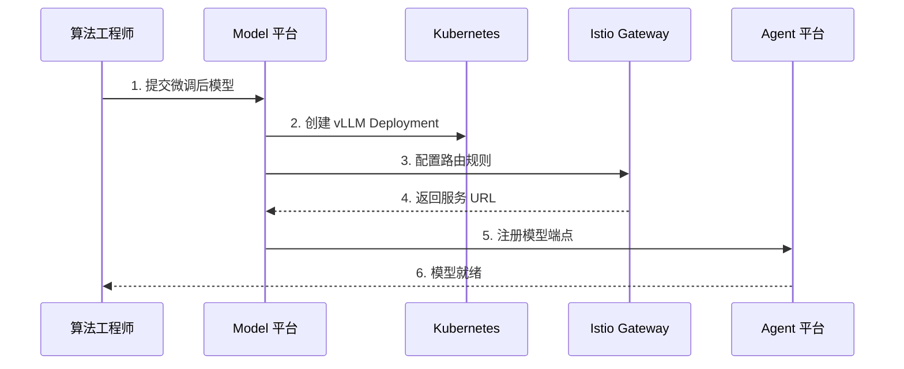
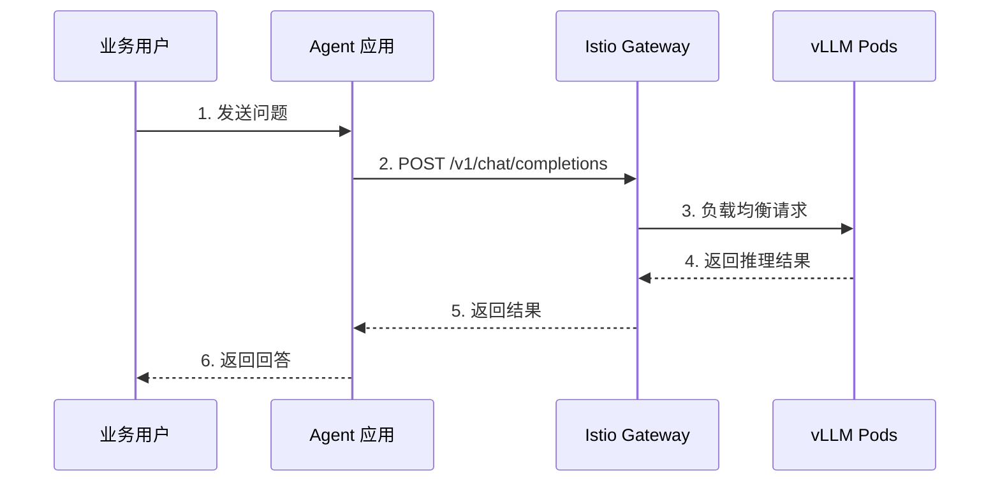

# Model 与 Agent 平台集成方案

## 集成目标

打通**模型引擎**与**应用编排**之间的连接，实现：
- 模型服务标准化部署
- OpenAI 兼容 API 统一调用
- 弹性伸缩支持高并发

## 架构图

```
┌──────────────────────────────────────────────────────────────┐
│                       Agent 平台 (L4)                         │
│  ┌─────────┐   ┌─────────┐   ┌──────────────┐               │
│  │ RAG 流程 │   │ Agent  │   │  应用编排    │               │
│  └────┬────┘   └────┬────┘   └──────┬───────┘               │
│       │             │                │                       │
│       └─────────────┴────────────────┘                       │
│                     │ OpenAI API                             │
│                     │ /v1/chat/completions                   │
└─────────────────────┼───────────────────────────────────────┘
                      │
                      ↓
┌──────────────────────────────────────────────────────────────┐
│                    Model 平台 (L3)                            │
│  ┌─────────────────────────────────────────────────────┐    │
│  │              Istio Gateway (模型服务网关)             │    │
│  │              /llm/* → /v1/* (OpenAI 兼容)            │    │
│  └────────────────────────┬──────────────────────────────┘    │
│                           │                                   │
│  ┌────────────────────────┴──────────────────────────────┐    │
│  │                    vLLM / TGI Pods                    │    │
│  │  ┌────────┐  ┌────────┐  ┌────────┐  (HPA 自动伸缩) │    │
│  │  │ Pod 1  │  │ Pod 2  │  │ Pod N  │                  │    │
│  │  └────────┘  └────────┘  └────────┘                  │    │
│  └───────────────────────────────────────────────────────┘    │
└──────────────────────────────────────────────────────────────┘
```

## 核心流程

### 1. 模型部署流程



### 2. 推理调用流程



## API 规范

### OpenAI 兼容接口

```http
POST /v1/chat/completions
Content-Type: application/json
Authorization: Bearer ${MODEL_API_KEY}

{
  "model": "enterprise-llama-7b-v1.0",
  "messages": [
    {"role": "system", "content": "你是企业智能助手"},
    {"role": "user", "content": "请分析销售数据"}
  ],
  "temperature": 0.7,
  "max_tokens": 2000,
  "stream": false
}
```

### 响应格式

```json
{
  "id": "chatcmpl-123",
  "object": "chat.completion",
  "created": 1677652288,
  "model": "enterprise-llama-7b-v1.0",
  "choices": [{
    "index": 0,
    "message": {
      "role": "assistant",
      "content": "根据销售数据分析..."
    },
    "finish_reason": "stop"
  }],
  "usage": {
    "prompt_tokens": 56,
    "completion_tokens": 31,
    "total_tokens": 87
  }
}
```

## vLLM 部署配置

### Kubernetes Deployment

```yaml
apiVersion: apps/v1
kind: Deployment
metadata:
  name: llama-7b-vllm
  namespace: model-platform
spec:
  replicas: 1
  selector:
    matchLabels:
      app: llama-7b-vllm
  template:
    metadata:
      labels:
        app: llama-7b-vllm
    spec:
      containers:
      - name: vllm
        image: vllm/vllm-openai:v0.2.7
        resources:
          limits:
            nvidia.com/gpu: 1
            memory: 16Gi
          requests:
            cpu: "4"
            memory: 12Gi
        env:
        - name: MODEL_NAME
          value: "meta-llama/Llama-2-7b-chat-hf"
        - name: HF_TOKEN
          valueFrom:
            secretKeyRef:
              name: huggingface-token
              key: token
        ports:
        - containerPort: 8000
---
apiVersion: autoscaling/v2
kind: HorizontalPodAutoscaler
metadata:
  name: llama-7b-vllm-hpa
spec:
  scaleTargetRef:
    apiVersion: apps/v1
    kind: Deployment
    name: llama-7b-vllm
  minReplicas: 1
  maxReplicas: 10
  metrics:
  - type: Resource
    resource:
      name: cpu
      target:
        type: Utilization
        averageUtilization: 70
```

### Istio Gateway 配置

```yaml
apiVersion: networking.istio.io/v1beta1
kind: VirtualService
metadata:
  name: llm-serving
spec:
  hosts:
  - "llm.example.com"
  gateways:
  - llm-gateway
  http:
  - match:
    - uri:
        prefix: /v1/
    rewrite:
      uri: /v1/
    route:
    - destination:
        host: llama-7b-vllm
        port:
          number: 8000
```

## Agent 平台配置

### 模型接入配置

```yaml
# Agent 平台 config/models.yaml
models:
  - id: "enterprise-llama-7b"
    name: "企业私有 Llama 7B"
    type: "openai-compatible"
    base_url: "http://llm.example.com/v1"
    api_key: "${MODEL_LLM_API_KEY}"
    capabilities:
      chat: true
      completion: true
      function_calling: true
    parameters:
      temperature: 0.7
      max_tokens: 2000
      top_p: 0.9
```

### LangChain 集成

```python
from langchain.llms import OpenAI

# 配置 Model 平台模型
llm = OpenAI(
    openai_api_key="${MODEL_LLM_API_KEY}",
    openai_api_base="http://llm.example.com/v1",
    model_name="enterprise-llama-7b",
    temperature=0.7
)

# 使用
response = llm("请分析销售数据")
print(response)
```

## 监控指标

### 关键指标

| 指标 | 说明 | 告警阈值 |
|------|------|----------|
| request_latency | 推理延迟 | > 5s (P95) |
| request_throughput | 请求吞吐量 | < 10 req/s |
| gpu_utilization | GPU 利用率 | < 50% |
| pod_count | Pod 数量 | < 1 |
| error_rate | 错误率 | > 1% |

### Prometheus 查询

```promql
# 推理延迟 P95
histogram_quantile(0.95, rate(llm_request_duration_seconds_bucket[5m]))

# GPU 利用率
avg(nvml_gpu_utilization_gpu)

# Pod 副本数
count(kube_pod_info{pod=~"llm-.*-vllm-.*"})
```

## 弹性伸缩策略

### HPA 配置

```yaml
metrics:
- type: Resource
  resource:
    name: cpu
    target:
      type: Utilization
      averageUtilization: 70
- type: Pods
  pods:
    metric:
      name: requests_per_second
    target:
      type: AverageValue
      averageValue: "100"
```

### KEDA (可选)

```yaml
apiVersion: keda.sh/v1alpha1
kind: ScaledObject
metadata:
  name: llm-scaler
spec:
  scaleTargetRef:
    name: llama-7b-vllm
  minReplicaCount: 1
  maxReplicaCount: 10
  triggers:
  - type: prometheus
    metricType: AverageValue
    metadata:
      serverAddress: http://prometheus:9090
      metricName: http_requests_total
      threshold: "100"
      query: rate(http_requests_total[1m])
```

## 故障排查

| 问题 | 可能原因 | 解决方案 |
|------|----------|----------|
| 502 Bad Gateway | Pod 未就绪 | 检查 GPU 资源和模型加载 |
| 超时 | 模型加载慢 | 使用模型缓存，增加超时时间 |
| 并发限制 | Pod 数量不足 | 增加 HPA 上限 |
| GPU OOM | 显存不足 | 减少批量大小或使用量化 |
