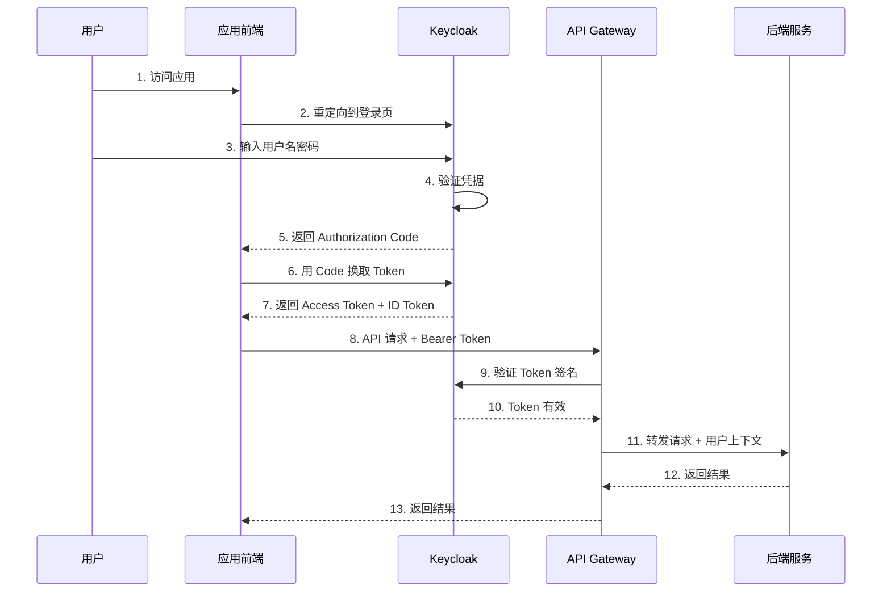
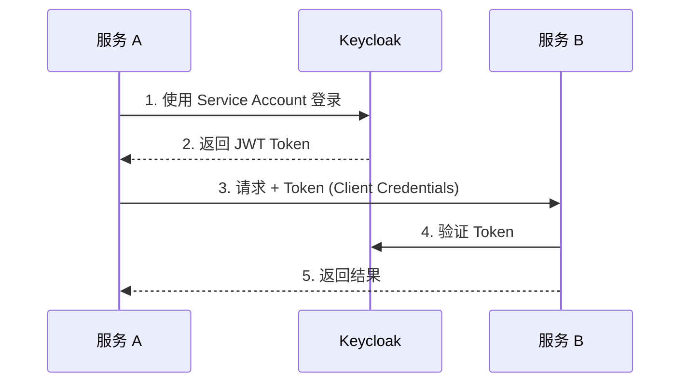
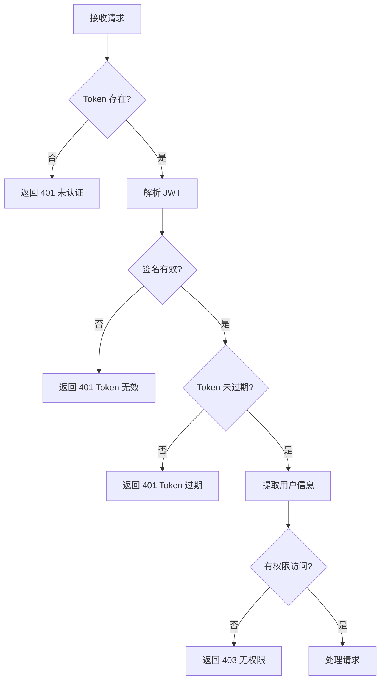
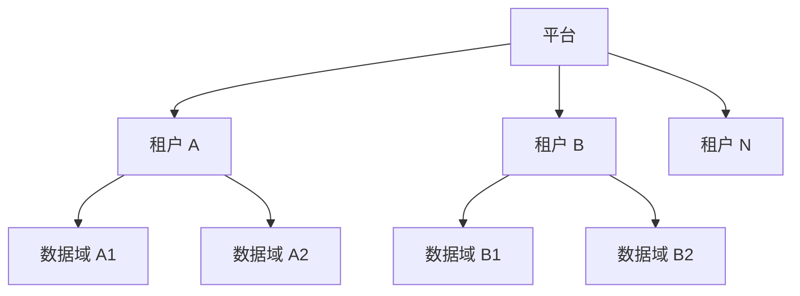

# 安全方案设计

本文档定义 ONE-DATA-STUDIO 平台的统一认证和权限管理方案，确保三个平台（Alldata、Cube Studio、Bisheng）能够安全地协同工作。

---

## 安全架构概览

```
┌─────────────────────────────────────────────────────────────────┐
│                           安全边界                               │
│  ┌───────────────────────────────────────────────────────────┐  │
│  │                    API 网关层 (Istio Gateway)              │  │
│  │  ┌─────────────┐  ┌─────────────┐  ┌─────────────┐        │  │
│  │  │  认证       │  │  鉴权       │  │  限流       │        │  │
│  │  │ (Keycloak)  │  │ (OPA/Policy)│  │ (RateLimit) │        │  │
│  │  └─────────────┘  └─────────────┘  └─────────────┘        │  │
│  └───────────────────────────────────────────────────────────┘  │
│                              │                                  │
│  ┌───────────────────────────────────────────────────────────┐  │
│  │                         服务层                             │  │
│  │  ┌──────────┐  ┌──────────┐  ┌──────────┐                 │  │
│  │  │ Alldata  │  │  Cube    │  │ Bisheng  │                 │  │
│  │  └──────────┘  └──────────┘  └──────────┘                 │  │
│  └───────────────────────────────────────────────────────────┘  │
└─────────────────────────────────────────────────────────────────┘
```

---

## 一、统一认证方案（SSO）

### 1.1 Keycloak 集成架构



### 1.2 认证流程

#### 用户登录流程

| 步骤 | 说明 |
|------|------|
| 1. 用户访问应用 | 重定向到 Keycloak 登录页面 |
| 2. 用户认证 | 支持密码、LDAP、社交登录多种方式 |
| 3. 获取 Token | 返回 JWT 格式的 Access Token |
| 4. 后续请求 | 在 Header 中携带 Token 访问 API |

#### 服务间认证流程



### 1.3 JWT Token 结构

#### Access Token Payload

```json
{
    "iss": "https://keycloak.example.com/realms/one-data",
    "sub": "user-123",
    "aud": ["alldata", "cube", "bisheng"],
    "exp": 1705995600,
    "iat": 1705992000,
    "jti": "token-id-123",
    "preferred_username": "zhangsan",
    "email": "zhangsan@example.com",
    "roles": ["data_engineer", "model_developer"],
    "tenant_id": "tenant-001",
    "groups": ["/data-team", "/ml-team"]
}
```

#### Token 刷新策略

| Token 类型 | 有效期 | 刷新方式 |
|------------|--------|----------|
| Access Token | 15 分钟 | 使用 Refresh Token |
| Refresh Token | 7 天 | 重新登录 |
| ID Token | 15 分钟 | 使用 Refresh Token |

---

## 二、跨平台 Token 传递机制

### 2.1 传递架构

```
┌──────────┐      Token       ┌─────────────┐      Token       ┌──────────┐
│ Bisheng  │ ───────────────→ │ API Gateway │ ───────────────→ │ Alldata │
│ (L4)     │                  │  (Istio)    │                  │  (L2)    │
└──────────┘                  └─────────────┘                  └──────────┘
```

### 2.2 Token 传递规范

#### 请求头格式

```http
Authorization: Bearer {jwt_token}
X-User-ID: {user_id}
X-Tenant-ID: {tenant_id}
X-Original-Service: bisheng
```

#### Token 验证流程



### 2.3 服务网格层传递（Istio）

#### Istio 认证策略

```yaml
apiVersion: security.istio.io/v1beta1
kind: RequestAuthentication
metadata:
  name: jwt-authentication
  namespace: one-data
spec:
  selector:
    matchLabels:
      app: one-data-service
  jwtRules:
  - issuer: "https://keycloak.example.com/realms/one-data"
    jwksUri: "https://keycloak.example.com/realms/one-data/protocol/openid-connect/certs"
    forwardOriginalToken: true
```

#### Istio 授权策略

```yaml
apiVersion: security.istio.io/v1beta1
kind: AuthorizationPolicy
metadata:
  name: rbac-policy
  namespace: one-data
spec:
  selector:
    matchLabels:
      app: alldata-api
  action: ALLOW
  rules:
  - from:
    - source:
        requestPrincipals: ["*"]
    to:
    - operation:
        methods: ["GET", "POST"]
        paths: ["/api/v1/datasets/*"]
    when:
    - key: request.auth.claims[roles]
      values: ["data_engineer", "admin"]
```

---

## 三、权限模型设计

### 3.1 RBAC 角色定义

#### 平台级角色

| 角色 | 权限范围 | 说明 |
|------|----------|------|
| **super_admin** | 全部权限 | 超级管理员 |
| **platform_admin** | 平台管理 | 平台配置、用户管理 |
| **tenant_admin** | 租户管理 | 租户内全部资源 |

#### Alldata 角色层级

| 角色 | 数据权限 | 操作权限 |
|------|----------|----------|
| **data_admin** | 全部数据 | 全部操作 |
| **data_engineer** | 指定域 | ETL、数据开发 |
| **data_analyst** | 只读 | 查询、导出 |
| **data_viewer** | 只读（受限） | 仅查看 |

#### Cube Studio 角色层级

| 角色 | 算力权限 | 操作权限 |
|------|----------|----------|
| **ml_admin** | 全部资源 | 全部操作 |
| **ml_engineer** | 指定配额 | 训练、部署 |
| **ml_developer** | 开发环境 | Notebook 开发 |
| **ml_viewer** | 只读 | 查看实验 |

#### Bisheng 角色层级

| 角色 | 应用权限 | 操作权限 |
|------|----------|----------|
| **app_admin** | 全部应用 | 全部操作 |
| **app_developer** | 指定应用 | 开发、发布 |
| **app_user** | 运行时 | 使用应用 |

### 3.2 权限矩阵

#### 数据集操作权限

| 操作 | data_admin | data_engineer | data_analyst | data_viewer |
|------|------------|---------------|--------------|-------------|
| 创建数据集 | ✅ | ✅ | ❌ | ❌ |
| 编辑数据集 | ✅ | 所有者 | ❌ | ❌ |
| 删除数据集 | ✅ | 所有者 | ❌ | ❌ |
| 查看数据集 | ✅ | ✅ | ✅ | ✅ |
| 下载数据 | ✅ | ✅ | ✅ | ❌ |
| 注册元数据 | ✅ | ✅ | ❌ | ❌ |

#### 模型操作权限

| 操作 | ml_admin | ml_engineer | ml_developer | ml_viewer |
|------|----------|-------------|--------------|-----------|
| 部署模型 | ✅ | ✅ | ❌ | ❌ |
| 训练任务 | ✅ | ✅ | ✅ | ❌ |
| 使用 Notebook | ✅ | ✅ | ✅ | ❌ |
| 查看实验 | ✅ | ✅ | ✅ | ✅ |
| 删除模型 | ✅ | 所有者 | ❌ | ❌ |

### 3.3 资源隔离设计

#### 租户隔离



#### Namespace 划分

| Namespace | 用途 | 访问控制 |
|-----------|------|----------|
| `one-data-system` | 系统组件 | platform_admin |
| `tenant-{id}` | 租户资源 | tenant_admin |
| `tenant-{id}-alldata` | Alldata 实例 | data_admin |
| `tenant-{id}-cube` | Cube 实例 | ml_admin |
| `tenant-{id}-bisheng` | Bisheng 实例 | app_admin |

---

## 四、API 网关鉴权策略

### 4.1 网关认证流程

```
┌─────────┐    ┌─────────────┐    ┌──────────┐    ┌──────────┐
│  Client │───→│ API Gateway │───→│ Keycloak │───→│ Database │
└─────────┘    └─────────────┘    └──────────┘    └──────────┘
                     │
                     ↓
              ┌─────────────┐
              │  鉴权决策   │
              │   (OPA)     │
              └─────────────┘
                     │
         ┌───────────┼───────────┐
         ↓           ↓           ↓
    ┌────────┐ ┌────────┐ ┌────────┐
    │Alldata │ │  Cube  │ │Bisheng │
    └────────┘ └────────┘ └────────┘
```

### 4.2 OPA 策略示例

#### 数据集访问策略

```rego
package one_data.authz

default allow = false

# 允许平台管理员
allow {
    input.user.roles[_] == "platform_admin"
}

# 允许数据集所有者
allow {
    input.resource.owner == input.user.id
}

# 允许有读权限的用户查看
allow {
    input.method == "GET"
    input.user.roles[_] in ["data_admin", "data_engineer", "data_analyst", "data_viewer"]
}

# 允许数据工程师在自己域内创建
allow {
    input.method == "POST"
    input.user.roles[_] == "data_engineer"
    input.resource.domain == input.user.domain
}
```

### 4.3 限流策略

#### 按用户限流

```yaml
apiVersion: config.istio.io/v1alpha2
kind: quota
metadata:
  name: user-quota
  namespace: one-data
spec:
  dimensions:
    - source_user: request.headers["x-user-id"] | "unknown"
    - destination: destination.service | "unknown"
  quotas:
    - amount: 100
      expiresAfter: 1m
```

#### 按租户限流

```yaml
rate_limits:
  - tenant_id:
      unit: MINUTE
      requests_per_unit: 1000
  - model_inference:
      unit: MINUTE
      requests_per_unit: 100
```

---

## 五、资源配额管理

### 5.1 配额类型

| 资源类型 | 配额维度 | 默认值 |
|----------|----------|--------|
| **存储** | GB per tenant | 1000 GB |
| **计算** | GPU hours per month | 100 小时 |
| **API 调用** | Requests per minute | 100 RPM |
| **并发任务** | Max concurrent jobs | 10 |

### 5.2 配额策略示例

```yaml
apiVersion: v1
kind: ResourceQuota
metadata:
  name: tenant-gpu-quota
  namespace: tenant-001
spec:
  hard:
    requests.nvidia.com/gpu: "4"
    limits.nvidia.com/gpu: "8"
    requests.cpu: "32"
    requests.memory: "128Gi"
    persistentvolumeclaims: "10"
```

---

## 六、密钥管理

### 6.1 密钥存储方案

```
┌─────────────────────────────────────────────────────────┐
│                    Vault 密钥管理                        │
│  ┌─────────────┐  ┌─────────────┐  ┌─────────────┐      │
│  │ 数据库凭据   │  │ API Keys    │  │ 证书管理    │      │
│  └─────────────┘  └─────────────┘  └─────────────┘      │
└─────────────────────────────────────────────────────────┘
                          │
                          ↓
                 ┌────────────────┐
                 │  动态注入       │
                 │  (Sidecar/Env) │
                 └────────────────┘
```

### 6.2 密钥注入方式

#### Kubernetes Secret

```yaml
apiVersion: v1
kind: Secret
metadata:
  name: alldata-db-credentials
type: Opaque
stringData:
  username: ${vault.alldata.db.username}
  password: ${vault.alldata.db.password}
```

#### 环境变量注入

```yaml
env:
  - name: DB_PASSWORD
    valueFrom:
      secretKeyRef:
        name: alldata-db-credentials
        key: password
```

---

## 七、审计日志

### 7.1 审计事件

| 事件类型 | 记录内容 |
|----------|----------|
| 用户登录 | 用户 ID、IP、时间、结果 |
| API 调用 | 用户、资源、操作、结果 |
| 资源变更 | 变更前后的值、操作人 |
| 权限变更 | 角色、权限变更详情 |
| 数据访问 | 查询语句、影响行数 |

### 7.2 日志格式

```json
{
    "timestamp": "2024-01-23T10:30:00Z",
    "event_type": "api_call",
    "user_id": "user-123",
    "tenant_id": "tenant-001",
    "service": "alldata",
    "operation": "dataset.create",
    "resource_id": "ds-001",
    "result": "success",
    "ip_address": "192.168.1.100",
    "user_agent": "Mozilla/5.0..."
}
```

---

## 八、安全检查清单

### 部署前检查

- [ ] Keycloak 已配置并测试通过
- [ ] 所有服务启用 TLS/HTTPS
- [ ] Istio mTLS 已启用
- [ ] OPA 策略已部署并验证
- [ ] 密钥轮换策略已配置
- [ ] 审计日志已启用

### 运行时检查

- [ ] Token 验证正常工作
- [ ] 权限控制正确执行
- [ ] 限流策略生效
- [ ] 审计日志正常采集
- [ ] 告警规则已配置

---

## 更新记录

| 日期 | 版本 | 更新内容 | 更新人 |
|------|------|----------|--------|
| 2024-01-23 | v1.0 | 初始版本，定义安全架构方案 | Claude |
