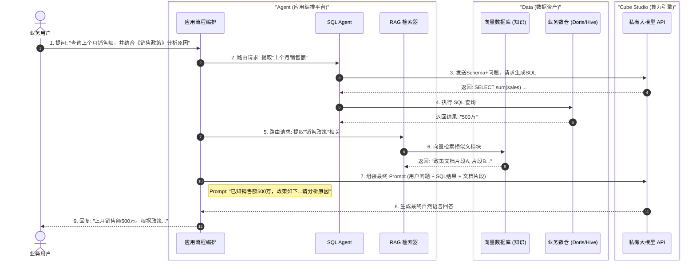
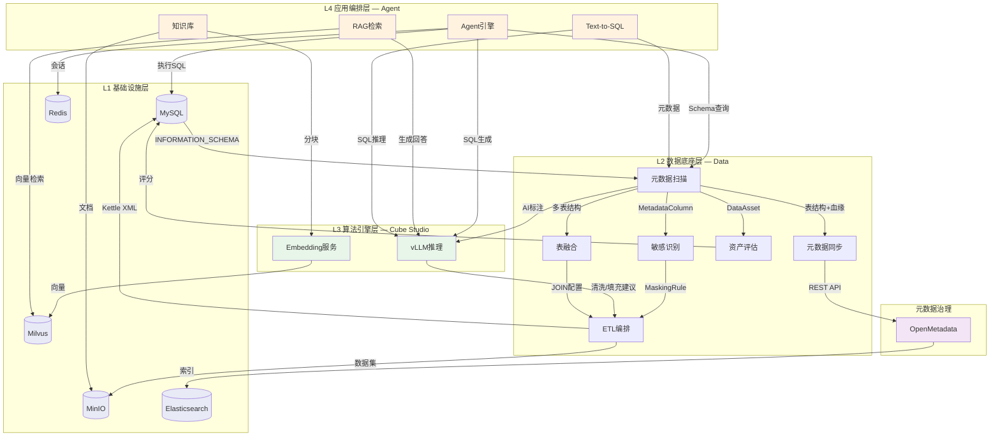

# 系统时序图

本文档包含两个核心场景的详细时序图，展示 Data、Cube Studio 和 Agent 三者如何协同工作。

---

## 场景一：研发态（Build Phase）

**数据清洗与模型生产流水线**

这个流程展示了数据工程师和算法工程师如何协作，将原始数据转化为可用的模型服务。

### 流程解析

**阶段1：数据准备 (步骤 1-5)**
- **Data** 负责把"脏数据"变成"标准数据"并入库（MinIO 或 向量库）
- **Data** 将数据位置通知给元数据中心，打破数据与算法的壁垒

**阶段2：模型开发与微调 (步骤 6-11)**
- **Cube Studio** 直接消费 Data 产出的数据进行训练
- 训练任务自动挂载存储，无需手动下载数据
- 模型权重保存回共享存储

**阶段3：模型服务化 (步骤 12-14)**
- 一键部署模型为 API 服务
- 暴露 OpenAI 兼容接口供上层应用调用

---

## 场景二：运行态（Run Phase）

**智能应用交互 (RAG + Text-to-SQL)**

这个流程展示了最终用户如何在 Agent 构建的应用中，同时利用非结构化知识（RAG）和结构化数据（SQL）。

### 流程解析

**用户提问 (步骤 1)**
- 用户提出复杂的混合问题，涉及数据查询和知识检索

**分支A：结构化数据查询 (步骤 2-4)**
- **Agent_SQL** 负责处理数值查询部分
- 调用 **LLM_API** 生成 SQL（注入元数据 Schema）
- 在 **DataWarehouse** 中执行查询获取结果

**分支B：非结构化知识检索 (步骤 5-6)**
- **Agent_RAG** 负责处理文档知识部分
- 在 **VectorDB** 中进行向量相似度检索

**最终合成 (步骤 7-9)**
- **App_Flow** 整合 SQL 结果和检索到的文档片段
- 组装完整 Prompt 调用 **LLM_API** 生成最终回答
- 返回给用户自然语言的分析结果

---

## 价值链总结

通过这两个时序图可以看出：

1. **Data 是"供货商"**：保证原材料（数据）的质量和供给。
2. **Cube Studio 是"加工厂"**：提供机器（算力）和工艺（模型），把原材料变成能力（API）。
3. **Agent 是"零售商"**：把能力包装成产品（App），直接服务消费者（用户）。

这种架构实现了**数据流、模型流、业务流**的完美闭环。

---

## 场景三：数据全生命周期（Full Data Lifecycle）

**从基础设施到智能应用的完整数据旅程**

这个流程展示了数据从底层基础设施（L1）经过数据治理（L2）、算法推理（L3）到应用编排（L4）的完整生命周期。涵盖八个阶段：数据源接入、元数据发现、敏感识别、ETL加工、元数据同步、资产评估、知识索引、智能查询。

```mermaid
sequenceDiagram
    autonumber
    actor User as 用户

    box "L4 应用编排层 (Agent)" #fff3e0
        participant Web as 前端(React)
        participant Agent as Agent API
        participant Agent as Agent引擎
    end

    box "L3 算法引擎层 (Cube Studio)" #e8f5e9
        participant vLLM as vLLM 推理服务
    end

    box "L2 数据底座层 (Data)" #e1f5fe
        participant Data as Data API
        participant Kettle as Kettle ETL引擎
    end

    box "元数据治理" #f3e5f5
        participant OM as OpenMetadata
    end

    box "L1 基础设施层" #eeeeee
        participant MySQL as MySQL
        participant MinIO as MinIO(S3)
        participant Milvus as Milvus(向量库)
        participant ES as Elasticsearch
        participant Redis as Redis
    end

    %% ================================================================
    %% 阶段一：数据源接入与元数据发现
    %% ================================================================
    rect rgb(227, 242, 253)
    Note over User,Redis: 阶段一：数据源接入与元数据自动发现

    User->>Web: 注册业务数据源
    Web->>Data: POST /api/v1/datasources
    Data->>MySQL: 测试连接 & 持久化配置
    MySQL-->>Data: DataSource 创建成功
    Data-->>Web: 返回 datasource_id

    User->>Web: 启动元数据自动扫描
    Web->>Data: POST /api/v1/metadata/auto-scan
    activate Data
    Note right of Data: MetadataAutoScanEngine

    Data->>MySQL: SELECT FROM INFORMATION_SCHEMA.TABLES
    MySQL-->>Data: 返回 50 张表结构

    Data->>MySQL: SELECT FROM INFORMATION_SCHEMA.COLUMNS
    MySQL-->>Data: 返回 1200 列定义

    Note right of Data: AI标注阶段
    Data->>Data: 规则匹配列名<br/>(id→主键, created_at→创建时间)
    Data->>vLLM: POST /v1/chat/completions<br/>请求AI标注表/列业务描述
    vLLM-->>Data: 返回AI描述

    Data->>MySQL: 批量保存<br/>MetadataDatabase / MetadataTable / MetadataColumn
    deactivate Data
    Data-->>Web: 扫描完成 (50表, 1200列已标注)
    end

    %% ================================================================
    %% 阶段二：敏感数据自动识别
    %% ================================================================
    rect rgb(255, 243, 224)
    Note over User,Redis: 阶段二：敏感数据自动识别

    User->>Web: 启动敏感数据扫描
    Web->>Data: POST /api/v1/sensitivity/scan/start
    activate Data
    Note right of Data: SensitivityAutoScanService

    Data->>MySQL: 加载全部 MetadataColumn
    MySQL-->>Data: 返回 1200 列

    loop 逐列扫描
        Data->>Data: 1. 正则匹配列名模式<br/>(phone/email/id_card/bank_card...)
        Data->>MySQL: 2. SELECT TOP 200 采样数据
        MySQL-->>Data: 返回样本值
        Data->>Data: 3. 内容正则匹配<br/>match_rate > 30% → 标记敏感
    end

    Data->>Data: 计算置信度<br/>confidence = 60 + match_rate × 30

    Data->>MySQL: 更新 MetadataColumn<br/>sensitivity_type = pii/financial/credential<br/>sensitivity_level = confidential/restricted

    Data->>MySQL: 自动生成 MaskingRule<br/>(手机→partial_mask, 身份证→id_card_mask...)
    deactivate Data
    Data-->>Web: 扫描完成 (PII:15列, 金融:8列, 凭证:3列)
    end

    %% ================================================================
    %% 阶段三：智能ETL编排与数据加工
    %% ================================================================
    rect rgb(232, 245, 233)
    Note over User,Redis: 阶段三：智能ETL编排与数据加工

    User->>Web: 创建ETL编排任务
    Web->>Data: POST /api/v1/kettle/orchestrate
    activate Data
    Note right of Data: KettleOrchestrationService

    Note right of Data: ▶ 分析阶段 (ANALYZING)
    Data->>MySQL: 查询源表结构 + 敏感标记 + NULL统计
    MySQL-->>Data: 列定义 / NULL率 / 敏感类型

    Note right of Data: ▶ AI推荐阶段 (RECOMMENDING)
    Data->>vLLM: POST /v1/chat/completions<br/>请求清洗规则推荐
    vLLM-->>Data: 返回清洗建议<br/>(去NULL/去重/格式标准化/异常值处理)

    Data->>Data: AIImputationService:<br/>缺失模式分析 (random/block/systematic)<br/>推荐填充策略 (均值/中位数/KNN/前向填充)

    Data->>Data: DataMaskingService:<br/>生成脱敏配置<br/>(手机:138****1234, 身份证:110101****1234<br/>银行卡:6222****1234, 邮箱:t***@domain)

    Note right of Data: ▶ 生成阶段 (GENERATING)
    Data->>Data: KettleAIIntegrator 转换规则→XML步骤:<br/>清洗→IfFieldValueIsNull/FilterRows<br/>填充→AnalyticQuery(LAG/LEAD)/DBLookup<br/>脱敏→ScriptValueMod(JavaScript)

    Note right of Data: ▶ 执行阶段 (EXECUTING)
    Data->>Kettle: 提交 Kettle 转换XML
    activate Kettle

    Kettle->>MySQL: TableInput: 读取源数据
    Kettle->>Kettle: Step1: 数据清洗<br/>(NULL处理/去重/格式化)
    Kettle->>Kettle: Step2: 缺失值填充<br/>(AnalyticQuery/StreamLookup)
    Kettle->>Kettle: Step3: 数据脱敏<br/>(ScriptValueMod: AES/SHA256/正则)
    Kettle->>MySQL: TableOutput: 写入目标表
    deactivate Kettle
    Kettle-->>Data: 执行报告 (处理行数/耗时/成功率)

    Data->>MinIO: 存储ETL产出数据集 (Parquet/CSV)
    MinIO-->>Data: 返回 S3 presigned URL
    deactivate Data
    Data-->>Web: ETL编排完成
    end

    %% ================================================================
    %% 阶段四：元数据同步与数据血缘
    %% ================================================================
    rect rgb(243, 229, 245)
    Note over User,Redis: 阶段四：元数据同步与数据血缘追踪

    User->>Web: 同步元数据到 OpenMetadata
    Web->>Data: POST /api/v1/openmetadata/sync
    activate Data
    Note right of Data: MetadataSyncService

    Data->>OM: GET /services/databaseServices/name/alldata-service
    OM-->>Data: 404 (不存在)
    Data->>OM: POST /services/databaseServices<br/>创建 alldata-service (MySQL类型)
    OM->>MySQL: 持久化服务注册
    OM->>ES: 索引服务元数据
    OM-->>Data: 服务创建成功

    loop 逐表同步 (50张表)
        Data->>Data: 类型映射 (varchar→VARCHAR, int→INT...)<br/>敏感性标签转换 (pii→PersonalData Tag)<br/>合并AI描述到description
        Data->>OM: POST /tables<br/>{name, databaseSchema, columns[], tags[], description}
        OM->>MySQL: 持久化表+列元数据
        OM->>ES: 全文索引 (支持搜索)
        OM-->>Data: FQN: alldata-service.{db}.{table}
    end

    Note right of Data: ▶ 血缘推送 (OpenLineageService)
    Data->>Data: 提取ETL任务的<br/>source_tables[] → target_tables[]
    Data->>OM: PUT /lineage<br/>{fromEntity: source_fqn, toEntity: target_fqn}<br/>附带 transformation SQL
    OM->>MySQL: 存储血缘边 (DAG图)
    OM-->>Data: 血缘创建成功
    deactivate Data
    Data-->>Web: 同步完成 (synced:50, lineage:23条边)
    end

    %% ================================================================
    %% 阶段五：资产编目与价值评估
    %% ================================================================
    rect rgb(255, 253, 231)
    Note over User,Redis: 阶段五：数据资产编目与价值评估

    User->>Web: 自动编目 + 评估资产价值
    Web->>Data: POST /api/v1/assets/auto-catalog
    Data->>MySQL: 查询已治理的 MetadataTable 列表
    MySQL-->>Data: 返回50张表
    Data->>Data: 自动生成 DataAsset 记录<br/>(匹配分类/推断类型/分配负责人)
    Data->>MySQL: 批量保存 DataAsset
    Data-->>Web: 编目完成 (50项资产)

    Web->>Data: POST /api/v1/assets/value/batch-evaluate
    activate Data
    Note right of Data: AssetValueCalculator

    par 并行计算四维度
        Data->>MySQL: 使用度评分 (权重35%)<br/>查询次数/活跃用户/下游依赖/复用率
    and
        Data->>MySQL: 业务度评分 (权重30%)<br/>核心指标/SLA等级/业务域重要性
    and
        Data->>MySQL: 质量度评分 (权重20%)<br/>完整性/准确性/一致性/时效性
    and
        Data->>MySQL: 治理度评分 (权重15%)<br/>负责人/描述/血缘/质量规则/安全等级
    end

    Data->>Data: 综合评分 = Σ(维度 × 权重)<br/>评级: S(≥80) / A(≥60) / B(≥40) / C(<40)
    Data->>MySQL: 保存 AssetValueMetrics + AssetValueHistory
    deactivate Data
    Data-->>Web: 评估完成<br/>(S级:5项, A级:12项, B级:20项, C级:13项)
    end

    %% ================================================================
    %% 阶段六：表融合分析
    %% ================================================================
    rect rgb(232, 245, 233)
    Note over User,Redis: 阶段六：多表融合与JOIN推荐

    User->>Web: 分析表关联关系
    Web->>Data: POST /api/v1/fusion/detect-join-keys
    activate Data
    Note right of Data: TableFusionService

    Data->>Data: 精确名称匹配 (confidence=0.95)<br/>模糊名称匹配 Levenshtein (≥0.7)<br/>语义匹配 (user_id ≈ uid, confidence=0.8)
    Data->>MySQL: 采样1000行做值级匹配
    MySQL-->>Data: overlap_rate计算
    Data-->>Web: 候选JOIN键列表

    Web->>Data: POST /api/v1/fusion/validate-join
    Data->>MySQL: 统计 match_rate/coverage/skew/orphan
    MySQL-->>Data: JOIN质量指标
    Data->>Data: 综合评分 & 推荐JOIN类型<br/>(INNER/LEFT/RIGHT)

    Web->>Data: POST /api/v1/fusion/generate-kettle-config
    Data->>Data: 生成JOIN转换Kettle XML
    deactivate Data
    Data-->>Web: 返回融合配置 + SQL模板 + 索引建议
    end

    %% ================================================================
    %% 阶段七：知识库向量索引构建
    %% ================================================================
    rect rgb(227, 242, 253)
    Note over User,Redis: 阶段七：企业知识库向量索引构建

    User->>Web: 上传企业文档到知识库
    Web->>Agent: POST /api/v1/documents/upload
    activate Agent

    Agent->>MinIO: 存储原始文档 (PDF/Word/TXT)
    MinIO-->>Agent: 存储成功

    Agent->>Agent: 文档解析 & 分块<br/>(RecursiveTextSplitter)

    Agent->>vLLM: POST /v1/embeddings<br/>文档分块 → 向量化
    vLLM-->>Agent: 返回 embedding 向量

    Agent->>Milvus: INSERT INTO collection<br/>(向量 + 元数据 + 文档ID)
    Milvus-->>Agent: 索引构建完成

    Agent->>MySQL: 保存 IndexedDocument 记录
    deactivate Agent
    Agent-->>Web: 文档索引成功 (128个分块)
    end

    %% ================================================================
    %% 阶段八：智能查询 — Text-to-SQL + RAG
    %% ================================================================
    rect rgb(252, 228, 236)
    Note over User,Redis: 阶段八：智能查询 — Text-to-SQL + RAG 融合

    User->>Web: "上季度销售额TOP10产品，并结合销售政策分析原因"
    Web->>Agent: POST /api/v1/agent/run

    Agent->>Agent: 创建 ReActAgent (max_iterations=10)
    activate Agent

    Note over Agent,vLLM: ▶ 迭代1: 意图识别与规划
    Agent->>vLLM: POST /v1/chat/completions<br/>System: ReAct Prompt Template<br/>User: 用户问题
    vLLM-->>Agent: Thought: 需要先查SQL获取销售数据,<br/>再检索销售政策文档<br/>Action: text_to_sql

    Note over Agent,MySQL: ▶ 迭代2: Text-to-SQL 执行
    Agent->>Data: GET /api/v1/metadata/databases/{db}/tables/{table}
    Data->>MySQL: 查询元数据
    MySQL-->>Data: 返回表结构 (列名/类型/关系)
    Data-->>Agent: Schema信息

    Agent->>vLLM: POST /v1/chat/completions<br/>Schema注入 → 生成SQL
    vLLM-->>Agent: SELECT product_name, SUM(amount)...<br/>WHERE quarter = 'Q3' GROUP BY ... TOP 10

    Agent->>Agent: SQL安全检查<br/>(拒绝DROP/DELETE/TRUNCATE)
    Agent->>MySQL: 执行查询SQL
    MySQL-->>Agent: Observation: 结果集 (10行)

    Note over Agent,Milvus: ▶ 迭代3: RAG知识检索
    Agent->>vLLM: POST /v1/chat/completions
    vLLM-->>Agent: Action: vector_search<br/>query="销售政策"

    Agent->>vLLM: POST /v1/embeddings (查询向量化)
    vLLM-->>Agent: query embedding

    Agent->>Milvus: vector_search (top_k=5)
    Milvus-->>Agent: Observation: 5个相关文档片段

    Note over Agent,vLLM: ▶ 迭代4: 综合分析与回答
    Agent->>vLLM: POST /v1/chat/completions<br/>Context: SQL结果 + 文档片段 + 用户问题
    vLLM-->>Agent: Final Answer:<br/>"上季度TOP10产品如下...根据《销售政策》分析..."

    deactivate Agent

    Agent->>MySQL: 保存 Conversation + Message
    Agent->>Redis: 缓存会话上下文

    Agent-->>Web: 返回结构化回答
    Web-->>User: 展示结果 (回答 + SQL + 引用来源 + 图表)
    end
```

### 八阶段全生命周期解析

| 阶段 | 层级 | 核心服务 | 输入 | 输出 |
|------|------|---------|------|------|
| **1. 数据源接入** | L1→L2 | MetadataAutoScanEngine | 数据库连接信息 | MetadataDatabase/Table/Column |
| **2. 敏感识别** | L2+L3 | SensitivityAutoScanService | MetadataColumn + 采样数据 | sensitivity_type/level + MaskingRule |
| **3. ETL加工** | L2+L3 | KettleOrchestrationService | 源表 + AI推荐规则 | 清洗/填充/脱敏后的目标表 + S3数据集 |
| **4. 元数据同步** | L2→OM | MetadataSyncService + OpenLineageService | Data元数据 | OpenMetadata实体 + 血缘图 |
| **5. 资产评估** | L2 | AssetValueCalculator | DataAsset + 使用/业务/质量/治理指标 | 四维评分 + S/A/B/C评级 |
| **6. 表融合** | L2 | TableFusionService | 多表结构 + 采样数据 | JOIN键 + 策略推荐 + Kettle配置 |
| **7. 知识索引** | L4+L3 | Agent + vLLM + Milvus | 企业文档 (PDF/Word) | 向量索引 (embedding + metadata) |
| **8. 智能查询** | L4+L3+L2 | ReActAgent + Text-to-SQL + RAG | 用户自然语言问题 | 结构化回答 + SQL + 引用来源 |

### 跨层数据流向

### 关键集成协议

| 调用方 | 被调用方 | 协议 | 端点 |
|--------|---------|------|------|
| Data → vLLM | OpenAI兼容API | HTTP/JSON | `POST /v1/chat/completions` |
| Data → OpenMetadata | REST API v1 | HTTP/JSON | `POST /tables`, `PUT /lineage` |
| Agent → Data | 内部REST | HTTP/JSON | `GET /api/v1/metadata/databases/...` |
| Agent → vLLM | OpenAI兼容API | HTTP/JSON | `POST /v1/chat/completions`, `/v1/embeddings` |
| Agent → Milvus | pymilvus SDK | gRPC | `INSERT`, `SEARCH` |
| OpenMetadata → ES | REST Client | HTTP/JSON | 全文索引与搜索 |
| Kettle → MySQL | JDBC | TCP | `TableInput` / `TableOutput` |
| All → Redis | redis-py | TCP | 会话缓存 / 结果缓存 |
