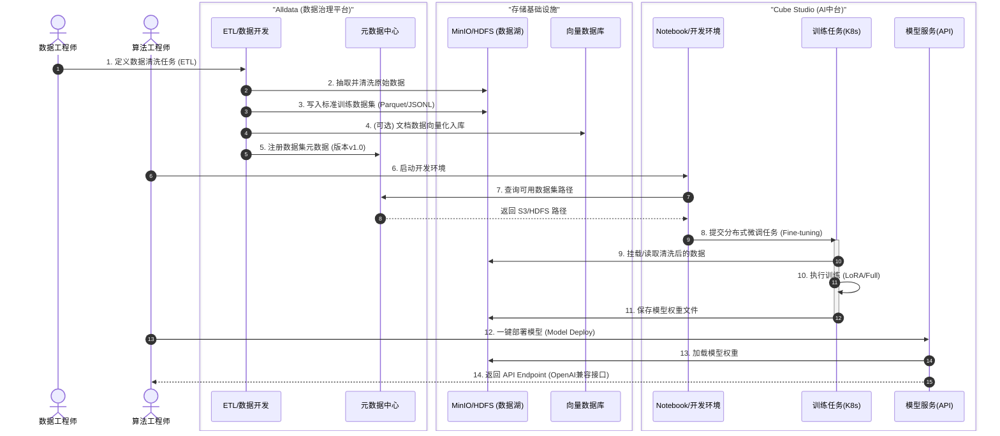

# 系统时序图

本文档包含两个核心场景的详细时序图，展示 Alldata、Cube Studio 和 Bisheng 三者如何协同工作。

---

## 场景一：研发态（Build Phase）

**数据清洗与模型生产流水线**

这个流程展示了数据工程师和算法工程师如何协作，将原始数据转化为可用的模型服务。

### 流程解析

**阶段1：数据准备 (步骤 1-5)**
- **Alldata** 负责把"脏数据"变成"标准数据"并入库（MinIO 或 向量库）
- **Alldata** 将数据位置通知给元数据中心，打破数据与算法的壁垒

**阶段2：模型开发与微调 (步骤 6-11)**
- **Cube Studio** 直接消费 Alldata 产出的数据进行训练
- 训练任务自动挂载存储，无需手动下载数据
- 模型权重保存回共享存储

**阶段3：模型服务化 (步骤 12-14)**
- 一键部署模型为 API 服务
- 暴露 OpenAI 兼容接口供上层应用调用

---

## 场景二：运行态（Run Phase）

**智能应用交互 (RAG + Text-to-SQL)**

这个流程展示了最终用户如何在 Bisheng 构建的应用中，同时利用非结构化知识（RAG）和结构化数据（SQL）。

### 流程解析

**用户提问 (步骤 1)**
- 用户提出复杂的混合问题，涉及数据查询和知识检索

**分支A：结构化数据查询 (步骤 2-4)**
- **Agent_SQL** 负责处理数值查询部分
- 调用 **LLM_API** 生成 SQL（注入元数据 Schema）
- 在 **DataWarehouse** 中执行查询获取结果

**分支B：非结构化知识检索 (步骤 5-6)**
- **Agent_RAG** 负责处理文档知识部分
- 在 **VectorDB** 中进行向量相似度检索

**最终合成 (步骤 7-9)**
- **App_Flow** 整合 SQL 结果和检索到的文档片段
- 组装完整 Prompt 调用 **LLM_API** 生成最终回答
- 返回给用户自然语言的分析结果

---

## 价值链总结

通过这两个时序图可以看出：

1. **Alldata 是"供货商"**：保证原材料（数据）的质量和供给。
2. **Cube Studio 是"加工厂"**：提供机器（算力）和工艺（模型），把原材料变成能力（API）。
3. **Bisheng 是"零售商"**：把能力包装成产品（App），直接服务消费者（用户）。

这种架构实现了**数据流、模型流、业务流**的完美闭环。
