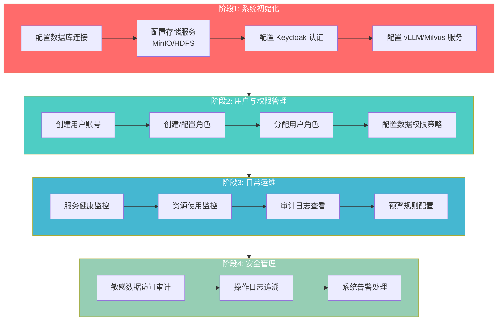
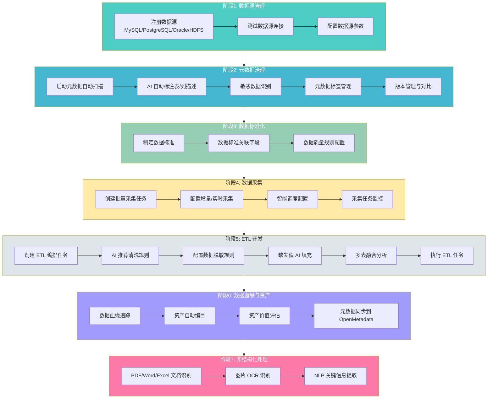
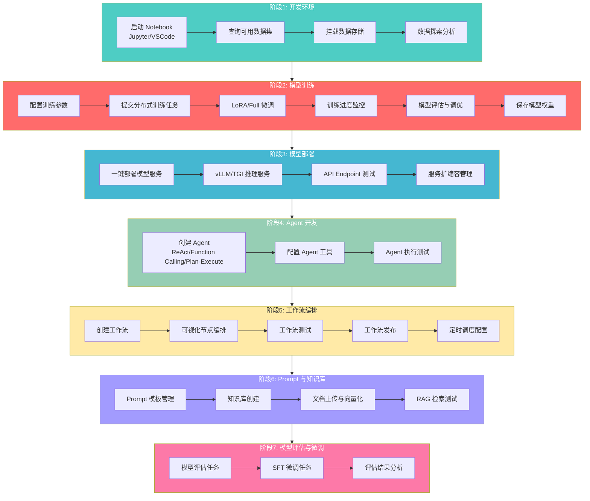
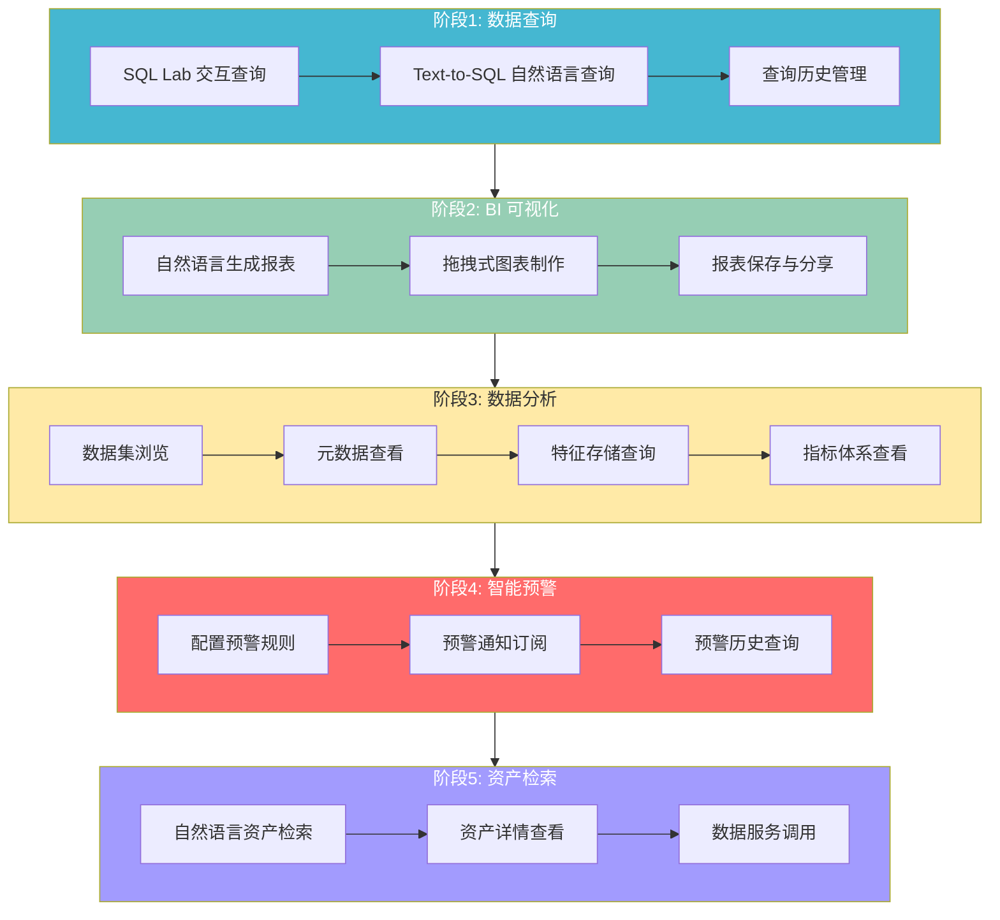
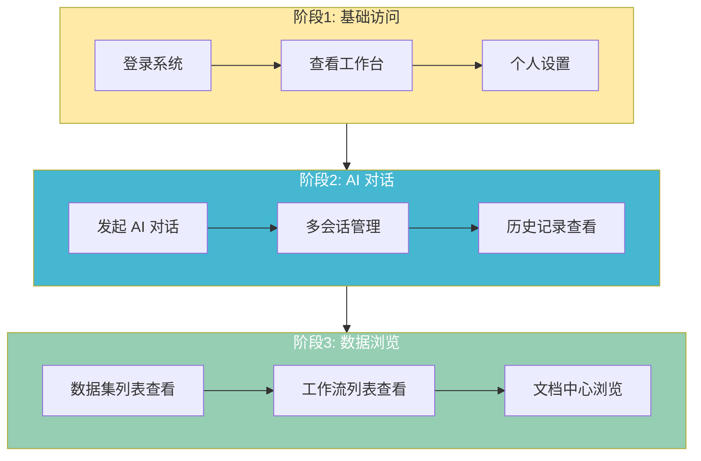
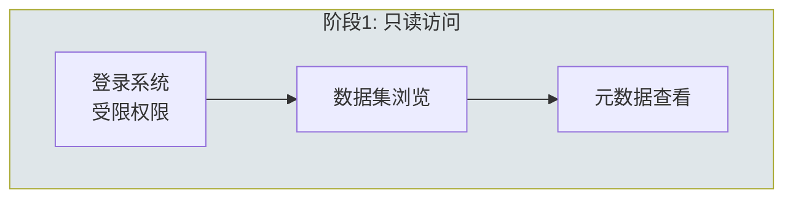

# ONE-DATA-STUDIO 用户全生命周期文档

## 概述

本文档描述 ONE-DATA-STUDIO 平台中所有角色用户的全生命周期，包括用户创建、激活、角色分配、日常使用、权限变更、停用和删除等各个阶段，以及基于 Keycloak OAuth2/OIDC 的认证流程和 RBAC 权限控制。

---

## 1. 用户角色体系

### 1.1 预定义系统角色

| 角色名称 | 显示名称 | 优先级 | 描述 |
|---------|---------|-------|------|
| admin | 管理员 | 100 | 系统管理员，拥有所有权限 |
| data_engineer | 数据工程师 | 50 | 数据集和元数据管理权限 |
| ai_developer | AI开发者 | 50 | 工作流和聊天权限 |
| data_analyst | 数据分析师 | 30 | 只读权限 |
| user | 普通用户 | 10 | 基础权限 |
| guest | 访客 | 0 | 只读部分资源 |

### 1.2 角色与业务场景映射

| 系统角色 | 对应业务场景 | 核心职责 |
|---------|------------|---------|
| admin | 系统管理员 | 系统配置、权限管理、运维监控、审计 |
| data_engineer | 数据工程师 + 数据管理员 | 数据采集、ETL、治理、元数据、安全 |
| ai_developer | AI 开发者 + 算法工程师 | 模型开发、训练、部署、Agent、工作流 |
| data_analyst | 数据分析师 + 业务用户 | BI 分析、报表、查询、预警 |
| user | 普通用户 | 基础功能使用、AI 对话、数据查看 |
| guest | 访客 | 只读浏览 |

### 1.3 资源类型

| 资源代码 | 资源名称 | 描述 |
|---------|---------|------|
| `dataset` | 数据集 | 数据集资源 |
| `metadata` | 元数据 | 元数据资源 |
| `workflow` | 工作流 | 工作流资源 |
| `chat` | 聊天 | AI 聊天资源 |
| `model` | 模型 | 模型资源 |
| `prompt_template` | Prompt模板 | Prompt 模板资源 |
| `user` | 用户 | 用户资源 |
| `system` | 系统 | 系统资源 |
| `role` | 角色 | 角色资源 |

### 1.4 操作类型

| 操作代码 | 操作名称 | 描述 |
|---------|---------|------|
| `create` | 创建 | 创建资源 |
| `read` | 读取 | 读取资源 |
| `update` | 更新 | 更新资源 |
| `delete` | 删除 | 删除资源 |
| `execute` | 执行 | 执行操作 |
| `manage` | 管理 | 管理操作 |
| `config` | 配置 | 配置操作 |
| `audit` | 审计 | 审计操作 |
| `admin` | 系统管理 | 系统管理操作 |

---

## 2. 用户生命周期阶段

### 2.1 用户状态转换图


### 2.2 创建阶段

**触发方式：**
- 管理员通过系统管理界面手动创建
- 自助注册（如启用）
- LDAP/Keycloak 同步

**系统动作：**
1. 创建用户记录，包含：
   - `user_id`: 用户唯一标识
   - `username`: 用户名
   - `email`: 邮箱
   - `display_name`: 显示名称
   - `department`: 部门
   - `position`: 职位
2. 分配默认角色（通常是 `user`）
3. 设置初始状态为 `pending` 或 `active`
4. 记录创建者 `created_by` 和创建时间 `created_at`

**涉及接口：**
- `POST /api/v1/users` - 创建用户
- `POST /api/v1/users/{id}/roles` - 分配角色

**数据模型：**
```python
class User(Base):
    user_id: String(64)          # 用户唯一标识
    username: String(128)         # 用户名
    email: String(255)            # 邮箱
    display_name: String(128)     # 显示名称
    department: String(128)       # 部门
    position: String(128)         # 职位
    status: String(32)            # 状态: active, inactive, locked, deleted
    last_login_at: TIMESTAMP      # 最后登录时间
    last_login_ip: String(64)     # 最后登录IP
    login_count: Integer          # 登录次数
    failed_login_count: Integer   # 登录失败次数
    locked_until: TIMESTAMP       # 锁定截止时间
    created_by: String(128)       # 创建者
    created_at: TIMESTAMP         # 创建时间
```

### 2.3 激活阶段

**场景：**
- 新用户首次登录
- 被停用用户重新激活

**系统动作：**
1. 验证用户身份（通过 Keycloak OAuth2）
2. 状态更新为 `active`
3. 记录激活时间 `last_login_at`
4. 重置失败登录计数 `failed_login_count = 0`

### 2.4 角色分配阶段

**触发方式：**
- 创建时分配默认角色
- 管理员手动调整
- 通过用户组继承角色

**涉及功能：**
- `POST /api/v1/users/{id}/roles` - 分配角色
- `DELETE /api/v1/users/{id}/roles/{role_id}` - 撤销角色
- 用户组管理

**角色继承关系：**


### 2.5 日常使用阶段

#### 2.5.1 登录认证流程


#### 2.5.2 权限验证流程

每个 API 请求的权限验证步骤：


#### 2.5.3 权限装饰器使用

**后端权限验证装饰器：**

```python
# JWT 认证装饰器
@require_jwt(optional=False)
def api_endpoint():
    user = g.user          # 当前用户
    roles = g.roles        # 用户角色列表
    user_id = g.user_id    # 用户ID

# 角色验证装饰器
@require_role("admin", "super_admin")
def admin_only_endpoint():
    pass

# 权限验证装饰器
@require_permission(Resource.DATASET, Operation.CREATE)
def create_dataset():
    pass

# 多权限验证（满足其一即可）
@require_any_permission(
    (Resource.DATASET, Operation.UPDATE),
    (Resource.DATASET, Operation.DELETE)
)
def update_or_delete_dataset():
    pass

# 资源所有者或管理员验证
@owner_or_admin("id", get_resource_owner=get_dataset_owner)
def delete_dataset():
    pass
```

**前端权限检查：**

```typescript
// 使用 AuthContext 进行权限检查
const { user, hasRole, hasAnyRole } = useAuth();

// 检查角色
if (hasRole('admin')) {
  // 显示管理员功能
}

// 检查多个角色（满足其一）
if (hasAnyRole(['data_engineer', 'ai_developer'])) {
  // 显示功能
}

// 使用 ProtectedRoute 组件保护路由
<ProtectedRoute requireAuth={true} requiredRoles={['admin']}>
  <AdminPage />
</ProtectedRoute>
```

### 2.6 权限变更阶段

**触发场景：**
- 职位调整
- 项目角色变化
- 临时权限授予/撤销

**系统动作：**
1. 更新用户角色关联
2. 清除权限缓存
3. 记录审计日志

**涉及接口：**
- `POST /api/v1/users/{id}/roles` - 添加角色
- `DELETE /api/v1/users/{id}/roles/{role_id}` - 移除角色
- `PUT /api/v1/users/{id}` - 更新用户信息

### 2.7 停用/锁定阶段

**触发场景：**
- 管理员手动停用
- 密码多次错误（自动锁定）
- 长时间未登录（策略）

**用户状态：**
- `inactive` - 停用
- `locked` - 锁定（临时）

**系统动作：**
- 状态更新
- Token 失效
- 拒绝登录请求

**锁定机制：**
```python
# 登录失败次数达到阈值自动锁定
MAX_FAILED_LOGIN = 5
LOCK_DURATION_MINUTES = 30

if failed_login_count >= MAX_FAILED_LOGIN:
    status = 'locked'
    locked_until = now() + timedelta(minutes=LOCK_DURATION_MINUTES)
```

### 2.8 删除阶段

**触发方式：**
- 管理员手动删除（软删除）
- 数据保留期到期

**用户状态：**
- `deleted` - 已删除

**系统动作：**
- 标记为 `deleted`
- 保留审计记录
- 撤销所有访问权限

---

## 3. 认证与授权流程

### 3.1 Keycloak OAuth2/OIDC 认证

**配置参数：**

| 参数 | 默认值 | 描述 |
|-----|-------|------|
| `KEYCLOAK_URL` | `/auth` | Keycloak 服务器地址 |
| `KEYCLOAK_REALM` | `one-data-studio` | Realm 名称 |
| `KEYCLOAK_CLIENT_ID` | `web-frontend` | 客户端 ID |

**认证流程：**

1. **前端发起登录请求**
```typescript
// 构建登录 URL
const loginUrl = buildLoginUrl();
// 跳转到 Keycloak 登录页
window.location.href = loginUrl;
```

2. **Keycloak 返回授权码**
```
GET /callback?code=xxx&state=yyy
```

3. **前端交换 Token**
```typescript
// 使用授权码交换 access_token
const response = await fetch(tokenEndpoint, {
  method: 'POST',
  body: new URLSearchParams({
    grant_type: 'authorization_code',
    code: code,
    client_id: clientId,
    redirect_uri: redirectUri,
  }),
});
```

4. **后端验证 JWT**
```python
# 使用 RS256 公钥验证 JWT 签名
payload = jwt.decode(
    token,
    public_key,
    algorithms=["RS256"],
    audience=JWT_ALLOWED_AUDIENCES,
    issuer=f"{KEYCLOAK_URL}/realms/{KEYCLOAK_REALM}",
)
```

### 3.2 Token 刷新机制

**自动刷新策略：**
- Token 有效期检测（提前 30 秒刷新）
- 自动刷新间隔：30 秒
- 刷新失败时跳转登录

```typescript
// AuthContext 自动刷新
useEffect(() => {
  if (!autoRefresh || !authenticated) return;

  const interval = setInterval(async () => {
    const token = getAccessToken();
    if (token) {
      const payload = JSON.parse(atob(token.split('.')[1]));
      const expiresAt = payload.exp * 1000;
      const now = Date.now();

      // 提前 30 秒刷新
      if (expiresAt - now < 30 * 1000) {
        await refresh();
      }
    }
  }, 30000);

  return () => clearInterval(interval);
}, [authenticated, autoRefresh, refresh]);
```

### 3.3 安全特性

1. **HttpOnly Cookie** - refresh_token 存储在 HttpOnly Cookie 中，防止 XSS 攻击
2. **CSRF 保护** - 使用 state 参数验证 OAuth2 流程
3. **JWT 签名验证** - 使用 Keycloak RS256 公钥验证
4. **Token 过期检测** - 自动检测并刷新过期 Token
5. **严格认证模式** - 生产环境强制认证，除非明确标记为公开端点

---

## 4. 角色权限矩阵

### 4.1 数据集权限

| 角色 | 创建 | 读取 | 更新 | 删除 | 执行 |
|-----|-----|-----|-----|-----|-----|
| admin | ✅ | ✅ | ✅ | ✅ | ✅ |
| data_engineer | ✅ | ✅ | ✅ | ✅ | - |
| ai_developer | - | ✅ | - | - | - |
| data_analyst | - | ✅ | - | - | - |
| user | - | ✅ | - | - | - |
| guest | - | ✅ | - | - | - |

### 4.2 元数据权限

| 角色 | 创建 | 读取 | 更新 | 删除 |
|-----|-----|-----|-----|-----|
| admin | ✅ | ✅ | ✅ | ✅ |
| data_engineer | ✅ | ✅ | - | - |
| ai_developer | - | ✅ | - | - |
| data_analyst | - | ✅ | - | - |
| user | - | - | - | - |
| guest | - | ✅ | - | - |

### 4.3 工作流权限

| 角色 | 创建 | 读取 | 更新 | 删除 | 执行 |
|-----|-----|-----|-----|-----|-----|
| admin | ✅ | ✅ | ✅ | ✅ | ✅ |
| data_engineer | - | ✅ | - | - | - |
| ai_developer | ✅ | ✅ | ✅ | - | ✅ |
| data_analyst | - | ✅ | - | - | - |
| user | - | ✅ | - | - | - |
| guest | - | - | - | - | - |

### 4.4 聊天权限

| 角色 | 执行 |
|-----|-----|
| admin | ✅ |
| data_engineer | ✅ |
| ai_developer | ✅ |
| data_analyst | - |
| user | ✅ |
| guest | - |

### 4.5 用户管理权限

| 角色 | 创建 | 读取 | 更新 | 删除 | 管理 |
|-----|-----|-----|-----|-----|-----|
| admin | ✅ | ✅ | ✅ | ✅ | ✅ |
| data_engineer | - | - | - | - | - |
| ai_developer | - | - | - | - | - |
| data_analyst | - | - | - | - | - |
| user | - | - | - | - | - |
| guest | - | - | - | - | - |

### 4.6 系统管理权限

| 角色 | 配置 | 审计 | 管理 |
|-----|-----|-----|-----|
| admin | ✅ | ✅ | ✅ |
| data_engineer | - | - | - |
| ai_developer | - | - | - |
| data_analyst | - | - | - |
| user | - | - | - |
| guest | - | - | - |

---

## 5. 功能访问清单

### 5.1 Admin（管理员）

**可访问所有功能模块，包括：**

| 功能模块 | 路由 | 权限 |
|---------|------|------|
| 工作台 | `/` | 查看 |
| 数据管理 | `/data/*` | 全部 |
| 数据开发 | `/data/etl`, `/data/quality` 等 | 全部 |
| 模型开发 | `/model/*` | 全部 |
| 模型服务 | `/model/serving` | 全部 |
| AI 应用 | `/agent/*`, `/chat`, `/agents` | 全部 |
| 运维中心 | `/schedules`, `/executions` | 全部 |
| **用户管理** | `/admin/users` | CRUD |
| **用户组管理** | `/admin/groups` | CRUD |
| **系统设置** | `/admin/settings` | CRUD |
| **审计日志** | `/admin/audit` | 查看 |
| **角色管理** | `/admin/roles` | CRUD |

### 5.2 Data Engineer（数据工程师）

| 功能模块 | 路由 | 权限 |
|---------|------|------|
| 工作台 | `/` | 查看 |
| **数据源** | `/data/datasources` | CRUD |
| **数据集** | `/datasets` | CRUD |
| **元数据** | `/metadata` | CRUD/Read |
| **特征存储** | `/data/features` | Read |
| **数据标准** | `/data/standards` | Read |
| **数据资产** | `/data/assets` | Read |
| **数据服务** | `/data/services` | Read |
| **BI 报表** | `/data/bi` | Read |
| **指标体系** | `/data/metrics` | Read |
| **ETL 任务** | `/data/etl` | CRUD |
| **数据质量** | `/data/quality` | CRUD |
| **数据血缘** | `/data/lineage` | CRUD |
| **离线开发** | `/data/offline` | Read/Execute |
| **实时开发** | `/data/streaming` | Read/Execute |
| **实时 IDE** | `/data/streaming-ide` | Read/Execute |
| **Notebook** | `/model/notebooks` | Read/Execute |
| **SQL Lab** | `/model/sql-lab` | Read/Execute |
| **实验管理** | `/model/experiments` | Read |
| **训练任务** | `/model/training` | Read |
| **模型仓库** | `/model/models` | Read |
| **AIHub** | `/model/aihub` | Read |
| **Pipeline** | `/model/pipelines` | Read |
| **LLM 微调** | `/model/llm-tuning` | Read |
| **在线服务** | `/model/serving` | Read |
| **资源管理** | `/model/resources` | Read |
| **监控告警** | `/model/monitoring` | Read |
| **AI 对话** | `/chat` | Execute |
| **Prompt 管理** | `/agent/prompts` | Read |
| **知识库** | `/agent/knowledge` | Read |
| **模型评估** | `/agent/evaluation` | Read |
| **SFT 微调** | `/agent/sft` | Read |
| **Agent** | `/agents` | Read |
| **工作流** | `/workflows` | Read |
| **Text2SQL** | `/text2sql` | Read |
| **应用发布** | `/agent/apps` | Read |
| **系统监控** | `/data/monitoring` | Read |
| **调度管理** | `/schedules` | Read |
| **执行记录** | `/executions` | Read |
| **文档中心** | `/documents` | Read |

### 5.3 AI Developer（AI开发者）

| 功能模块 | 路由 | 权限 |
|---------|------|------|
| 工作台 | `/` | 查看 |
| 数据集 | `/datasets` | Read |
| 元数据 | `/metadata` | Read |
| Notebook | `/model/notebooks` | Read/Execute |
| SQL Lab | `/model/sql-lab` | Read/Execute |
| **实验管理** | `/model/experiments` | CRUD |
| **训练任务** | `/model/training` | CRUD |
| 模型仓库 | `/model/models` | Read |
| **AIHub** | `/model/aihub` | Read/Execute |
| **Pipeline** | `/model/pipelines` | CRUD/Execute |
| **LLM 微调** | `/model/llm-tuning` | CRUD |
| **在线服务** | `/model/serving` | CRUD |
| 资源管理 | `/model/resources` | Read |
| 监控告警 | `/model/monitoring` | Read |
| **AI 对话** | `/chat` | Execute |
| **Prompt 管理** | `/agent/prompts` | CRUD |
| **知识库** | `/agent/knowledge` | CRUD |
| **模型评估** | `/agent/evaluation` | Execute |
| **SFT 微调** | `/agent/sft` | Execute |
| **Agent** | `/agents` | Execute |
| **工作流** | `/workflows` | CRUD/Execute |
| **Text2SQL** | `/text2sql` | Execute |
| **应用发布** | `/agent/apps` | CRUD |
| 系统监控 | `/data/monitoring` | Read |
| 调度管理 | `/schedules` | Read |
| 执行记录 | `/executions` | Read |
| 文档中心 | `/documents` | Read |

### 5.4 Data Analyst（数据分析师）

| 功能模块 | 路由 | 权限 |
|---------|------|------|
| 工作台 | `/` | 查看 |
| 数据源 | `/data/datasources` | Read |
| 数据集 | `/datasets` | Read |
| 元数据 | `/metadata` | Read |
| 特征存储 | `/data/features` | Read |
| BI 报表 | `/data/bi` | Read |
| 指标体系 | `/data/metrics` | Read |
| SQL Lab | `/model/sql-lab` | Execute |
| 模型仓库 | `/model/models` | Read |
| 工作流 | `/workflows` | Read |

### 5.5 User（普通用户）

| 功能模块 | 路由 | 权限 |
|---------|------|------|
| 工作台 | `/` | 查看 |
| 数据集 | `/datasets` | Read |
| AI 对话 | `/chat` | Execute |
| 工作流 | `/workflows` | Read |
| 文档中心 | `/documents` | Read |

### 5.6 Guest（访客）

| 功能模块 | 路由 | 权限 |
|---------|------|------|
| 工作台 | `/` | 查看 |
| 数据集 | `/datasets` | Read |
| 元数据 | `/metadata` | Read |

---

## 6. 附录：关键代码位置

### 6.1 后端文件

| 文件路径 | 描述 |
|---------|------|
| `services/shared/auth/permissions.py` | 权限定义和验证装饰器 |
| `services/shared/auth/jwt_middleware.py` | JWT 认证中间件 |
| `services/shared/models/rbac.py` | RBAC 数据模型 |
| `services/admin-api/models/user.py` | 用户数据模型 |
| `services/admin-api/models/role.py` | 角色数据模型 |
| `services/admin-api/models/group.py` | 用户组数据模型 |

### 6.2 前端文件

| 文件路径 | 描述 |
|---------|------|
| `web/src/contexts/AuthContext.tsx` | 认证上下文 |
| `web/src/services/auth.ts` | Keycloak 认证服务 |
| `web/src/components/layout/Sidebar.tsx` | 侧边栏菜单 |
| `web/src/pages/admin/` | 管理页面 |
| `web/src/components/ProtectedRoute.tsx` | 路由守卫组件 |

### 6.3 API 端点

| 端点 | 方法 | 描述 |
|-----|------|------|
| `/api/v1/auth/login` | POST | 登录（开发模式） |
| `/api/v1/auth/refresh` | POST | 刷新 Token |
| `/api/v1/auth/logout` | POST | 登出 |
| `/api/v1/users` | GET/POST | 用户列表/创建 |
| `/api/v1/users/{id}` | GET/PUT/DELETE | 用户详情/更新/删除 |
| `/api/v1/users/{id}/roles` | POST/DELETE | 分配/撤销角色 |
| `/api/v1/roles` | GET/POST | 角色列表/创建 |
| `/api/v1/permissions` | GET | 权限列表 |

---

## 7. 配置参考

### 7.1 环境变量

| 变量名 | 默认值 | 描述 |
|-------|-------|------|
| `KEYCLOAK_URL` | `/auth` | Keycloak 服务器地址 |
| `KEYCLOAK_REALM` | `one-data-studio` | Realm 名称 |
| `KEYCLOAK_CLIENT_ID` | `web-frontend` | 客户端 ID |
| `STRICT_AUTH_MODE` | `false` | 严格认证模式 |
| `PUBLIC_API_ENDPOINTS` | - | 公开 API 端点列表 |
| `JWT_ALLOWED_AUDIENCES` | `account,web-frontend` | 允许的 Token 受众 |

### 7.2 前端配置

```typescript
// web/.env.development
VITE_KEYCLOAK_URL=http://localhost:8080/auth
VITE_KEYCLOAK_REALM=one-data-studio
VITE_KEYCLOAK_CLIENT_ID=web-frontend
```

```typescript
// web/.env.production
VITE_KEYCLOAK_URL=https://keycloak.example.com
VITE_KEYCLOAK_REALM=one-data-studio
VITE_KEYCLOAK_CLIENT_ID=web-frontend
```

---

## 8. 安全最佳实践

1. **使用 HttpOnly Cookie 存储 refresh_token** - 防止 XSS 攻击窃取刷新令牌
2. **启用 CSRF 保护** - 使用 state 参数验证 OAuth2 流程
3. **实施严格的 Token 验证** - 验证 JWT 签名、过期时间、签发者
4. **定期轮换密钥** - Keycloak 密钥定期轮换，系统支持多密钥验证
5. **限制权限范围** - 使用最小权限原则，按需分配
6. **审计日志记录** - 记录所有敏感操作
7. **自动锁定机制** - 多次登录失败自动锁定账户
8. **生产环境严格模式** - 启用 `STRICT_AUTH_MODE`，除非明确标记否则所有端点需要认证

---

## 9. 各角色全生命周期流程

本节详细描述每个系统角色在平台中的完整使用流程，从入职到日常操作的各个阶段。

### 9.1 Admin（管理员）全生命周期

管理员负责系统的整体配置、用户管理、运维监控和安全审计。



**阶段详情：**

| 阶段 | 核心任务 | 涉及功能模块 |
|-----|---------|-------------|
| 系统初始化 | 配置基础设施连接 | 系统设置、数据源管理 |
| 用户与权限管理 | 创建用户、分配角色 | 用户管理、角色管理、权限配置 |
| 日常运维 | 监控系统状态 | 系统监控、审计日志、预警管理 |
| 安全管理 | 审计与追溯 | 安全审计、敏感数据管理 |

---

### 9.2 Data Engineer（数据工程师）全生命周期

数据工程师负责数据采集、ETL 开发、元数据治理和数据资产管理。



**阶段详情：**

| 阶段 | 核心任务 | 涉及功能模块 |
|-----|---------|-------------|
| 数据源管理 | 注册和配置数据源 | 数据源管理 |
| 元数据治理 | 扫描、标注、版本管理 | 元数据智能识别、标签管理、版本管理 |
| 数据标准化 | 制定并落地数据标准 | 数据标准智能落地 |
| 数据采集 | 配置采集任务和调度 | 多源数据智能采集、智能调度 |
| ETL 开发 | 清洗、转换、融合 | AI 辅助清洗、字段映射、数据融合、缺失值填充 |
| 数据血缘与资产 | 追踪血缘、编目资产 | 数据血缘追踪、资产智能编目 |
| 非结构化处理 | OCR 识别和信息提取 | OCR 文档识别、NLP 提取 |

---

### 9.3 AI Developer（AI 开发者）全生命周期

AI 开发者负责模型训练、部署、Agent 开发和工作流编排。



**阶段详情：**

| 阶段 | 核心任务 | 涉及功能模块 |
|-----|---------|-------------|
| 开发环境 | 启动 IDE、探索数据 | Notebook、数据集管理 |
| 模型训练 | 配置训练、监控进度 | 模型训练、实验管理、LLM 微调 |
| 模型部署 | 部署推理服务 | 模型部署、在线服务 |
| Agent 开发 | 创建和测试 Agent | Agent 管理、工具配置 |
| 工作流编排 | 编排和发布工作流 | 工作流编排、调度管理 |
| Prompt 与知识库 | 管理 Prompt 和知识库 | Prompt 管理、知识库管理、RAG |
| 模型评估与微调 | 评估和微调模型 | 模型评估、SFT 微调 |

---

### 9.4 Data Analyst（数据分析师）全生命周期

数据分析师负责 BI 分析、报表制作、数据查询和智能预警。



**阶段详情：**

| 阶段 | 核心任务 | 涉及功能模块 |
|-----|---------|-------------|
| 数据查询 | SQL 和自然语言查询 | SQL Lab、Text-to-SQL |
| BI 可视化 | 制作报表和图表 | BI 智能可视化 |
| 数据分析 | 浏览数据和指标 | 数据集、元数据、特征存储、指标体系 |
| 智能预警 | 配置和订阅预警 | 智能预警推送 |
| 资产检索 | 检索和使用数据资产 | 资产 AI 检索、数据服务 |

---

### 9.5 User（普通用户）全生命周期

普通用户使用平台的基础功能，包括 AI 对话和数据浏览。



**阶段详情：**

| 阶段 | 核心任务 | 涉及功能模块 |
|-----|---------|-------------|
| 基础访问 | 登录和基础设置 | 认证、工作台 |
| AI 对话 | 与 AI 进行对话 | 聊天对话 |
| 数据浏览 | 查看数据和文档 | 数据集、工作流、文档中心 |

---

### 9.6 Guest（访客）全生命周期

访客拥有最小权限，仅可进行只读浏览。



**阶段详情：**

| 阶段 | 核心任务 | 涉及功能模块 |
|-----|---------|-------------|
| 只读访问 | 浏览公开数据 | 数据集（只读）、元数据（只读） |

---

## 10. 功能模块覆盖矩阵

本节展示 8 大功能模块与 6 种系统角色的完整覆盖关系，确保所有功能都有对应角色可访问。

**图例说明：**
- ✓ = 完全权限（CRUD + 执行）
- R = 只读权限
- E = 执行权限
- `-` = 无权限

### 10.1 一、数据规划与元数据管理

| 功能模块 | admin | data_engineer | ai_developer | data_analyst | user | guest |
|---------|:-----:|:-------------:|:------------:|:------------:|:----:|:-----:|
| 元数据智能识别引擎 | ✓ | ✓ | R | R | - | R |
| 元数据标签与版本管理 | ✓ | ✓ | R | R | - | R |
| 数据标准智能落地 | ✓ | ✓ | - | R | - | - |
| Kettle 联动 | ✓ | ✓ | - | - | - | - |

### 10.2 二、数据感知汇聚

| 功能模块 | admin | data_engineer | ai_developer | data_analyst | user | guest |
|---------|:-----:|:-------------:|:------------:|:------------:|:----:|:-----:|
| 多源数据智能采集 | ✓ | ✓ | - | - | - | - |
| 采集任务智能调度 | ✓ | ✓ | - | - | - | - |

### 10.3 三、数据加工融合

| 功能模块 | admin | data_engineer | ai_developer | data_analyst | user | guest |
|---------|:-----:|:-------------:|:------------:|:------------:|:----:|:-----:|
| AI 辅助清洗规则 | ✓ | ✓ | - | - | - | - |
| 字段转换智能映射 | ✓ | ✓ | - | - | - | - |
| 多源数据智能融合 | ✓ | ✓ | - | - | - | - |
| 缺失值 AI 填充 | ✓ | ✓ | - | - | - | - |
| OCR 文档识别 | ✓ | ✓ | R | - | - | - |
| ETL 可视化编排 | ✓ | ✓ | - | - | - | - |

### 10.4 四、数据分析挖掘（AI+BI）

| 功能模块 | admin | data_engineer | ai_developer | data_analyst | user | guest |
|---------|:-----:|:-------------:|:------------:|:------------:|:----:|:-----:|
| BI 智能可视化 | ✓ | R | R | ✓ | R | R |
| AI 预测与分群 | ✓ | R | ✓ | ✓ | - | - |
| 智能预警推送 | ✓ | R | R | ✓ | - | - |
| 指标体系管理 | ✓ | ✓ | R | ✓ | - | - |
| Text-to-SQL | ✓ | ✓ | ✓ | ✓ | - | - |

### 10.5 五、数据资产

| 功能模块 | admin | data_engineer | ai_developer | data_analyst | user | guest |
|---------|:-----:|:-------------:|:------------:|:------------:|:----:|:-----:|
| 资产智能编目 | ✓ | ✓ | R | R | - | - |
| 资产 AI 检索 | ✓ | ✓ | ✓ | ✓ | R | R |
| 数据血缘追踪 | ✓ | ✓ | R | R | - | - |
| 数据服务接口 | ✓ | ✓ | R | ✓ | - | - |

### 10.6 六、数据安全管理

| 功能模块 | admin | data_engineer | ai_developer | data_analyst | user | guest |
|---------|:-----:|:-------------:|:------------:|:------------:|:----:|:-----:|
| 敏感数据 AI 识别 | ✓ | ✓ | - | - | - | - |
| 权限智能管控 | ✓ | - | - | - | - | - |
| SSO 单点登录 | ✓ | ✓ | ✓ | ✓ | ✓ | ✓ |
| 审计与追溯 | ✓ | R | - | - | - | - |

### 10.7 七、智能训推平台（MLOps）

| 功能模块 | admin | data_engineer | ai_developer | data_analyst | user | guest |
|---------|:-----:|:-------------:|:------------:|:------------:|:----:|:-----:|
| 用户/角色/权限 | ✓ | - | - | - | - | - |
| Notebook | ✓ | ✓ | ✓ | R | - | - |
| 模型训练 | ✓ | R | ✓ | - | - | - |
| 模型部署 | ✓ | R | ✓ | - | - | - |
| Pipeline | ✓ | R | ✓ | - | - | - |
| LLM 微调 | ✓ | R | ✓ | - | - | - |
| 资源管理 | ✓ | R | R | - | - | - |

### 10.8 八、AI 应用开发平台（Agent）

| 功能模块 | admin | data_engineer | ai_developer | data_analyst | user | guest |
|---------|:-----:|:-------------:|:------------:|:------------:|:----:|:-----:|
| Agent 管理 | ✓ | R | ✓ | - | - | - |
| 工作流编排 | ✓ | R | ✓ | R | R | - |
| 聊天对话 | ✓ | E | E | - | E | - |
| 知识库管理 | ✓ | R | ✓ | R | - | - |
| Prompt 管理 | ✓ | R | ✓ | - | - | - |
| 调度和执行 | ✓ | R | ✓ | R | - | - |

---

### 10.9 功能覆盖统计

| 角色 | 完全权限 | 只读权限 | 执行权限 | 总覆盖功能 |
|-----|:-------:|:-------:|:-------:|:--------:|
| admin | 35 | 0 | 0 | 35 (100%) |
| data_engineer | 16 | 18 | 1 | 35 (100%) |
| ai_developer | 12 | 11 | 1 | 24 (69%) |
| data_analyst | 6 | 10 | 0 | 16 (46%) |
| user | 0 | 4 | 1 | 5 (14%) |
| guest | 0 | 5 | 0 | 5 (14%) |

---

*文档版本: 2.0*
*最后更新: 2026-01-29*
*维护者: ONE-DATA-STUDIO 团队*
