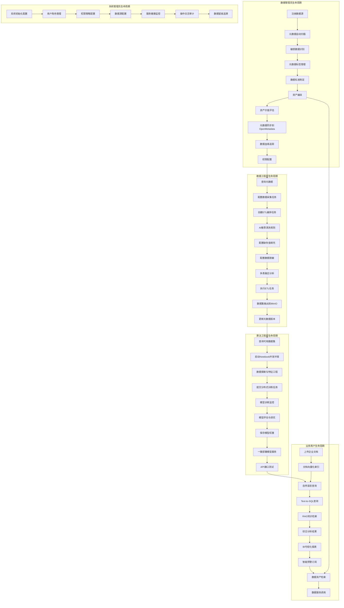
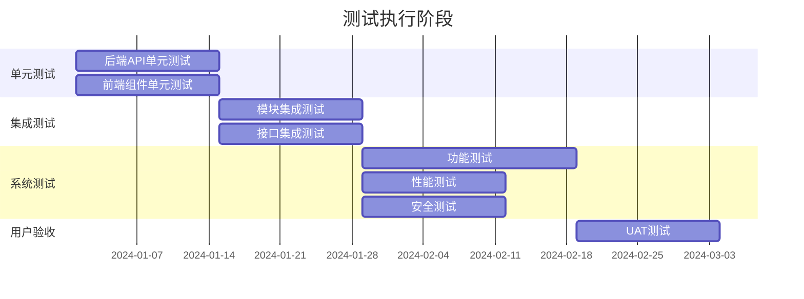

# 用户全生命周期测试用例文档

本文档基于 `docs/02-integration/sequence-diagrams.md` 和 `docs/智能大数据平台建设内容v2.txt` 梳理不同用户角色的全生命周期，并生成覆盖所有功能的测试用例。

---

## 一、用户角色定义

| 角色 | 职责 | 主要使用模块 |
|------|------|--------------|
| **数据工程师** | 数据采集、ETL开发、数据清洗、数据融合 | 数据感知汇聚、数据加工融合、元数据管理 |
| **算法工程师** | 模型开发、训练、调优、部署 | Cube Studio (Notebook/训练/服务) |
| **数据管理员** | 元数据治理、数据资产、数据安全、标准制定 | 元数据管理、数据资产、数据安全管理 |
| **业务用户** | 数据查询、报表分析、智能问答 | AI+BI分析、智能查询、知识库 |
| **系统管理员** | 系统配置、权限管理、运维监控 | 权限管控、系统配置 |

---

## 二、用户全生命周期流程图

---

## 三、功能模块与测试用例映射

### 功能覆盖矩阵

| 功能模块 | 数据管理员 | 数据工程师 | 算法工程师 | 业务用户 | 系统管理员 |
|----------|:----------:|:----------:|:----------:|:--------:|:----------:|
| 数据源管理 | ✓ | ✓ | - | - | ✓ |
| 元数据自动扫描 | ✓ | ✓ | - | - | - |
| 敏感数据识别 | ✓ | ✓ | - | - | - |
| 元数据标签管理 | ✓ | ✓ | - | - | - |
| 数据标准管理 | ✓ | - | - | - | - |
| 数据采集任务 | - | ✓ | - | - | - |
| ETL编排 | - | ✓ | - | - | - |
| AI清洗规则推荐 | - | ✓ | - | - | - |
| 缺失值AI填充 | - | ✓ | - | - | - |
| 数据脱敏 | ✓ | ✓ | - | - | - |
| 多表融合 | - | ✓ | - | - | - |
| 元数据同步 | ✓ | - | - | - | - |
| 数据血缘 | ✓ | ✓ | - | - | - |
| 资产编目 | ✓ | - | - | ✓ | - |
| 资产价值评估 | ✓ | - | - | - | - |
| Notebook开发 | - | - | ✓ | - | - |
| 模型训练 | - | - | ✓ | - | - |
| 模型部署 | - | - | ✓ | - | - |
| 知识库文档上传 | - | - | - | ✓ | - |
| 向量索引构建 | - | - | - | ✓ | - |
| Text-to-SQL | - | - | - | ✓ | - |
| RAG检索 | - | - | - | ✓ | - |
| BI可视化 | - | - | - | ✓ | - |
| 智能预警 | - | - | - | ✓ | ✓ |
| 权限管理 | - | - | - | - | ✓ |
| 操作审计 | - | - | - | - | ✓ |
| 数据留痕 | ✓ | - | - | - | ✓ |

---

## 四、详细测试用例

### 4.1 数据管理员生命周期测试用例

#### 4.1.1 数据源管理模块

| 用例ID | 用例名称 | 前置条件 | 测试步骤 | 预期结果 | 优先级 |
|--------|----------|----------|----------|----------|--------|
| DM-DS-001 | 注册MySQL数据源 | 用户已登录，具有数据管理员权限 | 1. 进入数据源管理页面 2. 点击"新增数据源" 3. 选择MySQL类型 4. 填写连接信息(host/port/user/password/database) 5. 点击"测试连接" 6. 点击"保存" | 1. 连接测试成功 2. 数据源创建成功，返回datasource_id 3. 数据源列表显示新增记录 | P0 |
| DM-DS-002 | 注册PostgreSQL数据源 | 同上 | 同上，选择PostgreSQL类型 | 同上 | P0 |
| DM-DS-003 | 注册Oracle数据源 | 同上 | 同上，选择Oracle类型 | 同上 | P1 |
| DM-DS-004 | 数据源连接测试失败 | 用户已登录 | 1. 新增数据源 2. 填写错误的连接信息 3. 点击"测试连接" | 返回连接失败错误信息，提示具体原因 | P0 |
| DM-DS-005 | 编辑数据源配置 | 已存在数据源 | 1. 选择已有数据源 2. 修改连接参数 3. 保存 | 配置更新成功 | P1 |
| DM-DS-006 | 删除数据源 | 已存在未被引用的数据源 | 1. 选择数据源 2. 点击删除 3. 确认删除 | 数据源删除成功 | P1 |
| DM-DS-007 | 删除被引用的数据源 | 数据源已被ETL任务引用 | 1. 选择数据源 2. 点击删除 | 提示"数据源正在被使用，无法删除" | P1 |

#### 4.1.2 元数据自动扫描模块

| 用例ID | 用例名称 | 前置条件 | 测试步骤 | 预期结果 | 优先级 |
|--------|----------|----------|----------|----------|--------|
| DM-MS-001 | 启动元数据自动扫描 | 已注册数据源 | 1. 选择数据源 2. 点击"启动自动扫描" 3. 等待扫描完成 | 1. 自动发现所有表结构 2. 自动发现所有列定义 3. 生成MetadataDatabase/Table/Column记录 | P0 |
| DM-MS-002 | AI自动标注表描述 | 扫描完成 | 1. 查看扫描结果 2. 检查表的description字段 | 1. AI自动生成表的业务描述 2. 描述准确反映表的业务含义 | P0 |
| DM-MS-003 | AI自动标注列描述 | 扫描完成 | 1. 查看列详情 2. 检查列的description字段 | 1. AI自动识别列的业务含义 2. 常见列名(id/created_at等)自动标注 | P0 |
| DM-MS-004 | 规则匹配列名识别 | 扫描完成 | 1. 检查id列 2. 检查created_at列 3. 检查updated_at列 | 1. id列自动识别为主键 2. created_at识别为创建时间 3. 规则匹配优先于AI推断 | P1 |
| DM-MS-005 | 增量元数据扫描 | 已完成首次扫描，数据源新增表 | 1. 在数据源新增表 2. 触发增量扫描 | 1. 只扫描新增/变更的表 2. 已有元数据不受影响 | P1 |
| DM-MS-006 | 扫描大规模数据源 | 数据源包含500+表 | 1. 启动扫描 2. 监控扫描进度 | 1. 扫描正常完成 2. 性能在可接受范围内 | P2 |
| DM-MS-007 | 元数据版本记录 | 多次扫描同一数据源 | 1. 首次扫描 2. 修改表结构 3. 再次扫描 | 1. 生成新版本元数据 2. 保留历史版本 3. 支持版本对比 | P1 |

#### 4.1.3 敏感数据识别模块

| 用例ID | 用例名称 | 前置条件 | 测试步骤 | 预期结果 | 优先级 |
|--------|----------|----------|----------|----------|--------|
| DM-SD-001 | 启动敏感数据扫描 | 已完成元数据扫描 | 1. 进入敏感数据管理 2. 点击"启动敏感扫描" 3. 等待扫描完成 | 返回敏感字段统计(PII:x列, 金融:y列, 凭证:z列) | P0 |
| DM-SD-002 | 手机号字段识别 | 表中包含手机号字段 | 1. 执行敏感扫描 2. 查看phone/mobile列 | 1. 自动识别为PII敏感类型 2. 置信度>80% 3. 自动生成partial_mask规则 | P0 |
| DM-SD-003 | 身份证号字段识别 | 表中包含身份证号字段 | 1. 执行敏感扫描 2. 查看id_card列 | 1. 识别为PII敏感类型 2. 生成id_card_mask规则 | P0 |
| DM-SD-004 | 银行卡号字段识别 | 表中包含银行卡号字段 | 1. 执行敏感扫描 2. 查看bank_card列 | 1. 识别为金融敏感类型 2. 生成bank_card_mask规则 | P0 |
| DM-SD-005 | 邮箱字段识别 | 表中包含邮箱字段 | 1. 执行敏感扫描 2. 查看email列 | 1. 识别为PII敏感类型 2. 生成email_mask规则(t***@domain) | P0 |
| DM-SD-006 | 密码/凭证字段识别 | 表中包含password字段 | 1. 执行敏感扫描 2. 查看password列 | 1. 识别为credential敏感类型 2. 敏感级别为restricted | P0 |
| DM-SD-007 | 列名正则匹配 | 列名包含phone/email等关键词 | 1. 执行敏感扫描 | 通过列名模式自动识别敏感类型 | P1 |
| DM-SD-008 | 内容采样匹配 | 列名不含敏感关键词但内容为手机号 | 1. 执行敏感扫描 2. 系统采样200行数据 3. 内容正则匹配 | 1. 通过内容匹配识别敏感字段 2. match_rate>30%时标记敏感 | P1 |
| DM-SD-009 | 置信度计算验证 | 完成敏感扫描 | 1. 查看敏感字段置信度 | confidence = 60 + match_rate × 30 | P2 |
| DM-SD-010 | 自动生成脱敏规则 | 识别出敏感字段 | 1. 查看MaskingRule记录 | 自动生成对应的脱敏规则配置 | P0 |

#### 4.1.4 元数据标签与版本管理模块

| 用例ID | 用例名称 | 前置条件 | 测试步骤 | 预期结果 | 优先级 |
|--------|----------|----------|----------|----------|--------|
| DM-TG-001 | 自动标注分类标签 | 已完成元数据扫描 | 1. 查看表的标签信息 | 基于数据属性自动标注分类标签 | P1 |
| DM-TG-002 | 手动添加标签 | 已有元数据记录 | 1. 选择表/列 2. 添加自定义标签 3. 保存 | 标签添加成功，支持多标签 | P1 |
| DM-TG-003 | 删除标签 | 已有标签 | 1. 选择标签 2. 删除 | 标签删除成功 | P2 |
| DM-TG-004 | 元数据版本回溯 | 存在多个版本 | 1. 查看版本历史 2. 选择历史版本 3. 查看详情 | 能查看任意历史版本的完整元数据 | P1 |
| DM-TG-005 | 版本差异对比 | 存在多个版本 | 1. 选择两个版本 2. 执行对比 | 清晰展示两个版本之间的差异 | P1 |

#### 4.1.5 数据标准管理模块

| 用例ID | 用例名称 | 前置条件 | 测试步骤 | 预期结果 | 优先级 |
|--------|----------|----------|----------|----------|--------|
| DM-ST-001 | 自动生成数据标准 | 已完成元数据分析 | 1. 进入数据标准管理 2. 点击"智能生成标准" | 基于元数据分析生成字段格式规范、编码规则 | P1 |
| DM-ST-002 | 手动创建数据标准 | 用户已登录 | 1. 点击"新增标准" 2. 填写标准信息 3. 保存 | 数据标准创建成功 | P1 |
| DM-ST-003 | 数据标准关联字段 | 已有数据标准和元数据 | 1. 选择数据标准 2. 关联目标字段 | 字段与标准关联成功 | P1 |
| DM-ST-004 | 数据标准合规检查 | 字段已关联标准 | 1. 执行合规检查 | 返回不符合标准的字段列表 | P2 |

#### 4.1.6 资产编目与价值评估模块

| 用例ID | 用例名称 | 前置条件 | 测试步骤 | 预期结果 | 优先级 |
|--------|----------|----------|----------|----------|--------|
| DM-AS-001 | 自动资产编目 | 已完成数据治理 | 1. 进入资产管理 2. 点击"自动编目" | 1. 自动生成DataAsset记录 2. 匹配分类、推断类型、分配负责人 | P0 |
| DM-AS-002 | 资产价值批量评估 | 已完成资产编目 | 1. 点击"批量评估" 2. 等待评估完成 | 1. 计算使用度评分(权重35%) 2. 计算业务度评分(权重30%) 3. 计算质量度评分(权重20%) 4. 计算治理度评分(权重15%) | P0 |
| DM-AS-003 | 使用度评分计算 | 执行价值评估 | 1. 查看使用度评分详情 | 包含：查询次数、活跃用户、下游依赖、复用率 | P1 |
| DM-AS-004 | 业务度评分计算 | 执行价值评估 | 1. 查看业务度评分详情 | 包含：核心指标、SLA等级、业务域重要性 | P1 |
| DM-AS-005 | 质量度评分计算 | 执行价值评估 | 1. 查看质量度评分详情 | 包含：完整性、准确性、一致性、时效性 | P1 |
| DM-AS-006 | 治理度评分计算 | 执行价值评估 | 1. 查看治理度评分详情 | 包含：负责人、描述、血缘、质量规则、安全等级 | P1 |
| DM-AS-007 | 资产评级验证 | 完成价值评估 | 1. 查看资产评级结果 | S级(≥80)/A级(≥60)/B级(≥40)/C级(<40) | P0 |
| DM-AS-008 | 资产价值历史记录 | 多次评估同一资产 | 1. 查看资产价值历史 | 保存AssetValueHistory记录，支持趋势分析 | P2 |

#### 4.1.7 元数据同步与血缘模块

| 用例ID | 用例名称 | 前置条件 | 测试步骤 | 预期结果 | 优先级 |
|--------|----------|----------|----------|----------|--------|
| DM-SY-001 | 同步元数据到OpenMetadata | 已完成元数据扫描 | 1. 点击"同步到OpenMetadata" 2. 等待同步完成 | 1. 创建alldata-service 2. 同步所有表和列 3. 返回同步结果统计 | P0 |
| DM-SY-002 | 服务不存在时自动创建 | OpenMetadata中无对应服务 | 1. 执行同步 | 自动创建MySQL类型的alldata-service | P1 |
| DM-SY-003 | 类型映射正确性 | 执行同步 | 1. 检查同步后的类型 | varchar→VARCHAR, int→INT等映射正确 | P1 |
| DM-SY-004 | 敏感性标签转换 | 存在敏感字段 | 1. 执行同步 2. 检查标签 | pii→PersonalData Tag转换正确 | P1 |
| DM-SY-005 | AI描述同步 | 字段有AI描述 | 1. 执行同步 2. 检查description | AI描述正确合并到OpenMetadata | P1 |
| DM-SY-006 | 数据血缘推送 | 存在ETL任务 | 1. 执行血缘同步 | 1. 提取source_tables→target_tables 2. 创建血缘边(DAG图) 3. 附带transformation SQL | P0 |
| DM-SY-007 | 血缘图可视化 | 已同步血缘 | 1. 在OpenMetadata查看血缘图 | 正确展示数据流向和依赖关系 | P1 |
| DM-SY-008 | 全文搜索索引 | 完成同步 | 1. 在OpenMetadata搜索 | Elasticsearch索引支持全文搜索 | P2 |

#### 4.1.8 权限与安全管理模块

| 用例ID | 用例名称 | 前置条件 | 测试步骤 | 预期结果 | 优先级 |
|--------|----------|----------|----------|----------|--------|
| DM-PM-001 | 配置角色权限 | 系统管理员权限 | 1. 进入权限管理 2. 创建角色 3. 分配权限 | 角色权限配置成功 | P0 |
| DM-PM-002 | 动态权限分配 | 用户已登录 | 1. 根据角色和场景 2. 动态分配数据访问权限 | 权限按规则动态调整 | P1 |
| DM-PM-003 | 敏感数据访问控制 | 存在敏感数据 | 1. 非授权用户访问敏感数据 | 访问被拒绝或返回脱敏数据 | P0 |
| DM-PM-004 | 数据留痕追溯 | 用户执行数据操作 | 1. 查看操作日志 | 任何修改都能追溯到操作人、时间、内容 | P0 |

---

### 4.2 数据工程师生命周期测试用例

#### 4.2.1 数据采集任务模块

| 用例ID | 用例名称 | 前置条件 | 测试步骤 | 预期结果 | 优先级 |
|--------|----------|----------|----------|----------|--------|
| DE-DC-001 | 创建批量数据采集任务 | 已注册数据源 | 1. 进入数据采集 2. 选择数据源和表 3. 配置采集参数 4. 保存任务 | 采集任务创建成功 | P0 |
| DE-DC-002 | 执行数据采集 | 已创建采集任务 | 1. 启动采集任务 2. 等待完成 | 数据正确采集到目标存储 | P0 |
| DE-DC-003 | 增量数据采集 | 已完成首次采集 | 1. 配置增量采集条件 2. 执行增量采集 | 只采集新增/变更数据 | P1 |
| DE-DC-004 | 实时数据采集 | 支持实时采集的数据源 | 1. 配置实时采集 2. 启动采集 | 数据实时同步到目标 | P1 |
| DE-DC-005 | 智能调度触发 | 配置智能调度规则 | 1. 数据源有增量变化 2. 系统自动触发采集 | 根据变化和优先级自动执行 | P1 |
| DE-DC-006 | JSON数据采集 | JSON格式数据源 | 1. 配置JSON输入 2. 执行采集 | 正确解析JSON结构 | P1 |
| DE-DC-007 | 日志文件采集 | 日志文件数据源 | 1. 配置文件输入 2. 执行采集 | 正确解析日志格式 | P2 |
| DE-DC-008 | 外部API数据采集 | 外部开放接口 | 1. 配置API连接 2. 执行采集 | 正确调用API获取数据 | P2 |

#### 4.2.2 ETL编排模块

| 用例ID | 用例名称 | 前置条件 | 测试步骤 | 预期结果 | 优先级 |
|--------|----------|----------|----------|----------|--------|
| DE-ETL-001 | 创建ETL编排任务 | 已有源表数据 | 1. 进入ETL编排 2. 选择源表 3. 配置目标表 4. 保存 | ETL任务创建成功 | P0 |
| DE-ETL-002 | ETL分析阶段 | 创建ETL任务 | 1. 系统分析源表结构 2. 获取敏感标记 3. 获取NULL统计 | 返回完整的分析结果 | P0 |
| DE-ETL-003 | AI推荐清洗规则 | 完成分析阶段 | 1. 调用vLLM获取推荐 2. 查看推荐规则 | 返回：去NULL/去重/格式标准化/异常值处理建议 | P0 |
| DE-ETL-004 | 生成Kettle转换XML | 完成推荐阶段 | 1. 系统生成Kettle XML | 清洗→IfFieldValueIsNull/FilterRows 填充→AnalyticQuery/DBLookup 脱敏→ScriptValueMod | P0 |
| DE-ETL-005 | 执行ETL任务 | 生成Kettle配置 | 1. 提交到Kettle 2. 等待执行完成 | 返回执行报告(处理行数/耗时/成功率) | P0 |
| DE-ETL-006 | 数据清洗-NULL处理 | ETL任务执行 | 1. 检查NULL值处理结果 | NULL值按规则处理(删除/填充) | P0 |
| DE-ETL-007 | 数据清洗-去重 | ETL任务执行 | 1. 检查重复数据处理结果 | 重复记录被正确删除 | P0 |
| DE-ETL-008 | 数据清洗-格式标准化 | ETL任务执行 | 1. 检查格式转换结果 | 数据格式符合标准 | P1 |
| DE-ETL-009 | 数据清洗-异常值处理 | ETL任务执行 | 1. 检查异常值处理结果 | 异常值被识别并处理 | P1 |
| DE-ETL-010 | ETL输出到MinIO | ETL任务完成 | 1. 检查MinIO存储 | 数据集(Parquet/CSV)正确存储 返回S3 presigned URL | P0 |

#### 4.2.3 缺失值AI填充模块

| 用例ID | 用例名称 | 前置条件 | 测试步骤 | 预期结果 | 优先级 |
|--------|----------|----------|----------|----------|--------|
| DE-AI-001 | 缺失模式分析 | 数据存在缺失值 | 1. AIImputationService分析 | 识别缺失模式：random/block/systematic | P0 |
| DE-AI-002 | 均值填充策略 | 数值型缺失 | 1. 选择均值填充 2. 执行填充 | 缺失值用均值填充 | P0 |
| DE-AI-003 | 中位数填充策略 | 数值型缺失 | 1. 选择中位数填充 2. 执行填充 | 缺失值用中位数填充 | P1 |
| DE-AI-004 | KNN填充策略 | 复杂缺失模式 | 1. 选择KNN填充 2. 执行填充 | 基于相似样本填充 | P1 |
| DE-AI-005 | 前向填充策略 | 时序数据缺失 | 1. 选择前向填充 2. 执行填充 | 用前一个有效值填充 | P1 |
| DE-AI-006 | AI预测填充 | 复杂数据模式 | 1. 调用ML预测模型 2. 执行填充 | 基于特征预测填充缺失值 | P2 |

#### 4.2.4 数据脱敏模块

| 用例ID | 用例名称 | 前置条件 | 测试步骤 | 预期结果 | 优先级 |
|--------|----------|----------|----------|----------|--------|
| DE-DM-001 | 手机号脱敏 | 存在手机号字段 | 1. 执行脱敏 2. 检查结果 | 138****1234 格式 | P0 |
| DE-DM-002 | 身份证号脱敏 | 存在身份证字段 | 1. 执行脱敏 2. 检查结果 | 110101****1234 格式 | P0 |
| DE-DM-003 | 银行卡号脱敏 | 存在银行卡字段 | 1. 执行脱敏 2. 检查结果 | 6222****1234 格式 | P0 |
| DE-DM-004 | 邮箱脱敏 | 存在邮箱字段 | 1. 执行脱敏 2. 检查结果 | t***@domain.com 格式 | P0 |
| DE-DM-005 | AES加密脱敏 | 需要可逆脱敏 | 1. 配置AES加密 2. 执行脱敏 | 数据加密存储，支持解密 | P1 |
| DE-DM-006 | SHA256哈希脱敏 | 需要不可逆脱敏 | 1. 配置SHA256 2. 执行脱敏 | 数据哈希后存储 | P1 |
| DE-DM-007 | 自定义正则脱敏 | 特殊格式数据 | 1. 配置自定义正则 2. 执行脱敏 | 按正则规则脱敏 | P2 |

#### 4.2.5 多表融合模块

| 用例ID | 用例名称 | 前置条件 | 测试步骤 | 预期结果 | 优先级 |
|--------|----------|----------|----------|----------|--------|
| DE-FU-001 | 检测JOIN键 | 存在多个相关表 | 1. 调用detect-join-keys 2. 查看候选键 | 返回候选JOIN键列表 | P0 |
| DE-FU-002 | 精确名称匹配 | 列名完全相同 | 1. 检测JOIN键 | confidence=0.95 | P0 |
| DE-FU-003 | 模糊名称匹配 | 列名相似 | 1. 检测JOIN键 2. Levenshtein距离≥0.7 | 识别为候选键 | P1 |
| DE-FU-004 | 语义匹配 | 语义相关列名 | 1. 检测JOIN键 2. user_id ≈ uid | confidence=0.8 | P1 |
| DE-FU-005 | 值级匹配验证 | 候选JOIN键 | 1. 采样1000行 2. 计算overlap_rate | 返回值重叠率 | P1 |
| DE-FU-006 | JOIN质量验证 | 确定JOIN键 | 1. 调用validate-join 2. 查看质量指标 | 返回match_rate/coverage/skew/orphan | P0 |
| DE-FU-007 | JOIN类型推荐 | 完成质量验证 | 1. 查看推荐结果 | 推荐INNER/LEFT/RIGHT JOIN | P1 |
| DE-FU-008 | 生成融合Kettle配置 | 确定融合策略 | 1. 调用generate-kettle-config | 返回JOIN转换Kettle XML + SQL模板 + 索引建议 | P0 |
| DE-FU-009 | 执行多表融合 | 生成融合配置 | 1. 提交Kettle执行 2. 检查结果 | 多表正确融合 | P0 |

#### 4.2.6 非结构化文档处理模块

| 用例ID | 用例名称 | 前置条件 | 测试步骤 | 预期结果 | 优先级 |
|--------|----------|----------|----------|----------|--------|
| DE-OCR-001 | PDF文档OCR识别 | PDF文档 | 1. 上传PDF 2. 执行OCR识别 | 提取文档文本内容 | P1 |
| DE-OCR-002 | Word文档识别 | Word文档 | 1. 上传Word 2. 执行识别 | 提取文档结构和内容 | P1 |
| DE-OCR-003 | Excel文档识别 | Excel文档 | 1. 上传Excel 2. 执行识别 | 提取表格数据 | P1 |
| DE-OCR-004 | 图片OCR识别 | 图片文件 | 1. 上传图片 2. 执行OCR | 提取图片中的文字 | P1 |
| DE-OCR-005 | 扫描件OCR识别 | 扫描件PDF | 1. 上传扫描件 2. 执行OCR | 提取扫描件文字 | P2 |
| DE-OCR-006 | 合同关键信息提取 | 合同文档 | 1. 上传合同 2. 执行NLP提取 | 提取甲方乙方、金额、有效期 | P1 |
| DE-OCR-007 | 发票信息提取 | 发票图片/PDF | 1. 上传发票 2. 执行识别 | 提取开票日期、税额等 | P1 |
| DE-OCR-008 | 非结构化转结构化 | 提取的关键信息 | 1. 匹配标准数据元 2. 生成结构化数据 | 生成标准化数据字段 | P1 |

---

### 4.3 算法工程师生命周期测试用例

#### 4.3.1 开发环境模块

| 用例ID | 用例名称 | 前置条件 | 测试步骤 | 预期结果 | 优先级 |
|--------|----------|----------|----------|----------|--------|
| AE-NB-001 | 启动Notebook开发环境 | 用户已登录 | 1. 进入Cube Studio 2. 创建Notebook 3. 选择资源配置 4. 启动 | Notebook环境成功启动 | P0 |
| AE-NB-002 | 查询可用数据集 | Notebook已启动 | 1. 调用元数据API 2. 获取数据集列表 | 返回可用数据集及S3/HDFS路径 | P0 |
| AE-NB-003 | 挂载数据存储 | 数据集路径已知 | 1. 配置存储挂载 2. 访问数据 | 能直接访问MinIO/HDFS数据 | P0 |
| AE-NB-004 | 数据探索分析 | 已挂载数据 | 1. 加载数据 2. 执行EDA | 能进行数据探索性分析 | P1 |
| AE-NB-005 | 安装Python依赖 | Notebook运行中 | 1. pip install 包 | 依赖安装成功 | P1 |
| AE-NB-006 | GPU资源分配 | 需要GPU训练 | 1. 申请GPU资源 2. 验证GPU可用 | GPU资源正确分配 | P1 |

#### 4.3.2 模型训练模块

| 用例ID | 用例名称 | 前置条件 | 测试步骤 | 预期结果 | 优先级 |
|--------|----------|----------|----------|----------|--------|
| AE-TR-001 | 提交分布式训练任务 | 训练代码准备完成 | 1. 配置训练参数 2. 提交任务到K8s | 训练任务成功提交 | P0 |
| AE-TR-002 | LoRA微调训练 | 基座模型已加载 | 1. 配置LoRA参数 2. 执行微调 | LoRA微调正常执行 | P0 |
| AE-TR-003 | Full微调训练 | 基座模型已加载 | 1. 配置Full微调 2. 执行训练 | Full微调正常执行 | P1 |
| AE-TR-004 | 自动挂载训练数据 | 提交训练任务 | 1. 检查数据挂载 | 训练任务自动挂载数据存储 | P0 |
| AE-TR-005 | 训练进度监控 | 训练任务运行中 | 1. 查看训练日志 2. 查看metrics | 实时显示训练进度和指标 | P0 |
| AE-TR-006 | 训练任务暂停/恢复 | 训练任务运行中 | 1. 暂停任务 2. 恢复任务 | 任务能正确暂停和恢复 | P2 |
| AE-TR-007 | 训练任务终止 | 训练任务运行中 | 1. 终止任务 | 任务正确终止，释放资源 | P1 |
| AE-TR-008 | 保存模型权重 | 训练完成 | 1. 保存checkpoint 2. 保存最终模型 | 模型权重保存到MinIO/HDFS | P0 |
| AE-TR-009 | 多节点分布式训练 | 大规模训练需求 | 1. 配置多节点 2. 执行分布式训练 | 多节点协同训练正常 | P2 |

#### 4.3.3 模型评估与调优模块

| 用例ID | 用例名称 | 前置条件 | 测试步骤 | 预期结果 | 优先级 |
|--------|----------|----------|----------|----------|--------|
| AE-EV-001 | 模型评估 | 训练完成 | 1. 加载模型 2. 在测试集评估 | 返回评估指标 | P0 |
| AE-EV-002 | 模型对比 | 多个模型版本 | 1. 选择多个模型 2. 对比指标 | 展示不同版本差异 | P1 |
| AE-EV-003 | 超参数调优 | 需要优化性能 | 1. 配置搜索空间 2. 执行调优 | 找到最优超参数组合 | P2 |

#### 4.3.4 模型部署模块

| 用例ID | 用例名称 | 前置条件 | 测试步骤 | 预期结果 | 优先级 |
|--------|----------|----------|----------|----------|--------|
| AE-DP-001 | 一键部署模型 | 模型权重已保存 | 1. 选择模型 2. 点击"部署" 3. 配置资源 | 模型服务部署成功 | P0 |
| AE-DP-002 | vLLM推理服务部署 | LLM模型 | 1. 选择vLLM部署 2. 执行部署 | vLLM服务启动成功 | P0 |
| AE-DP-003 | TGI推理服务部署 | LLM模型 | 1. 选择TGI部署 2. 执行部署 | TGI服务启动成功 | P1 |
| AE-DP-004 | 获取API Endpoint | 部署完成 | 1. 查看服务详情 | 返回OpenAI兼容API地址 | P0 |
| AE-DP-005 | API接口测试 | 服务已部署 | 1. 调用/v1/chat/completions 2. 验证响应 | API正确响应 | P0 |
| AE-DP-006 | Embedding接口测试 | 服务已部署 | 1. 调用/v1/embeddings 2. 验证响应 | 返回正确的向量 | P0 |
| AE-DP-007 | 模型服务扩缩容 | 服务运行中 | 1. 调整副本数 2. 验证扩缩容 | 服务正确扩缩容 | P2 |
| AE-DP-008 | 模型服务下线 | 服务运行中 | 1. 下线服务 | 服务停止，资源释放 | P1 |
| AE-DP-009 | 模型版本切换 | 多个版本已部署 | 1. 切换到新版本 | 流量切换到新版本 | P2 |

---

### 4.4 业务用户生命周期测试用例

#### 4.4.1 知识库文档管理模块

| 用例ID | 用例名称 | 前置条件 | 测试步骤 | 预期结果 | 优先级 |
|--------|----------|----------|----------|----------|--------|
| BU-KB-001 | 上传PDF文档 | 用户已登录 | 1. 进入知识库 2. 上传PDF文件 | 文档上传成功，存储到MinIO | P0 |
| BU-KB-002 | 上传Word文档 | 用户已登录 | 1. 上传Word文件 | 文档上传成功 | P0 |
| BU-KB-003 | 上传TXT文档 | 用户已登录 | 1. 上传TXT文件 | 文档上传成功 | P1 |
| BU-KB-004 | 文档解析分块 | 文档已上传 | 1. 系统解析文档 2. RecursiveTextSplitter分块 | 文档正确分块 | P0 |
| BU-KB-005 | 文档向量化 | 文档已分块 | 1. 调用vLLM /v1/embeddings 2. 生成向量 | 每个分块生成embedding向量 | P0 |
| BU-KB-006 | 向量索引构建 | 向量已生成 | 1. 插入Milvus 2. 构建索引 | Milvus索引构建成功 | P0 |
| BU-KB-007 | 文档索引记录 | 索引完成 | 1. 保存IndexedDocument记录 | MySQL记录文档索引信息 | P1 |
| BU-KB-008 | 批量文档上传 | 多个文档 | 1. 批量上传 2. 批量处理 | 所有文档正确处理 | P1 |
| BU-KB-009 | 删除文档 | 文档已索引 | 1. 删除文档 | 文档及向量索引删除 | P1 |
| BU-KB-010 | 更新文档 | 文档已索引 | 1. 重新上传同名文档 | 向量索引更新 | P2 |

#### 4.4.2 智能查询模块 (Text-to-SQL + RAG)

| 用例ID | 用例名称 | 前置条件 | 测试步骤 | 预期结果 | 优先级 |
|--------|----------|----------|----------|----------|--------|
| BU-IQ-001 | 纯SQL查询 | 知识库和数据表已就绪 | 1. 输入"上个月销售额是多少" | 1. 生成SQL 2. 执行查询 3. 返回数值结果 | P0 |
| BU-IQ-002 | 纯RAG检索 | 知识库已索引 | 1. 输入"销售政策是什么" | 1. 向量检索 2. 返回相关文档片段 | P0 |
| BU-IQ-003 | 混合查询(SQL+RAG) | 数据和知识库就绪 | 1. 输入"上季度销售额TOP10产品，并结合销售政策分析原因" | 1. 并行执行SQL和RAG 2. 组合结果 3. 生成综合分析 | P0 |
| BU-IQ-004 | 意图识别 | 输入查询 | 1. Agent识别意图 | 正确路由到SQL Agent或RAG Agent | P0 |
| BU-IQ-005 | Schema注入SQL生成 | SQL查询 | 1. 获取表结构 2. 注入Prompt 3. 生成SQL | SQL语法正确，符合Schema | P0 |
| BU-IQ-006 | SQL安全检查 | 生成SQL | 1. 检查SQL语句 | 拒绝DROP/DELETE/TRUNCATE | P0 |
| BU-IQ-007 | 向量检索召回 | RAG查询 | 1. 查询向量化 2. Milvus检索top_k=5 | 返回相关度最高的5个片段 | P0 |
| BU-IQ-008 | ReAct多轮迭代 | 复杂查询 | 1. Agent多轮推理 | 最多10轮迭代，逐步解决问题 | P1 |
| BU-IQ-009 | 会话上下文保持 | 多轮对话 | 1. 连续提问 2. 引用上文 | 正确理解上下文 | P1 |
| BU-IQ-010 | 会话缓存 | 对话进行中 | 1. 检查Redis缓存 | 会话上下文正确缓存 | P1 |
| BU-IQ-011 | 结果来源引用 | 查询返回结果 | 1. 查看结果来源 | 标注SQL结果和文档引用来源 | P1 |

#### 4.4.3 BI可视化分析模块

| 用例ID | 用例名称 | 前置条件 | 测试步骤 | 预期结果 | 优先级 |
|--------|----------|----------|----------|----------|--------|
| BU-BI-001 | 自然语言生成报表 | 数据已就绪 | 1. 输入"近7天用户点击Top5页面" 2. 自动生成报表 | 自动生成对应可视化报表 | P0 |
| BU-BI-002 | 拖拽式图表制作 | 数据已就绪 | 1. 选择数据源 2. 拖拽字段 3. 选择图表类型 | 图表正确生成 | P1 |
| BU-BI-003 | 柱状图生成 | 数据已就绪 | 1. 创建柱状图 | 柱状图正确显示 | P1 |
| BU-BI-004 | 折线图生成 | 时序数据 | 1. 创建折线图 | 折线图正确显示趋势 | P1 |
| BU-BI-005 | 饼图生成 | 分类数据 | 1. 创建饼图 | 饼图正确显示占比 | P1 |
| BU-BI-006 | 报表保存 | 图表已创建 | 1. 保存报表 | 报表保存成功 | P1 |
| BU-BI-007 | 报表分享 | 报表已保存 | 1. 分享报表链接 | 生成可分享链接 | P2 |
| BU-BI-008 | 报表导出 | 报表已创建 | 1. 导出为PDF/Excel | 正确导出文件 | P2 |

#### 4.4.4 AI预测分析模块

| 用例ID | 用例名称 | 前置条件 | 测试步骤 | 预期结果 | 优先级 |
|--------|----------|----------|----------|----------|--------|
| BU-AI-001 | 销量预测 | 历史销量数据 | 1. 选择预测模型 2. 输入参数 3. 执行预测 | 返回预测结果 | P1 |
| BU-AI-002 | 客户分群 | 客户数据 | 1. 选择分群模型 2. 执行分群 | 返回客户分群结果 | P1 |
| BU-AI-003 | 用户行为预测 | 用户行为数据 | 1. 选择行为预测模型 2. 执行预测 | 返回行为预测结果 | P2 |
| BU-AI-004 | 异常检测 | 业务数据 | 1. 选择异常检测模型 2. 执行检测 | 识别异常数据点 | P1 |

#### 4.4.5 智能预警模块

| 用例ID | 用例名称 | 前置条件 | 测试步骤 | 预期结果 | 优先级 |
|--------|----------|----------|----------|----------|--------|
| BU-WN-001 | 配置预警规则 | 有监控指标 | 1. 选择指标 2. 配置阈值 3. 配置通知方式 | 预警规则创建成功 | P0 |
| BU-WN-002 | 触发预警通知 | 预警规则已配置 | 1. 指标异常 2. 如"转化率骤降>20%" | 自动触发告警通知 | P0 |
| BU-WN-003 | 预警推送-站内消息 | 预警触发 | 1. 检查站内消息 | 收到预警消息 | P1 |
| BU-WN-004 | 预警推送-邮件 | 预警触发 | 1. 检查邮箱 | 收到预警邮件 | P1 |
| BU-WN-005 | 预警推送-短信 | 预警触发 | 1. 检查手机 | 收到预警短信 | P2 |
| BU-WN-006 | 预警历史查询 | 有预警记录 | 1. 查看预警历史 | 显示历史预警记录 | P1 |
| BU-WN-007 | 预警规则禁用/启用 | 规则已创建 | 1. 禁用规则 2. 重新启用 | 规则状态正确切换 | P2 |

#### 4.4.6 数据资产检索模块

| 用例ID | 用例名称 | 前置条件 | 测试步骤 | 预期结果 | 优先级 |
|--------|----------|----------|----------|----------|--------|
| BU-AS-001 | 自然语言资产检索 | 资产已编目 | 1. 输入"近30天活跃用户数据" 2. 搜索 | 快速定位目标数据资产 | P0 |
| BU-AS-002 | 关键词资产检索 | 资产已编目 | 1. 输入关键词 2. 搜索 | 返回匹配的资产列表 | P0 |
| BU-AS-003 | 资产详情查看 | 检索到资产 | 1. 点击资产 2. 查看详情 | 显示资产描述、来源、负责人等 | P1 |
| BU-AS-004 | 资产溯源-ETL任务关联 | 查看资产详情 | 1. 点击"查看加工任务" | 显示关联的Kettle ETL任务 | P1 |
| BU-AS-005 | 资产血缘查看 | 查看资产详情 | 1. 点击"查看血缘" | 显示数据血缘图 | P1 |
| BU-AS-006 | 数据服务调用 | 资产提供服务接口 | 1. 查看服务接口 2. 调用接口 | 正确返回数据 | P1 |
| BU-AS-007 | 数据导出 | 有导出权限 | 1. 选择资产 2. 导出数据 | 数据正确导出 | P1 |
| BU-AS-008 | 服务调用记录 | 调用过服务 | 1. 查看调用记录 | 显示调用历史和统计 | P2 |

---

### 4.5 系统管理员生命周期测试用例

#### 4.5.1 系统配置模块

| 用例ID | 用例名称 | 前置条件 | 测试步骤 | 预期结果 | 优先级 |
|--------|----------|----------|----------|----------|--------|
| SA-CF-001 | 系统初始化 | 首次部署 | 1. 执行初始化脚本 2. 配置基础参数 | 系统初始化成功 | P0 |
| SA-CF-002 | 数据库连接配置 | 系统运行中 | 1. 配置数据库连接信息 | 配置生效 | P0 |
| SA-CF-003 | 存储服务配置 | 系统运行中 | 1. 配置MinIO连接 2. 配置HDFS连接 | 存储服务可用 | P0 |
| SA-CF-004 | vLLM服务配置 | 系统运行中 | 1. 配置vLLM API地址 | LLM服务可调用 | P0 |
| SA-CF-005 | Milvus配置 | 系统运行中 | 1. 配置Milvus连接 | 向量库可用 | P0 |
| SA-CF-006 | Redis配置 | 系统运行中 | 1. 配置Redis连接 | 缓存服务可用 | P1 |
| SA-CF-007 | Elasticsearch配置 | 系统运行中 | 1. 配置ES连接 | 搜索服务可用 | P1 |
| SA-CF-008 | OpenMetadata配置 | 系统运行中 | 1. 配置OM连接 | 元数据同步可用 | P1 |

#### 4.5.2 用户与权限管理模块

| 用例ID | 用例名称 | 前置条件 | 测试步骤 | 预期结果 | 优先级 |
|--------|----------|----------|----------|----------|--------|
| SA-UM-001 | 创建用户 | 系统管理员登录 | 1. 进入用户管理 2. 创建新用户 3. 分配角色 | 用户创建成功 | P0 |
| SA-UM-002 | 编辑用户 | 用户已存在 | 1. 选择用户 2. 修改信息 3. 保存 | 用户信息更新成功 | P1 |
| SA-UM-003 | 禁用用户 | 用户已存在 | 1. 选择用户 2. 禁用 | 用户无法登录 | P1 |
| SA-UM-004 | 启用用户 | 用户已禁用 | 1. 选择用户 2. 启用 | 用户可以登录 | P1 |
| SA-UM-005 | 删除用户 | 用户已存在 | 1. 选择用户 2. 删除 | 用户删除成功 | P2 |
| SA-UM-006 | 创建角色 | 系统管理员登录 | 1. 创建新角色 2. 配置权限 | 角色创建成功 | P0 |
| SA-UM-007 | 编辑角色权限 | 角色已存在 | 1. 选择角色 2. 修改权限 3. 保存 | 权限更新成功 | P1 |
| SA-UM-008 | 删除角色 | 角色未被使用 | 1. 选择角色 2. 删除 | 角色删除成功 | P2 |
| SA-UM-009 | 用户角色分配 | 用户和角色已存在 | 1. 选择用户 2. 分配角色 | 角色分配成功 | P0 |
| SA-UM-010 | 数据权限策略配置 | 角色已创建 | 1. 配置数据访问范围 2. 保存 | 数据权限策略生效 | P0 |

#### 4.5.3 服务监控模块

| 用例ID | 用例名称 | 前置条件 | 测试步骤 | 预期结果 | 优先级 |
|--------|----------|----------|----------|----------|--------|
| SA-MN-001 | 服务健康检查 | 服务运行中 | 1. 查看服务状态 | 显示所有服务健康状态 | P0 |
| SA-MN-002 | API调用监控 | 服务运行中 | 1. 查看API调用统计 | 显示调用量、响应时间等 | P1 |
| SA-MN-003 | 资源使用监控 | 服务运行中 | 1. 查看CPU/内存/磁盘使用 | 显示资源使用情况 | P1 |
| SA-MN-004 | ETL任务监控 | ETL任务运行 | 1. 查看任务状态 | 显示任务执行状态和进度 | P1 |
| SA-MN-005 | 模型服务监控 | 模型服务运行 | 1. 查看推理服务状态 | 显示QPS、延迟等指标 | P1 |
| SA-MN-006 | 告警配置 | 系统运行中 | 1. 配置系统告警规则 | 告警规则生效 | P1 |
| SA-MN-007 | 告警通知 | 告警触发 | 1. 检查告警通知 | 收到系统告警 | P1 |

#### 4.5.4 审计与追溯模块

| 用例ID | 用例名称 | 前置条件 | 测试步骤 | 预期结果 | 优先级 |
|--------|----------|----------|----------|----------|--------|
| SA-AU-001 | 操作日志查询 | 有操作记录 | 1. 查询操作日志 2. 按时间/用户/操作类型筛选 | 返回符合条件的日志 | P0 |
| SA-AU-002 | 登录日志查询 | 有登录记录 | 1. 查询登录日志 | 返回登录历史 | P1 |
| SA-AU-003 | 数据变更追溯 | 数据被修改 | 1. 查询变更记录 2. 追溯变更人和时间 | 能追溯到完整变更链 | P0 |
| SA-AU-004 | 敏感数据访问审计 | 敏感数据被访问 | 1. 查询敏感数据访问记录 | 显示访问人、时间、数据范围 | P0 |
| SA-AU-005 | 审计日志导出 | 有审计记录 | 1. 导出审计日志 | 日志正确导出 | P2 |
| SA-AU-006 | 审计日志归档 | 大量历史日志 | 1. 执行日志归档 | 历史日志正确归档 | P2 |

---

## 五、测试用例统计

### 5.1 按角色统计

| 角色 | 测试用例数 | 覆盖功能模块数 |
|------|-----------|---------------|
| 数据管理员 | 62 | 8 |
| 数据工程师 | 58 | 6 |
| 算法工程师 | 29 | 4 |
| 业务用户 | 45 | 6 |
| 系统管理员 | 31 | 4 |
| **总计** | **225** | **28** |

### 5.2 按优先级统计

| 优先级 | 描述 | 用例数 | 占比 |
|--------|------|--------|------|
| P0 | 核心功能，阻塞发布 | 89 | 39.6% |
| P1 | 重要功能，应该修复 | 98 | 43.5% |
| P2 | 一般功能，可延后 | 38 | 16.9% |

### 5.3 按功能模块统计

| 功能模块 | 用例数 |
|----------|--------|
| 数据源管理 | 7 |
| 元数据自动扫描 | 7 |
| 敏感数据识别 | 10 |
| 元数据标签与版本 | 5 |
| 数据标准管理 | 4 |
| 数据采集任务 | 8 |
| ETL编排 | 10 |
| 缺失值AI填充 | 6 |
| 数据脱敏 | 7 |
| 多表融合 | 9 |
| 非结构化文档处理 | 8 |
| 资产编目与价值评估 | 8 |
| 元数据同步与血缘 | 8 |
| 权限与安全管理 | 4 |
| Notebook开发环境 | 6 |
| 模型训练 | 9 |
| 模型评估 | 3 |
| 模型部署 | 9 |
| 知识库文档管理 | 10 |
| 智能查询 | 11 |
| BI可视化 | 8 |
| AI预测分析 | 4 |
| 智能预警 | 7 |
| 数据资产检索 | 8 |
| 系统配置 | 8 |
| 用户与权限管理 | 10 |
| 服务监控 | 7 |
| 审计与追溯 | 6 |

---

## 六、测试执行建议

### 6.1 测试阶段划分

### 6.2 测试环境要求

| 环境 | 用途 | 配置要求 |
|------|------|----------|
| 开发测试环境 | 单元测试、调试 | 最小配置，单节点 |
| 集成测试环境 | 模块集成、接口测试 | 中等配置，包含所有服务 |
| 性能测试环境 | 压力测试、性能验证 | 生产级配置 |
| 预发布环境 | UAT、回归测试 | 生产镜像环境 |

### 6.3 测试数据准备

1. **元数据测试数据**
   - 准备50+表结构的MySQL测试库
   - 包含各类敏感字段(手机号、身份证、银行卡等)
   - 包含缺失值、异常值数据

2. **文档测试数据**
   - PDF文档(销售政策、产品手册等)
   - Word文档(合同、报告等)
   - Excel文档(统计表、财务表等)

3. **业务数据测试数据**
   - 销售数据(用于Text-to-SQL测试)
   - 用户行为数据(用于分析测试)
   - 时序指标数据(用于预警测试)

---

## 七、附录

### 7.1 术语表

| 术语 | 说明 |
|------|------|
| ETL | Extract-Transform-Load，数据抽取、转换、加载 |
| RAG | Retrieval-Augmented Generation，检索增强生成 |
| Text-to-SQL | 自然语言转SQL查询 |
| vLLM | 高性能大模型推理引擎 |
| Milvus | 开源向量数据库 |
| OpenMetadata | 开源元数据管理平台 |
| Kettle | 开源ETL工具 |
| LoRA | Low-Rank Adaptation，低秩适应微调 |

### 7.2 相关文档

- [系统时序图](../02-integration/sequence-diagrams.md)
- [智能大数据平台建设内容](../智能大数据平台建设内容v2.txt)
- [API接口文档](../api-docs/)
- [部署指南](../../deploy/)

---

*文档版本: v1.0*
*创建日期: 2024*
*维护团队: 测试团队*
