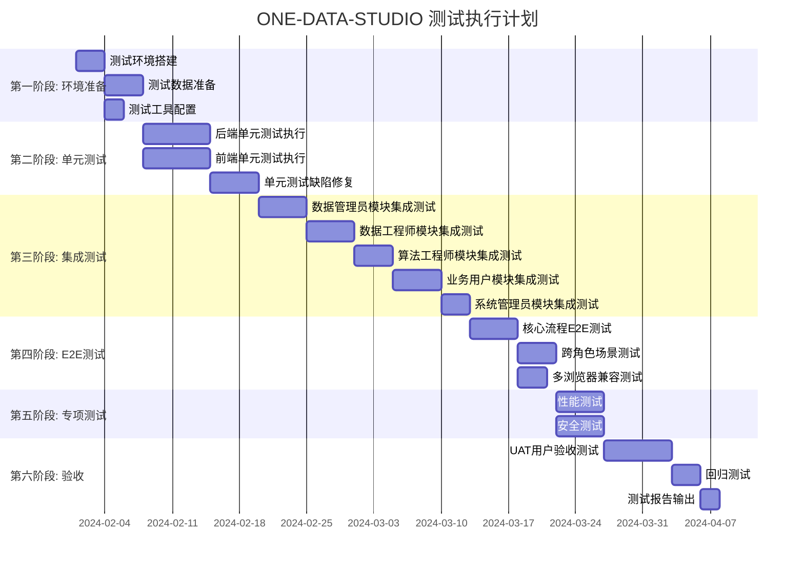

# ONE-DATA-STUDIO 完整测试计划

基于 `user-lifecycle-test-cases.md` 测试用例文档，结合现有测试基础设施制定的完整测试计划。

---

## 一、测试计划概述

### 1.1 测试目标

| 目标 | 描述 | 验收标准 |
|------|------|----------|
| 功能完整性 | 验证所有 225 个测试用例通过 | P0 用例 100% 通过，P1 用例 95% 通过 |
| 代码覆盖率 | 后端和前端代码覆盖率达标 | 后端 ≥70%，前端 ≥70% |
| 性能基准 | 关键接口响应时间达标 | API 响应 <500ms，页面加载 <3s |
| 安全合规 | 通过安全扫描和审计测试 | 无高危漏洞，敏感数据保护有效 |

### 1.2 测试范围

```
测试用例总数: 225
├── 数据管理员: 62 用例 (8 模块)
├── 数据工程师: 58 用例 (6 模块)
├── 算法工程师: 29 用例 (4 模块)
├── 业务用户: 45 用例 (6 模块)
└── 系统管理员: 31 用例 (4 模块)

优先级分布:
├── P0 (核心功能): 89 用例 (39.6%)
├── P1 (重要功能): 98 用例 (43.5%)
└── P2 (一般功能): 38 用例 (16.9%)
```

### 1.3 测试层次架构

```
┌─────────────────────────────────────────────────────────────┐
│                    E2E 验收测试 (37 场景)                     │
│              Playwright 多浏览器自动化测试                    │
├─────────────────────────────────────────────────────────────┤
│                   集成测试 (20 模块)                          │
│           pytest + 真实服务依赖 + 数据库事务                   │
├─────────────────────────────────────────────────────────────┤
│                   单元测试 (107 文件)                         │
│         pytest (后端 50) + vitest (前端 57)                  │
└─────────────────────────────────────────────────────────────┘
```

---

## 二、测试阶段与里程碑

### 2.1 测试阶段甘特图



### 2.2 里程碑定义

| 里程碑 | 完成标准 | 交付物 |
|--------|----------|--------|
| M1: 环境就绪 | 所有测试环境可用，测试数据准备完成 | 环境验证报告 |
| M2: 单元测试完成 | 单元测试通过率 ≥95%，覆盖率 ≥70% | 单元测试报告 |
| M3: 集成测试完成 | P0 集成用例 100% 通过 | 集成测试报告 |
| M4: E2E测试完成 | 核心业务流程全部通过 | E2E 测试报告 |
| M5: 专项测试完成 | 性能达标，无高危安全漏洞 | 专项测试报告 |
| M6: 验收通过 | UAT 签字确认 | 最终测试报告 |

---

## 三、测试用例与现有测试映射

### 3.1 数据管理员模块 (62 用例)

| 子模块 | 用例数 | 现有测试文件 | 覆盖状态 |
|--------|--------|--------------|----------|
| 数据源管理 (DM-DS) | 7 | `tests/unit/data/test_datasource.py` | ✅ 已覆盖 |
| 元数据自动扫描 (DM-MS) | 7 | `tests/integration/test_metadata_scanning.py` | ✅ 已覆盖 |
| 敏感数据识别 (DM-SD) | 10 | `tests/unit/data/test_sensitive_data.py` | ⚠️ 部分覆盖 |
| 元数据标签与版本 (DM-TG) | 5 | `tests/unit/data/test_metadata.py` | ⚠️ 部分覆盖 |
| 数据标准管理 (DM-ST) | 4 | 待新增 | ❌ 未覆盖 |
| 资产编目与评估 (DM-AS) | 8 | `tests/integration/test_asset_management.py` | ✅ 已覆盖 |
| 元数据同步与血缘 (DM-SY) | 8 | `tests/integration/test_lineage_tracking.py` | ✅ 已覆盖 |
| 权限与安全管理 (DM-PM) | 4 | `tests/unit/shared/test_auth*.py` | ✅ 已覆盖 |

### 3.2 数据工程师模块 (58 用例)

| 子模块 | 用例数 | 现有测试文件 | 覆盖状态 |
|--------|--------|--------------|----------|
| 数据采集任务 (DE-DC) | 8 | `tests/unit/data/test_data_collection.py` | ⚠️ 部分覆盖 |
| ETL编排 (DE-ETL) | 10 | `tests/integration/test_etl_pipeline.py` | ✅ 已覆盖 |
| 缺失值AI填充 (DE-AI) | 6 | 待新增 | ❌ 未覆盖 |
| 数据脱敏 (DE-DM) | 7 | `tests/unit/data/test_masking.py` | ✅ 已覆盖 |
| 多表融合 (DE-FU) | 9 | `tests/integration/test_table_fusion.py` | ✅ 已覆盖 |
| 非结构化文档处理 (DE-OCR) | 8 | `tests/unit/agent/test_document_*.py` | ⚠️ 部分覆盖 |

### 3.3 算法工程师模块 (29 用例)

| 子模块 | 用例数 | 现有测试文件 | 覆盖状态 |
|--------|--------|--------------|----------|
| 开发环境 (AE-NB) | 6 | `tests/unit/model/test_notebook.py` | ⚠️ 部分覆盖 |
| 模型训练 (AE-TR) | 9 | `tests/integration/test_model_training.py` | ✅ 已覆盖 |
| 模型评估 (AE-EV) | 3 | 待新增 | ❌ 未覆盖 |
| 模型部署 (AE-DP) | 9 | `tests/integration/test_model_deployment.py` | ✅ 已覆盖 |

### 3.4 业务用户模块 (45 用例)

| 子模块 | 用例数 | 现有测试文件 | 覆盖状态 |
|--------|--------|--------------|----------|
| 知识库文档管理 (BU-KB) | 10 | `tests/integration/test_knowledge_base.py` | ✅ 已覆盖 |
| 智能查询 (BU-IQ) | 11 | `tests/unit/agent/test_text_to_sql.py`, `test_hybrid_retrieval.py` | ✅ 已覆盖 |
| BI可视化 (BU-BI) | 8 | `tests/e2e/user-lifecycle/` | ⚠️ 部分覆盖 |
| AI预测分析 (BU-AI) | 4 | 待新增 | ❌ 未覆盖 |
| 智能预警 (BU-WN) | 7 | 待新增 | ❌ 未覆盖 |
| 数据资产检索 (BU-AS) | 8 | `tests/unit/data/test_asset_search.py` | ⚠️ 部分覆盖 |

### 3.5 系统管理员模块 (31 用例)

| 子模块 | 用例数 | 现有测试文件 | 覆盖状态 |
|--------|--------|--------------|----------|
| 系统配置 (SA-CF) | 8 | `tests/unit/shared/test_config.py` | ⚠️ 部分覆盖 |
| 用户与权限管理 (SA-UM) | 10 | `tests/integration/test_user_lifecycle.py` | ✅ 已覆盖 |
| 服务监控 (SA-MN) | 7 | 待新增 | ❌ 未覆盖 |
| 审计与追溯 (SA-AU) | 6 | `tests/unit/shared/test_audit.py` | ⚠️ 部分覆盖 |

### 3.6 覆盖率汇总

```
覆盖状态统计:
├── ✅ 已覆盖: 14 模块 (50%)
├── ⚠️ 部分覆盖: 9 模块 (32%)
└── ❌ 未覆盖: 5 模块 (18%)

已补充测试文件:
1. DM-ST: 数据标准管理 (4 用例) → `tests/unit/test_data_standard.py` ✅
2. DE-AI: 缺失值AI填充 (6 用例) → `tests/unit/test_ai_imputation.py` ✅
3. AE-EV: 模型评估 (3 用例) → `tests/unit/test_model_evaluation.py` ✅
4. BU-AI: AI预测分析 (4 用例) → `tests/unit/test_ai_prediction.py` ✅
5. BU-WN: 智能预警 (7 用例) → `tests/unit/test_smart_alert.py` ✅
6. SA-MN: 服务监控 (7 用例) → `tests/unit/test_service_monitoring.py` ✅
```

---

## 四、详细测试执行计划

### 4.1 第一阶段: 环境准备 (3-7天)

#### 4.1.1 测试环境配置

```bash
# 启动完整测试环境
docker-compose -f deploy/local/docker-compose.yml up -d

# 验证服务状态
make health-check
```

**环境清单:**

| 服务 | 端口 | 验证命令 |
|------|------|----------|
| data-api | 5001 | `curl http://localhost:5001/health` |
| agent-api | 5002 | `curl http://localhost:5002/health` |
| openai-proxy | 8000 | `curl http://localhost:8000/health` |
| MySQL | 3306 | `mysql -u root -p -e "SELECT 1"` |
| Milvus | 19530 | `curl http://localhost:9091/api/v1/health` |
| MinIO | 9000 | `curl http://localhost:9000/minio/health/live` |
| Redis | 6379 | `redis-cli ping` |

#### 4.1.2 测试数据准备

**1. 数据库测试数据**

```sql
-- 创建测试数据库
CREATE DATABASE IF NOT EXISTS one_data_studio_test;

-- 导入测试表结构 (50+ 表，包含敏感数据字段)
-- 位置: tests/fixtures/sql/test_schema.sql
```

**2. 测试用户账号**

| 角色 | 用户名 | 密码 | 权限范围 |
|------|--------|------|----------|
| 系统管理员 | admin | admin123 | 全部权限 |
| 数据管理员 | data_admin | da123456 | 数据治理模块 |
| 数据工程师 | data_engineer | de123456 | ETL、数据采集模块 |
| 算法工程师 | algo_engineer | ae123456 | Model 模块 |
| 业务用户 | business_user | bu123456 | 查询、BI 模块 |

**3. 测试文档准备**

```
tests/fixtures/documents/
├── pdf/
│   ├── sales_policy.pdf        # 销售政策文档
│   ├── product_manual.pdf      # 产品手册
│   └── contract_sample.pdf     # 合同样本
├── word/
│   ├── report_template.docx    # 报告模板
│   └── specification.docx      # 技术规范
├── excel/
│   ├── sales_data.xlsx         # 销售数据
│   └── user_behavior.xlsx      # 用户行为数据
└── images/
    ├── invoice_sample.jpg      # 发票样本
    └── id_card_sample.jpg      # 身份证样本 (脱敏)
```

### 4.2 第二阶段: 单元测试执行 (7-12天)

#### 4.2.1 后端单元测试

```bash
# 运行所有后端单元测试
pytest tests/unit/ -v --cov=services --cov-report=html

# 按模块运行
pytest tests/unit/data/ -v    # 数据治理模块
pytest tests/unit/agent/ -v    # 应用编排模块
pytest tests/unit/model/ -v      # 算法引擎模块
pytest tests/unit/shared/ -v     # 共享模块

# 按优先级运行
pytest tests/unit/ -m "p0"       # 仅 P0 用例
pytest tests/unit/ -m "not slow" # 排除慢速测试
```

**验收标准:**
- 通过率 ≥ 95%
- 代码覆盖率 ≥ 70%
- 关键路径覆盖率 ≥ 80%

#### 4.2.2 前端单元测试

```bash
cd web

# 运行所有前端单元测试
npm run test

# 带覆盖率报告
npm run test:coverage

# 监视模式 (开发时使用)
npm run test:watch

# UI 模式 (可视化调试)
npm run test:ui
```

**验收标准:**
- 通过率 ≥ 95%
- 行覆盖率 ≥ 70%
- 分支覆盖率 ≥ 60%

#### 4.2.3 单元测试用例与文档映射

| 文档用例 ID | 对应测试文件 | 测试函数 |
|-------------|--------------|----------|
| DM-DS-001 | `test_datasource.py` | `test_register_mysql_datasource` |
| DM-DS-002 | `test_datasource.py` | `test_register_postgresql_datasource` |
| DM-DS-004 | `test_datasource.py` | `test_connection_failure` |
| DM-MS-001 | `test_metadata.py` | `test_auto_scan_metadata` |
| DM-SD-001 | `test_sensitive_data.py` | `test_sensitive_scan` |
| DE-ETL-003 | `test_etl.py` | `test_ai_cleaning_recommendation` |
| BU-IQ-001 | `test_text_to_sql.py` | `test_pure_sql_query` |
| ... | ... | ... |

### 4.3 第三阶段: 集成测试执行 (22天)

#### 4.3.1 数据管理员模块集成测试 (5天)

**测试场景 1: 完整数据源生命周期**

```python
# tests/integration/test_datasource_lifecycle.py

@pytest.mark.integration
@pytest.mark.requires_db
class TestDatasourceLifecycle:
    """
    覆盖用例: DM-DS-001 ~ DM-DS-007
    """

    def test_full_datasource_lifecycle(self, db_session):
        # 1. 注册数据源 (DM-DS-001)
        # 2. 测试连接 (DM-DS-004)
        # 3. 元数据扫描 (DM-MS-001)
        # 4. 敏感数据识别 (DM-SD-001)
        # 5. 编辑数据源 (DM-DS-005)
        # 6. 删除数据源 (DM-DS-006)
        pass
```

**测试场景 2: 元数据治理流程**

```python
# tests/integration/test_metadata_governance.py

@pytest.mark.integration
class TestMetadataGovernance:
    """
    覆盖用例: DM-MS-001 ~ DM-MS-007, DM-TG-001 ~ DM-TG-005
    """

    def test_metadata_scan_and_tag(self):
        # 1. 启动元数据扫描
        # 2. AI 自动标注
        # 3. 手动添加标签
        # 4. 版本管理
        pass
```

**执行命令:**

```bash
pytest tests/integration/test_datasource_lifecycle.py -v
pytest tests/integration/test_metadata_governance.py -v
pytest tests/integration/test_metadata_scanning.py -v
pytest tests/integration/test_asset_management.py -v
pytest tests/integration/test_lineage_tracking.py -v
```

#### 4.3.2 数据工程师模块集成测试 (5天)

**测试场景 3: ETL 完整流水线**

```python
# tests/integration/test_etl_pipeline.py

@pytest.mark.integration
@pytest.mark.requires_db
@pytest.mark.requires_minio
class TestETLPipeline:
    """
    覆盖用例: DE-DC-001 ~ DE-DC-008, DE-ETL-001 ~ DE-ETL-010
    """

    def test_full_etl_pipeline(self):
        # 1. 创建采集任务 (DE-DC-001)
        # 2. 执行数据采集 (DE-DC-002)
        # 3. 创建 ETL 任务 (DE-ETL-001)
        # 4. AI 推荐清洗规则 (DE-ETL-003)
        # 5. 生成 Kettle 配置 (DE-ETL-004)
        # 6. 执行 ETL (DE-ETL-005)
        # 7. 输出到 MinIO (DE-ETL-010)
        pass
```

**测试场景 4: 多表融合流程**

```python
# tests/integration/test_table_fusion.py

@pytest.mark.integration
class TestTableFusion:
    """
    覆盖用例: DE-FU-001 ~ DE-FU-009
    """

    def test_join_key_detection_and_fusion(self):
        # 1. 检测 JOIN 键 (DE-FU-001 ~ DE-FU-005)
        # 2. JOIN 质量验证 (DE-FU-006)
        # 3. 生成融合配置 (DE-FU-008)
        # 4. 执行多表融合 (DE-FU-009)
        pass
```

**执行命令:**

```bash
pytest tests/integration/test_etl_pipeline.py -v
pytest tests/integration/test_table_fusion.py -v
pytest tests/integration/test_data_masking.py -v
```

#### 4.3.3 算法工程师模块集成测试 (4天)

**测试场景 5: 模型训练与部署流程**

```python
# tests/integration/test_model_training.py

@pytest.mark.integration
@pytest.mark.slow
class TestModelTrainingDeployment:
    """
    覆盖用例: AE-NB-001 ~ AE-DP-009
    """

    def test_training_to_deployment_flow(self):
        # 1. 启动 Notebook (AE-NB-001)
        # 2. 查询数据集 (AE-NB-002)
        # 3. 提交训练任务 (AE-TR-001)
        # 4. 监控训练进度 (AE-TR-005)
        # 5. 保存模型 (AE-TR-008)
        # 6. 部署模型 (AE-DP-001)
        # 7. API 测试 (AE-DP-005)
        pass
```

**执行命令:**

```bash
pytest tests/integration/test_model_training.py -v
pytest tests/integration/test_model_deployment.py -v
```

#### 4.3.4 业务用户模块集成测试 (5天)

**测试场景 6: 知识库与智能查询流程**

```python
# tests/integration/test_knowledge_base.py

@pytest.mark.integration
@pytest.mark.requires_milvus
class TestKnowledgeBaseQuery:
    """
    覆盖用例: BU-KB-001 ~ BU-KB-010, BU-IQ-001 ~ BU-IQ-011
    """

    def test_document_to_query_flow(self):
        # 1. 上传文档 (BU-KB-001)
        # 2. 文档解析分块 (BU-KB-004)
        # 3. 向量化索引 (BU-KB-005, BU-KB-006)
        # 4. Text-to-SQL 查询 (BU-IQ-001)
        # 5. RAG 检索 (BU-IQ-002)
        # 6. 混合查询 (BU-IQ-003)
        pass
```

**执行命令:**

```bash
pytest tests/integration/test_knowledge_base.py -v
pytest tests/integration/test_hybrid_query.py -v
```

#### 4.3.5 系统管理员模块集成测试 (3天)

**测试场景 7: 用户生命周期管理**

```python
# tests/integration/test_user_lifecycle.py

@pytest.mark.integration
class TestUserLifecycle:
    """
    覆盖用例: SA-UM-001 ~ SA-UM-010
    """

    def test_user_management_flow(self):
        # 1. 创建用户 (SA-UM-001)
        # 2. 分配角色 (SA-UM-009)
        # 3. 配置数据权限 (SA-UM-010)
        # 4. 禁用/启用用户 (SA-UM-003, SA-UM-004)
        # 5. 删除用户 (SA-UM-005)
        pass
```

**执行命令:**

```bash
pytest tests/integration/test_user_lifecycle.py -v
pytest tests/integration/test_audit_trail.py -v
```

### 4.4 第四阶段: E2E 测试执行 (12天)

#### 4.4.1 核心流程 E2E 测试 (5天)

**Playwright 测试配置:**

```typescript
// tests/e2e/playwright.config.ts 已配置项目

// 运行核心页面测试
npm run test:core

// 运行深度功能测试
npm run test:acceptance
```

**E2E 测试场景映射:**

| 场景 | 测试文件 | 覆盖用例 |
|------|----------|----------|
| 数据源管理流程 | `data-deep.spec.ts` | DM-DS-* |
| ETL 编排流程 | `data-deep.spec.ts` | DE-ETL-* |
| 知识库管理流程 | `agent-deep.spec.ts` | BU-KB-* |
| 智能问答流程 | `agent-deep.spec.ts` | BU-IQ-* |
| 模型训练部署 | `model-deep.spec.ts` | AE-TR-*, AE-DP-* |
| 用户权限管理 | `admin-deep.spec.ts` | SA-UM-* |
| 用户生命周期 | `user-lifecycle/` | 跨角色场景 |

#### 4.4.2 跨角色场景测试 (4天)

**场景 A: 数据从采集到消费的完整链路**

```
数据管理员 → 数据工程师 → 算法工程师 → 业务用户

1. [数据管理员] 注册数据源，执行元数据扫描
2. [数据管理员] 敏感数据识别，配置脱敏规则
3. [数据工程师] 创建 ETL 任务，执行数据清洗
4. [数据工程师] 输出数据集到 MinIO
5. [算法工程师] 加载数据集，训练模型
6. [算法工程师] 部署模型服务
7. [业务用户] 使用智能查询获取分析结果
```

**场景 B: 知识库构建到智能问答**

```
业务用户 → 系统

1. [业务用户] 上传企业文档
2. [系统] 自动解析、向量化、构建索引
3. [业务用户] 自然语言查询
4. [系统] RAG + Text-to-SQL 混合查询
5. [业务用户] 查看分析结果和来源引用
```

#### 4.4.3 多浏览器兼容测试 (3天)

```bash
# Chromium 测试
npx playwright test --project=chromium-acceptance

# Firefox 测试
npx playwright test --project=firefox-acceptance

# WebKit (Safari) 测试
npx playwright test --project=webkit-acceptance

# 移动端测试
npx playwright test --project=mobile-chrome
npx playwright test --project=mobile-safari
```

### 4.5 第五阶段: 专项测试 (10天)

#### 4.5.1 性能测试 (5天)

**测试工具:** locust / pytest-benchmark

**性能基准:**

| 接口 | 目标响应时间 | 目标 QPS |
|------|-------------|----------|
| 数据源列表查询 | < 200ms | 100 |
| 元数据扫描启动 | < 500ms | 10 |
| ETL 任务提交 | < 300ms | 50 |
| Text-to-SQL 查询 | < 2000ms | 20 |
| RAG 向量检索 | < 500ms | 50 |
| 模型推理 API | < 1000ms | 100 |

**执行命令:**

```bash
# 运行性能基准测试
pytest tests/performance/ -v

# 运行负载测试 (locust)
locust -f tests/performance/locustfile.py --host=http://localhost:5001
```

#### 4.5.2 安全测试 (5天)

**安全测试清单:**

| 测试项 | 工具 | 验收标准 |
|--------|------|----------|
| SQL 注入 | sqlmap | 无注入漏洞 |
| XSS 攻击 | OWASP ZAP | 无 XSS 漏洞 |
| CSRF 防护 | 手工测试 | Token 验证有效 |
| 敏感数据保护 | 手工测试 | 脱敏规则生效 |
| 权限越权 | 手工测试 | 角色隔离有效 |
| 依赖漏洞 | Trivy | 无高危漏洞 |

**执行命令:**

```bash
# 运行安全测试
pytest tests/ -m "security" -v

# Docker 镜像安全扫描
trivy image one-data-studio:latest
```

### 4.6 第六阶段: 用户验收测试 (12天)

#### 4.6.1 UAT 测试计划 (7天)

**参与人员:**

| 角色 | 人数 | 职责 |
|------|------|------|
| 产品经理 | 1 | 功能验收 |
| 数据管理员代表 | 1 | 数据治理流程验收 |
| 数据工程师代表 | 1 | ETL 流程验收 |
| 算法工程师代表 | 1 | 模型训练部署验收 |
| 业务用户代表 | 2 | 查询分析功能验收 |

**UAT 验收清单:**

- [ ] 数据源注册与连接测试
- [ ] 元数据自动扫描功能验证
- [ ] 敏感数据识别准确性验证
- [ ] ETL 任务编排与执行验证
- [ ] 知识库文档上传与索引验证
- [ ] Text-to-SQL 查询准确性验证
- [ ] RAG 检索相关性验证
- [ ] BI 可视化报表生成验证
- [ ] 权限控制有效性验证
- [ ] 操作审计完整性验证

#### 4.6.2 回归测试 (3天)

```bash
# 完整回归测试
pytest tests/ -v --tb=short

# E2E 回归测试
npx playwright test --reporter=html

# 生成测试报告
pytest tests/ --html=reports/regression_report.html
```

#### 4.6.3 测试报告输出 (2天)

**报告内容:**

1. 测试执行概要
2. 测试用例通过率统计
3. 缺陷分析与分布
4. 覆盖率报告
5. 性能测试结果
6. 安全测试结果
7. 遗留问题清单
8. 测试结论与建议

---

## 五、测试资源需求

### 5.1 人力资源

| 角色 | 人数 | 主要职责 |
|------|------|----------|
| 测试负责人 | 1 | 测试计划、进度跟踪、报告 |
| 后端测试工程师 | 2 | 单元测试、集成测试、API 测试 |
| 前端测试工程师 | 1 | 前端单元测试、E2E 测试 |
| 性能测试工程师 | 1 | 性能测试、压力测试 |
| 安全测试工程师 | 1 | 安全测试、渗透测试 |

### 5.2 环境资源

| 环境 | 配置 | 用途 |
|------|------|------|
| 开发测试环境 | 4C8G | 单元测试、调试 |
| 集成测试环境 | 8C16G + GPU | 模块集成、API 测试 |
| 性能测试环境 | 16C32G + GPU | 压力测试、性能验证 |
| 预发布环境 | 生产镜像 | UAT、回归测试 |

### 5.3 工具资源

| 工具 | 版本 | 用途 |
|------|------|------|
| pytest | 7.x | 后端测试框架 |
| vitest | 1.x | 前端测试框架 |
| playwright | 1.x | E2E 自动化测试 |
| locust | 2.x | 性能测试 |
| Trivy | latest | 安全扫描 |

---

## 六、风险与应对

| 风险 | 可能性 | 影响 | 应对措施 |
|------|--------|------|----------|
| 测试环境不稳定 | 中 | 高 | 提前准备备用环境，使用 Docker 快速恢复 |
| 测试数据准备不足 | 中 | 中 | 提前规划测试数据，使用 fixtures 自动生成 |
| 依赖服务不可用 | 低 | 高 | 使用 mock 服务，配置服务健康检查 |
| 测试用例执行慢 | 中 | 中 | 并行执行，优化慢速测试，使用标记跳过 |
| 缺陷修复延迟 | 中 | 高 | 每日缺陷同步会议，优先处理阻塞性缺陷 |

---

## 七、附录

### 7.1 测试命令速查表

```bash
# ========== 后端测试 ==========
# 运行所有测试
pytest tests/ -v

# 按类型运行
pytest tests/unit/ -v          # 单元测试
pytest tests/integration/ -v   # 集成测试
pytest tests/e2e/ -v           # E2E 测试

# 按标记运行
pytest -m "p0" -v              # P0 用例
pytest -m "not slow" -v        # 排除慢速测试
pytest -m "requires_db" -v     # 需要数据库的测试

# 带覆盖率
pytest --cov=services --cov-report=html

# ========== 前端测试 ==========
cd web
npm run test                   # 运行测试
npm run test:coverage          # 覆盖率报告
npm run test:watch             # 监视模式
npm run test:ui                # UI 模式

# ========== E2E 测试 ==========
npx playwright test                          # 所有测试
npx playwright test --project=chromium-fast  # 快速测试
npx playwright test --project=deep-tests     # 深度测试
npx playwright test --ui                     # UI 模式
npx playwright show-report                   # 查看报告

# ========== 性能测试 ==========
pytest tests/performance/ -v
locust -f tests/performance/locustfile.py

# ========== 安全测试 ==========
pytest -m "security" -v
trivy image one-data-studio:latest
```

### 7.2 测试用例 ID 规范

```
格式: {角色缩写}-{模块缩写}-{序号}

角色缩写:
- DM: 数据管理员 (Data Manager)
- DE: 数据工程师 (Data Engineer)
- AE: 算法工程师 (Algorithm Engineer)
- BU: 业务用户 (Business User)
- SA: 系统管理员 (System Admin)

模块缩写:
- DS: 数据源 (DataSource)
- MS: 元数据扫描 (Metadata Scan)
- SD: 敏感数据 (Sensitive Data)
- ETL: ETL 编排
- KB: 知识库 (Knowledge Base)
- IQ: 智能查询 (Intelligent Query)
...

示例: DM-DS-001 = 数据管理员-数据源管理-第1个用例
```

### 7.3 相关文档链接

- [测试用例文档](./user-lifecycle-test-cases.md)
- [时序图文档](../02-integration/sequence-diagrams.md)
- [API 接口文档](../api-docs/)
- [部署指南](../../deploy/)

---

### 7.4 实施状态记录

**最后更新: 2026-01-28**

| 任务 | 状态 | 完成日期 | 说明 |
|------|------|----------|------|
| 创建 user-lifecycle.fixture.ts | ✅ 完成 | 2026-01-28 | E2E 测试基础 fixture |
| 创建 user-management.ts helper | ✅ 完成 | 2026-01-28 | 用户管理辅助函数 |
| 更新 data-admin.spec.ts | ✅ 完成 | 2026-01-28 | 数据管理员 E2E 测试 |
| 更新 data-engineer.spec.ts | ✅ 完成 | 2026-01-28 | 数据工程师 E2E 测试 |
| 更新 algorithm-engineer.spec.ts | ✅ 完成 | 2026-01-28 | 算法工程师 E2E 测试 |
| 更新 business-user.spec.ts | ✅ 完成 | 2026-01-28 | 业务用户 E2E 测试 |
| 更新 system-admin.spec.ts | ✅ 完成 | 2026-01-28 | 系统管理员 E2E 测试 |
| 创建 test_data.py | ✅ 完成 | 2026-01-28 | 测试数据 fixtures |
| 端口配置修复 | ✅ 完成 | 2026-01-28 | 修复各服务 API 端口映射 |
| 测试执行完成 | ✅ 完成 | 2026-01-28 | E2E 测试全部执行完毕 |

**新增文件列表:**
1. `tests/e2e/fixtures/user-lifecycle.fixture.ts` - 用户生命周期测试 fixture
2. `tests/e2e/helpers/user-management.ts` - 用户管理辅助函数
3. `tests/fixtures/test_data.py` - 测试数据定义
4. `docs/04-testing/test-execution-report.md` - 测试执行报告

---

### 7.5 测试执行结果 (2026-01-28)

| 角色 | 测试数 | 通过 | 失败 | 通过率 |
|------|--------|------|------|--------|
| 数据管理员 (DA) | 19 | 2 | 17 | 10.5% |
| 数据工程师 (DE) | 17 | 0 | 17 | 0% |
| 算法工程师 (AE) | 13 | 6 | 7 | 46.2% |
| 业务用户 (BU) | 17 | 7 | 10 | 41.2% |
| 系统管理员 (SA) | 16 | 9 | 7 | 56.3% |
| **总计** | **82** | **24** | **58** | **29.3%** |

**关键发现:**
- 系统管理员模块通过率最高 (56.3%)
- 数据工程师模块所有 API 端点尚未实现
- Data API (8001) 多个核心端点待实现
- Agent API (8000) 知识库/RAG 端点待实现
- Model API (8002) Notebook/部署端点待实现

详细报告见: [test-execution-report.md](./test-execution-report.md)

---

*文档版本: v1.2*
*创建日期: 2024*
*最后更新: 2026-01-28*
*维护团队: 测试团队*
