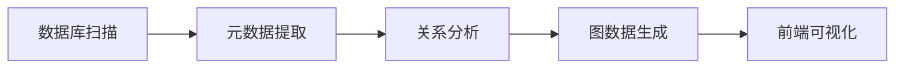
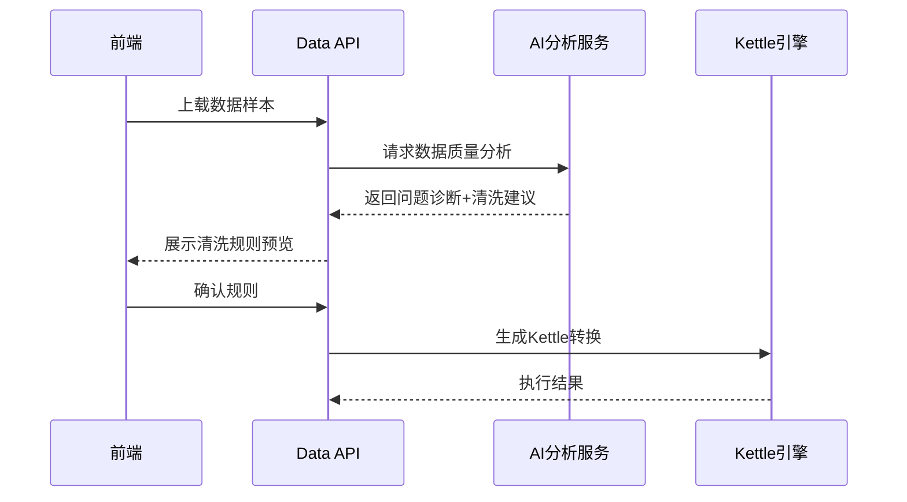
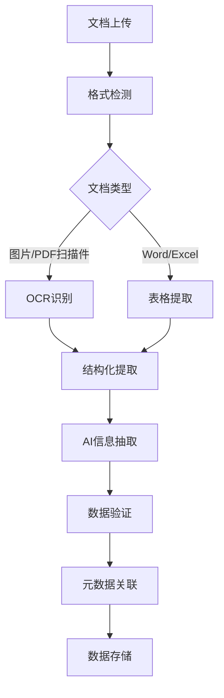
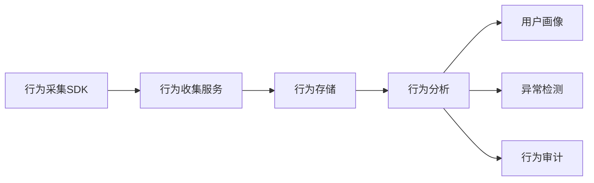
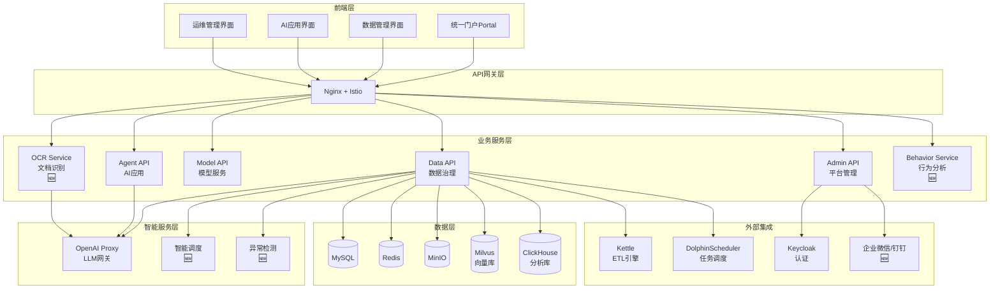

# 智能大数据平台功能增强实施计划

> **项目**: ONE-DATA-STUDIO
> **日期**: 2026-01-26
> **目标**: 提升需求文档覆盖度从 59% 到 85%+

---

## 一、实施概览

| 模块 | 当前覆盖度 | 目标覆盖度 | 优先级 | 预计工作量 |
| ----- | ---------- | ---------- | ------- | ----------- |
| （一）元数据管理系统 | 70% | 85% | P1 | 3天 |
| （二）数据感知汇聚系统 | 65% | 80% | P1 | 2天 |
| （三）数据加工融合系统 | 50% | 75% | P1 | 5天 |
| （四）数据分析挖掘系统 | 75% | 85% | P2 | 2天 |
| （五）数据资产系统 | 60% | 85% | P1 | 3天 |
| （六）数据安全管理系统 | 65% | 85% | P1 | 3天 |
| （七）业务应用支持平台 | 30% | 70% | P1 | 8天 |
| **综合目标覆盖度** | **59%** | **~82%** | - | **26天** |

---

## 二、详细实施计划

### 模块一：元数据管理系统增强 (70% → 85%)

#### 1.1 可视化元数据图谱 【NEW】

**目标**: 实现可视化数据血缘和元数据关系图

**技术方案**:

- 使用 D3.js 或 Cytoscape.js 渲染关系图
- 后端提供图数据接口

**实施内容**:



**新增文件**:

- `services/data-api/api/metadata_graph.py` - 图数据API
- `services/data-api/services/metadata_graph_builder.py` - 图构建服务
- `web/src/pages/metadata/MetadataGraphPage.tsx` - 可视化页面
- `web/src/components/metadata/GraphVisualization.tsx` - 图组件

#### 1.2 差异对比功能 【ENHANCE】

**目标**: 实现元数据版本差异对比

**实施内容**:

- 复用现有的 `MetadataColumn` 版本控制
- 新增差异对比算法

**新增文件**:

- `services/data-api/services/metadata_diff.py` - 差异计算
- `web/src/components/metadata/MetadataDiffViewer.tsx` - 差异展示

#### 1.3 Kettle联动增强 【VERIFY】

**现状检查**: 模型已支持 `kettle` 引擎类型，需验证执行逻辑

**验证点**:

- Kettle job/trans 文件解析
- Kettle REST API 调用
- 元数据同步机制

---

### 模块二：数据感知汇聚系统增强 (65% → 80%)

#### 2.1 智能调度增强 【ENHANCE】

**目标**: 基于增量变化和业务优先级的智能调度

**技术方案**:

- 扩展现有的 DolphinScheduler 集成
- 新增智能调度算法

**新增文件**:

- `services/data-api/services/smart_scheduler.py` - 智能调度
- `services/data-api/models/schedule_priority.py` - 优先级模型

#### 2.2 多源采集增强 【VERIFY】

**现状检查**: 已支持多种数据源，需补充文档要求的功能

**验证点**:

- JSON 输入组件
- 日志文件采集
- REST API 接入

---

### 模块三：数据加工融合系统增强 (50% → 75%)

#### 3.1 AI辅助清洗规则配置 【NEW】⭐

**目标**: AI分析数据质量问题并生成清洗规则

**架构设计**:



**新增文件**:

- `services/data-api/services/ai_data_cleaning.py` - AI清洗分析
- `services/data-api/services/cleaning_rule_generator.py` - 规则生成器
- `services/data-api/models/cleaning_rule.py` - 清洗规则模型
- `web/src/pages/data/cleaning/CleaningRulePage.tsx` - 清洗规则配置页
- `web/src/components/data/cleaning/RuleSuggestionPanel.tsx` - AI建议面板

#### 3.2 字段转换智能映射 【NEW】

**目标**: AI自动匹配字段转换逻辑

**新增文件**:

- `services/data-api/services/ai_field_mapper.py` - AI字段映射
- `services/data-api/models/field_mapping.py` - 映射规则模型

#### 3.3 OCR文档识别服务 【NEW】⭐

**目标**: 非结构化文档智能识别（发票、合同、扫描件）

**架构设计**:



**技术选型**:

- OCR: Tesseract / PaddleOCR / 阿里云OCR API
- 表格提取: Camelot / Tabula
- AI抽取: GPT-4o-mini with vision

**新增文件**:

```
services/ocr-service/
├── app.py                    # FastAPI主应用
├── models/
│   ├── ocr_task.py          # OCR任务模型
│   ├── ocr_result.py        # OCR结果模型
│   └── extraction_rule.py   # 提取规则模型
├── services/
│   ├── ocr_engine.py        # OCR引擎封装
│   ├── document_parser.py   # 文档解析
│   ├── table_extractor.py   # 表格提取
│   ├── ai_extractor.py      # AI信息抽取
│   └── validator.py         # 数据验证
├── templates/
│   ├── invoice.json         # 发票提取模板
│   ├── contract.json        # 合同提取模板
│   └── report.json          # 报告提取模板
└── utils/
    ├── image_utils.py       # 图像预处理
    └── pdf_utils.py         # PDF处理
```

**API接口**:

- `POST /api/v1/ocr/tasks` - 创建OCR任务
- `GET /api/v1/ocr/tasks/{id}` - 获取任务状态
- `GET /api/v1/ocr/tasks/{id}/result` - 获取识别结果
- `POST /api/v1/ocr/templates` - 创建提取模板
- `GET /api/v1/ocr/templates` - 列出模板

**前端集成**:

- `web/src/pages/data/ocr/OCRPage.tsx` - OCR任务管理
- `web/src/components/data/ocr/DocumentUpload.tsx` - 文档上传
- `web/src/components/data/ocr/ResultViewer.tsx` - 结果预览
- `web/src/components/data/ocr/TemplateEditor.tsx` - 模板编辑器

#### 3.4 缺失值AI填充 【NEW】

**新增文件**:

- `services/data-api/services/ai_imputation.py` - AI填充算法
- 支持策略: 均值/中位数/众数、KNN、回归预测、LLM推理

---

### 模块四：数据分析挖掘系统增强 (75% → 85%)

#### 4.1 智能预警推送 【ENHANCE】

**目标**: AI异常识别+自动预警

**新增文件**:

- `services/data-api/services/anomaly_detector.py` - 异常检测
- `services/data-api/services/alert_manager.py` - 告警管理
- `web/src/pages/data/alerts/AlertPage.tsx` - 告警管理页

---

### 模块五：数据资产系统增强 (60% → 85%)

#### 5.1 资产AI检索 【NEW】⭐

**目标**: 自然语言检索数据资产

**现状**: 已有 `semantic_search.py` 使用Milvus，需增强

**增强内容**:

- 强化自然语言理解
- 增加资产价值评估
- 优化搜索排序

**新增文件**:

- `services/data-api/services/asset_ai_search.py` - 增强版AI搜索
- `services/data-api/services/asset_valuation.py` - 资产价值评估
- `web/src/pages/assets/AssetSearchPage.tsx` - 资产搜索页

#### 5.2 数据服务接口 【ENHANCE】

**目标**: 标准化数据服务接口+调用记录

**新增文件**:

- `services/data-api/api/data_service.py` - 数据服务API
- `services/data-api/models/data_service.py` - 服务模型
- `services/data-api/models/service_call_log.py` - 调用日志
- `web/src/pages/data/services/DataServicePage.tsx` - 服务管理页

---

### 模块六：数据安全管理系统增强 (65% → 85%)

#### 6.1 敏感数据AI识别增强 【ENHANCE】⭐

**现状**: 已有 `sensitivity.py` 和 `ai_annotation.py`，需增强

**增强内容**:

- 扩展识别模式
- 增加AI识别置信度
- 支持自定义识别规则

**增强文件**:

- `services/data-api/src/ai_annotation.py` - 扩展识别能力
- `services/data-api/src/sensitivity.py` - 增强扫描功能

#### 6.2 权限智能管控 【NEW】

**目标**: 动态权限分配+访问控制策略

**新增文件**:

- `services/shared/auth/dynamic_permission.py` - 动态权限
- `services/shared/auth/access_policy.py` - 访问策略
- `web/src/pages/admin/PermissionPage.tsx` - 权限管理页

---

### 模块七：业务应用支持平台增强 (30% → 70%) ⭐

#### 7.1 统一SSO增强 【ENHANCE】

**现状**: 已有Keycloak集成，需补充

**补充内容**:

- 短信验证码登录
- 扫码登录（二维码）
- 第三方授权（企业微信/钉钉）

**新增文件**:

```
services/shared/auth/
├── sms_auth.py          # 短信认证
├── qr_auth.py           # 二维码认证
├── wecom_auth.py        # 企业微信认证
└── dingtalk_auth.py     # 钉钉认证
```

#### 7.2 统一通用能力管理 【NEW】

##### 7.2.1 统一用户权限管理

**新增文件**:

- `services/admin-api/api/unified_user.py` - 统一用户管理
- `services/admin-api/api/unified_permission.py` - 统一权限管理

##### 7.2.2 统一日志管理

**新增文件**:

- `services/admin-api/services/unified_logging.py` - 统一日志服务
- `services/admin-api/models/unified_log.py` - 统一日志模型
- `web/src/pages/admin/logs/UnifiedLogPage.tsx` - 日志管理页

##### 7.2.3 统一用户行为管理 【NEW】⭐

**目标**: 采集用户行为并生成画像

**架构设计**:



**新增文件**:

```
services/behavior-service/
├── app.py                      # FastAPI主应用
├── models/
│   ├── user_behavior.py       # 行为模型
│   ├── user_profile.py        # 用户画像模型
│   └── behavior_rule.py       # 行为规则模型
├── services/
│   ├── behavior_collector.py  # 行为收集
│   ├── behavior_analyzer.py   # 行为分析
│   ├── profile_builder.py     # 画像构建
│   └── anomaly_detector.py    # 异常检测
├── middleware/
│   └── behavior_middleware.py # 行为采集中间件
└── api/
    ├── behaviors.py           # 行为API
    ├── profiles.py            # 画像API
    └── audit.py               # 审计API
```

**前端SDK**:

- `web/src/services/behaviorTracker.ts` - 行为追踪SDK
- 自动采集: 登录时间、访问页面、点击操作、停留时长

**管理页面**:

- `web/src/pages/admin/behavior/BehaviorDashboard.tsx` - 行为分析看板
- `web/src/pages/admin/behavior/ProfileView.tsx` - 用户画像查看
- `web/src/pages/admin/behavior/AuditLogPage.tsx` - 行为审计

##### 7.2.4 统一通知管理 【ENHANCE】

**现状**: 已有通知系统，需增强管理后台

**增强内容**:

- 通知渠道配置管理
- 通知模板管理
- 批量发送和重发

**新增文件**:

- `services/admin-api/api/notification_manager.py` - 通知管理API
- `web/src/pages/admin/notifications/NotificationManagerPage.tsx` - 通知管理页

##### 7.2.5 统一内容管理 【NEW】

**新增文件**:

- `services/admin-api/api/content.py` - 内容管理API
- `services/admin-api/models/content.py` - 内容模型
- `web/src/pages/admin/content/ContentPage.tsx` - 内容管理页

##### 7.2.6 统一财务开票信息管理 【NEW】⭐

**新增文件**:

```
services/admin-api/
├── models/
│   └── invoice_info.py       # 开票信息模型
├── api/
│   └── invoice_info.py       # 开票信息API
└── services/
    └── invoice_validator.py  # 开票信息校验
```

**前端**:

- `web/src/pages/admin/invoice/InvoiceInfoPage.tsx` - 开票信息管理

#### 7.3 统一门户（Portal）增强 【NEW】⭐

**目标**: 一站式办公入口

**新增/增强页面**:

```typescript
web/src/pages/portal/
├── PersonalWorkspace.tsx     // 个人工作台（增强）
├── TodoCenter.tsx            // 待办中心（增强）
├── NotificationCenter.tsx    // 通知中心（增强）
├── PersonalCenter.tsx        // 个人中心（增强）
├── QuickAccess.tsx           // 快捷方式（新增）
└── MyReports.tsx             // 我的报表（新增）
```

**个人工作台功能**:

- 待办事项汇总（跨系统）
- 消息通知中心
- 快捷访问常用系统
- 个人数据看板
- 最近访问记录

---

## 三、技术架构图

### 整体架构增强



---

## 四、优先级建议

### Phase 1: 核心功能 (优先级P1, 12天)

1. **OCR文档识别服务** - 5天
   - 非结构化数据处理是文档重点需求
   - 独立服务，风险可控

2. **统一用户行为管理** - 3天
   - 独立服务，可并行开发
   - 审计合规需求

3. **统一财务开票管理** - 1天
   - 相对简单的基础CRUD

4. **元数据图谱可视化** - 2天
   - 前后端配合

5. **资产AI检索增强** - 1天
   - 基于现有代码增强

### Phase 2: 增强功能 (优先级P2, 10天)

1. **AI辅助清洗规则配置** - 3天
2. **字段转换智能映射** - 2天
3. **智能预警推送** - 2天
4. **统一SSO增强** - 2天
5. **数据服务接口** - 1天

### Phase 3: 门户完善 (优先级P3, 4天)

1. **统一门户页面增强** - 2天
2. **统一通知管理后台** - 1天
3. **统一内容管理** - 1天

---

## 五、技术选型补充

| 功能 | 技术选型 | 说明 |
| ----- | --------- | ------ |
| OCR识别 | PaddleOCR / 阿里云OCR | 开源/云服务双方案 |
| 图可视化 | Cytoscape.js | 强大的图可视化库 |
| 行为采集 | 自研SDK + Redis | 高性能写入 |
| 画像构建 | Python pandas + scikit-learn | 数据分析 |
| 异常检测 | Isolation Forest | 无监督异常检测 |
| 智能调度 | 遗传算法 + 规则引擎 | 优化任务调度 |
| 短信认证 | 阿里云SMS SDK | 短信发送 |
| 扫码登录 | qrcode + WebSocket | 二维码生成和轮询 |
| 企业微信 | 企业微信API | 第三方登录 |

---

## 六、风险评估

| 风险项 | 风险等级 | 应对措施 |
| ------- | --------- | --------- |
| OCR识别准确率 | 中 | 提供人工复核+AI学习机制 |
| Kettle集成复杂度 | 中 | 先实现基础集成，逐步完善 |
| 性能影响 | 中 | 行为采集异步处理，Redis缓存 |
| 第三方API依赖 | 低 | 提供备选方案 |

---

## 七、里程碑计划

| 里程碑 | 交付内容 | 完成时间 |
| ------- | --------- | --------- |
| M1 | OCR服务上线 | D+5 |
| M2 | 用户行为分析上线 | D+8 |
| M3 | 元数据图谱上线 | D+10 |
| M4 | AI清洗规则上线 | D+13 |
| M5 | 资产AI检索增强 | D+14 |
| M6 | 统一Portal增强 | D+18 |
| M7 | SSO增强完成 | D+20 |
| M8 | 数据服务接口 | D+21 |
| M9 | 全功能测试 | D+24 |
| M10 | 正式上线 | D+26 |
