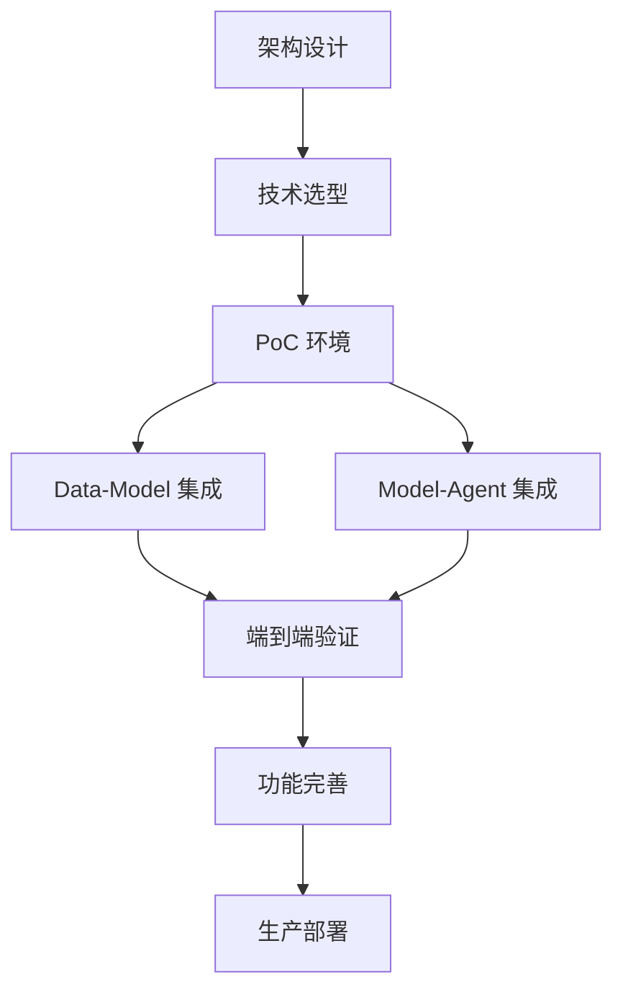

# 路线图

## 总体规划

```
┌─────────────────────────────────────────────────────────────────┐
│                         ONE-DATA-STUDIO 路线图                    │
└─────────────────────────────────────────────────────────────────┘

    2024 Q1                    2024 Q2                    2024 Q3
  ┌──────────┐              ┌──────────┐              ┌──────────┐
  │  设计阶段  │              │  开发阶段  │              │  优化阶段  │
  └──────────┘              └──────────┘              └──────────┘
      │                          │                          │
      ↓                          ↓                          ↓
  ┌────────┐                  ┌────────┐                  ┌────────┐
  │架构设计  │───────→         │原型开发  │───────→         │生产部署  │
  │技术选型  │                  │集成验证  │                  │性能优化  │
  │方案评审  │                  │功能完善  │                  │运维建设  │
  └────────┘                  └────────┘                  └────────┘
```

## 第一阶段：设计与规划（2024 Q1）

### 目标

完成架构设计、技术选型和方案评审

### 关键任务

| 任务 | 优先级 | 状态 | 交付物 |
|------|--------|------|--------|
| 架构设计 | P0 | ✅ 完成 | 四层架构文档 |
| 集成方案设计 | P0 | ✅ 完成 | 三个集成点方案 |
| 技术栈选型 | P0 | ✅ 完成 | 技术选型清单 + 版本确认 |
| API 规范设计 | P0 | ✅ 完成 | API 接口文档 |
| 安全方案设计 | P1 | ✅ 完成 | 安全架构文档 |
| 部署方案设计 | P1 | ✅ 完成 | 部署架构文档 |
| PoC 实施手册 | P1 | ✅ 完成 | PoC 搭建指南 |
| API 测试指南 | P1 | ✅ 完成 | API 测试用例 |

### 里程碑

- [x] 架构概念冻结
- [x] 技术选型评审通过
- [x] 方案设计评审通过
- [x] 设计阶段文档完成

---

## 第二阶段：原型开发（2024 Q2）

### 目标

完成核心功能的原型开发和集成验证

### 关键任务

| 任务 | 优先级 | 状态 | 交付物 |
|------|--------|------|--------|
| PoC 环境搭建 | P0 | ✅ 完成 | K8s 测试环境 |
| Data-Model 集成 | P0 | ✅ 完成 | 数据集注册/读取 |
| Model-Agent 集成 | P0 | ✅ 完成 | 模型服务 API |
| Data-Agent 集成 | P1 | ✅ 完成 | Text-to-SQL |
| RAG 流水线验证 | P1 | ✅ 完成 | 知识检索 Demo |
| 监控告警搭建 | P2 | ⚪ 待实现 | Prometheus + Grafana |

### 里程碑

- [x] PoC 环境就绪
- [x] 三个集成点验证通过
- [x] Demo 演示完成

---

## 第三阶段：功能完善（2024 Q3-Q4）

### 目标

完善功能、优化性能、准备生产部署

### 关键任务

| 任务 | 优先级 | 状态 | 交付物 |
|------|--------|------|--------|
| 高可用架构 | P0 | 🟡 进行中 | 多副本/容灾方案 |
| 性能优化 | P0 | 🟡 进行中 | 压测报告/优化方案 |
| 安全加固 | P0 | 🟡 进行中 | 认证/授权/审计 |
| 文档完善 | P1 | 🟡 进行中 | 用户文档/运维文档 |
| 自动化部署 | P1 | 🟡 进行中 | Helm Charts/CI-CD |

### 里程碑

- [x] 性能压测通过
- [ ] 安全审计通过
- [ ] 生产环境部署就绪

---

## 长期规划（2025+）

### 持续优化方向

| 方向 | 说明 |
|------|------|
| **模型能力增强** | 支持更多模型类型、多模态能力 |
| **自动化程度提升** | AutoML、自动特征工程 |
| **企业级特性** | 多租户、资源配额、计费 |
| **生态集成** | 对接更多第三方工具和服务 |

---

## 关键路径

```
架构设计 → 技术选型 → PoC环境 → 集成验证 → 功能完善 → 生产部署
    ↓          ↓          ↓          ↓          ↓          ↓
   P0         P0         P0         P0         P0         P0
```

## 依赖关系



## 版本规划

| 版本 | 计划时间 | 主要特性 |
|------|----------|----------|
| v0.1 | 2024 Q2 | PoC 验证，基础集成 |
| v0.5 | 2024 Q3 | 核心功能完整，Demo 演示 |
| v1.0 | 2024 Q4 | 生产可用，功能稳定 |
| v1.5 | 2025 Q1 | 企业级特性，多租户 |
| v2.0 | 2025 Q2 | AutoML，智能增强 |

### v0.1 详细规划（PoC 验证）

**目标**：验证三大集成点可行性

| 功能模块 | 描述 | 优先级 |
|----------|------|--------|
| 基础设施 | K8s 集群 + MinIO + MySQL + Redis | P0 |
| Data API | 数据集注册/查询（模拟服务） | P0 |
| Model 模型服务 | vLLM 推理服务（小模型测试） | P0 |
| Agent API | 应用编排服务（模拟） | P0 |
| Data → Model | 数据集注册与读取验证 | P0 |
| Model → Agent | OpenAI 兼容 API 调用验证 | P0 |
| Data → Agent | 元数据查询（P1，可延后） | P1 |

### v0.5 详细规划（核心功能）

**目标**：完成核心功能，可对外演示

| 功能模块 | 描述 |
|----------|------|
| 完整 API 服务 | 三个平台真实 API 部署 |
| RAG 流水线 | 向量检索 + LLM 生成 |
| Text-to-SQL | 元数据注入 + SQL 生成 |
| 前端界面 | 基础管理界面 |
| 监控告警 | Prometheus + Grafana |

### v1.0 详细规划（生产可用）

**目标**：生产级部署能力

| 功能模块 | 描述 |
|----------|------|
| 高可用 | 多副本、自动故障转移 |
| 安全加固 | Keycloak SSO、RBAC、审计 |
| 性能优化 | 缓存、连接池、异步处理 |
| 自动化部署 | Helm Charts、CI/CD |
| 文档完善 | 用户手册、运维手册 |
