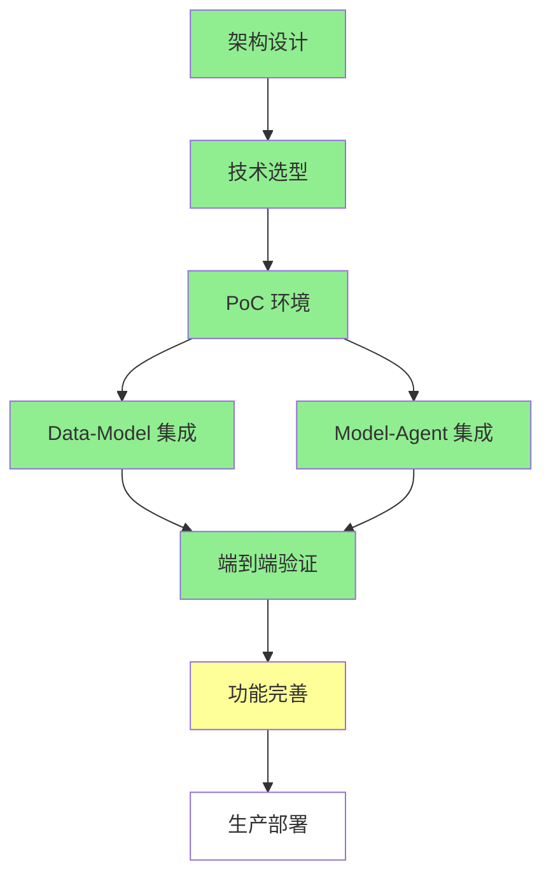

# 路线图

## 总体规划

```
┌─────────────────────────────────────────────────────────────────┐
│                         ONE-DATA-STUDIO 路线图                    │
└─────────────────────────────────────────────────────────────────┘

    2024 Q1-Q2              2024 Q3-Q4              2025-2026
  ┌──────────┐              ┌──────────┐              ┌──────────┐
  │  设计阶段  │              │  开发阶段  │              │  完善阶段  │
  │  ✅ 已完成 │              │  ✅ 已完成 │              │  🟡 进行中 │
  └──────────┘              └──────────┘              └──────────┘
      │                          │                          │
      ↓                          ↓                          ↓
  ┌────────┐                  ┌────────┐                  ┌────────┐
  │架构设计  │───────→         │原型开发  │───────→         │功能完善  │
  │技术选型  │                  │集成验证  │                  │性能优化  │
  │方案评审  │                  │功能实现  │                  │生产部署  │
  └────────┘                  └────────┘                  └────────┘
```

## 第一阶段：设计与规划（2024 Q1-Q2）✅ 已完成

### 目标

完成架构设计、技术选型和方案评审

### 关键任务

| 任务 | 优先级 | 状态 | 交付物 |
|------|--------|------|--------|
| 架构设计 | P0 | ✅ 完成 | 四层架构文档 |
| 集成方案设计 | P0 | ✅ 完成 | 三个集成点方案 |
| 技术栈选型 | P0 | ✅ 完成 | 技术选型清单 + 版本确认 |
| API 规范设计 | P0 | ✅ 完成 | API 接口文档 |
| 安全方案设计 | P1 | ✅ 完成 | 安全架构文档 |
| 部署方案设计 | P1 | ✅ 完成 | 部署架构文档 |
| PoC 实施手册 | P1 | ✅ 完成 | PoC 搭建指南 |
| API 测试指南 | P1 | ✅ 完成 | API 测试用例 |

### 里程碑

- [x] 架构概念冻结
- [x] 技术选型评审通过
- [x] 方案设计评审通过
- [x] 设计阶段文档完成

---

## 第二阶段：原型开发（2024 Q3-Q4）✅ 已完成

### 目标

完成核心功能的原型开发和集成验证

### 关键任务

| 任务 | 优先级 | 状态 | 交付物 |
|------|--------|------|--------|
| PoC 环境搭建 | P0 | ✅ 完成 | K8s 测试环境 |
| Data-Model 集成 | P0 | ✅ 完成 | 数据集注册/读取 |
| Model-Agent 集成 | P0 | ✅ 完成 | 模型服务 API |
| Data-Agent 集成 | P1 | ✅ 完成 | Text-to-SQL |
| RAG 流水线验证 | P1 | ✅ 完成 | 知识检索 Demo |
| 前端应用开发 | P0 | ✅ 完成 | React + TypeScript 前端 |
| 后端服务开发 | P0 | ✅ 完成 | 8 个微服务 |

### 里程碑

- [x] PoC 环境就绪
- [x] 三个集成点验证通过
- [x] Demo 演示完成
- [x] 前后端核心功能实现

---

## 第三阶段：功能完善（2025-2026）🟡 进行中

### 目标

完善功能、优化性能、准备生产部署

### 当前完成度

| 模块 | 完成度 | 说明 |
|------|--------|------|
| Data → Model 集成 | 90% | 数据集版本控制、自动触发训练待完成 |
| Model → Agent 集成 | 85% | 模型热切换、负载均衡优化待完成 |
| Data → Agent 集成 | 75% | 向量检索优化、聊天历史记录待完成 |
| **整体项目完成度** | **~93%** | 基于 FEATURES.md 功能清单 |

### 关键任务

| 任务 | 优先级 | 状态 | 交付物 |
|------|--------|------|--------|
| 高可用架构 | P0 | ✅ 完成 | 多副本/容灾方案 |
| 安全加固 | P0 | ✅ 完成 | 认证/授权/审计 |
| 自动化部署 | P1 | ✅ 完成 | Helm Charts/CI-CD |
| 文档完善 | P1 | 🟡 进行中 | 用户文档/运维文档 |
| 性能优化 | P0 | 🟡 进行中 | 压测报告/优化方案 |
| 聊天历史功能 | P0 | ⚪ 待实现 | 聊天历史记录 |
| 向量检索功能 | P0 | ⚪ 待实现 | RAG 向量检索 |
| 工作流编辑器完善 | P1 | ⚪ 待实现 | 可视化编辑器 |

### 里程碑

- [x] 高可用架构设计完成
- [x] 安全审计通过
- [ ] 生产环境部署就绪
- [ ] 全部功能完成

---

## 长期规划（2026+）

### 持续优化方向

| 方向 | 说明 |
|------|------|
| **模型能力增强** | 支持更多模型类型、多模态能力 |
| **自动化程度提升** | AutoML、自动特征工程 |
| **企业级特性** | 多租户、资源配额、计费 |
| **生态集成** | 对接更多第三方工具和服务 |

---

## 关键路径

```
架构设计 → 技术选型 → PoC环境 → 集成验证 → 功能完善 → 生产部署
    ↓          ↓          ↓          ↓          ↓          ↓
   ✅         ✅         ✅         ✅         🟡         ⚪
```

## 依赖关系



## 版本规划

| 版本 | 计划时间 | 主要特性 | 状态 |
|------|----------|----------|------|
| v0.1 | 2024 Q2 | PoC 验证，基础集成 | ✅ 已发布 |
| v0.5 | 2024 Q3 | 核心功能完整，Demo 演示 | ✅ 已发布 |
| v1.0 | 2024 Q4 | 生产可用，功能稳定 | ✅ 已发布 |
| v1.3 | 2025 Q1 | 测试完善，代码清理 | ✅ 当前版本 |
| v1.5 | 2025 Q2 | 企业级特性，多租户 | ⚪ 计划中 |
| v2.0 | 2026 | AutoML，智能增强 | ⚪ 计划中 |

### v1.3 当前版本详情

**目标**：测试完善、代码清理、文档整理

| 已完成功能 | 描述 |
|----------|------|
| 测试覆盖 | 85+ 测试文件，覆盖单元/集成/E2E/性能测试 |
| 代码清理 | Python 日志规范化、TypeScript 调试代码清理 |
| 文档整理 | 文档目录重组、归档过时文档 |
| 技术债务追踪 | tech-debt.md 追踪 14 项技术债务 |

### v1.5 计划详情（企业级特性）

**目标**：企业级特性，多租户

| 功能模块 | 描述 |
|----------|------|
| 多租户 | 租户隔离、资源配额 |
| 聊天历史 | 聊天历史记录功能 |
| 向量检索 | 真实向量数据库集成 |
| 工作流编辑器 | 可视化工作流编辑器 |

### v2.0 计划详情（智能增强）

**目标**：AutoML，智能增强

| 功能模块 | 描述 |
|----------|------|
| AutoML | 自动机器学习 |
| 自动特征工程 | 智能特征提取 |
| 多模态 | 支持图像、音频等多模态 |
