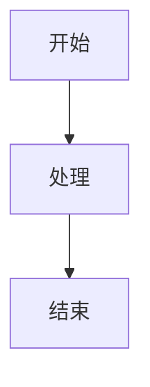

# 代码清理指南

> **更新日期**: 2026-01-29
> **目的**: 提供代码清理的最佳实践和指南

---

## 一、Python 代码规范

### 1.1 日志规范

**使用 `logging` 模块而非 `print()`**

```python
# ❌ 错误做法
print(f"Processing data: {data}")
print(f"Error occurred: {error}")

# ✅ 正确做法
import logging

logger = logging.getLogger(__name__)
logger.info(f"Processing data: {data}")
logger.error(f"Error occurred: {error}", exc_info=True)
```

### 1.2 异常处理

```python
# ✅ 正确的异常处理
try:
    result = process_data(data)
except ValueError as e:
    logger.warning(f"Invalid data: {e}")
    return None
except Exception as e:
    logger.error(f"Unexpected error: {e}", exc_info=True)
    raise
```

### 1.3 类型注解

```python
# ✅ 推荐使用类型注解
from typing import List, Dict, Optional

def process_items(items: List[Dict[str, any]]) -> Optional[Dict]:
    """处理项目列表"""
    if not items:
        return None
    return {"processed": len(items)}
```

---

## 二、TypeScript 代码规范

### 2.1 调试代码

**仅保留 `console.error`，移除 `console.log`**

```typescript
// ❌ 错误做法
console.log('Data loaded:', data);
console.debug('API response:', response);

// ✅ 正确做法 - 仅用于错误
console.error('API request failed:', error);

// ✅ 或使用专门的日志库
logger.info('Data loaded', { data });
```

### 2.2 组件规范

```typescript
// ✅ 使用类型定义
interface Props {
  title: string;
  onSubmit: () => void;
  disabled?: boolean;
}

export const SubmitButton: React.FC<Props> = ({
  title,
  onSubmit,
  disabled = false
}) => {
  return (
    <button onClick={onSubmit} disabled={disabled}>
      {title}
    </button>
  );
};
```

---

## 三、测试代码规范

### 3.1 测试文件组织

```
tests/
├── unit/              # 单元测试
│   ├── test_data_administrator/  # 按角色组织
│   ├── test_data_engineer/
│   └── test_ai_engineer/
├── integration/       # 集成测试
├── e2e/              # 端到端测试
└── performance/      # 性能测试
```

### 3.2 测试标记使用

```python
# ✅ 使用 pytest 标记
import pytest

@pytest.mark.p0
def test_critical_feature():
    """P0 优先级测试"""
    assert True

@pytest.mark.data_administrator
@pytest.mark.integration
def test_data_admin_workflow():
    """数据管理员集成测试"""
    assert True
```

### 3.3 测试命名规范

```python
# ✅ 清晰的测试命名
def test_dataset_create_returns_201():
    """测试创建数据集返回 201"""
    pass

def test_dataset_create_with_invalid_name_returns_400():
    """测试使用无效名称创建数据集返回 400"""
    pass
```

---

## 四、Git 提交规范

### 4.1 提交信息格式

```
<type>(<scope>): <subject>

<body>

<footer>
```

### 4.2 Type 类型

| Type | 说明 |
|------|------|
| `feat` | 新功能 |
| `fix` | Bug 修复 |
| `docs` | 文档更新 |
| `style` | 代码格式调整（不影响功能） |
| `refactor` | 重构（不是新功能也不是修复） |
| `perf` | 性能优化 |
| `test` | 测试相关 |
| `chore` | 构建/工具相关 |

### 4.3 示例

```bash
# 功能添加
git commit -m "feat(agent): add workflow version control"

# Bug 修复
git commit -m "fix(data): resolve metadata query timeout issue"

# 文档更新
git commit -m "docs: update API documentation for behavior service"
```

---

## 五、文档规范

### 5.1 Markdown 规范

```markdown
# 一级标题 - 文档标题

## 二级标题 - 主要章节

### 三级标题 - 子章节

**重点内容** 使用粗体

> 引用内容用于提示或说明

| 表头1 | 表头2 |
|-------|-------|
| 内容1 | 内容2 |

```python
# 代码块指定语言
def example():
    pass
```
```

### 5.2 Mermaid 图表

```markdown

```

### 5.3 更新记录

每个文档末尾应添加更新记录：

```markdown
---

## 更新记录

| 日期 | 更新内容 | 更新人 |
|------|----------|--------|
| 2026-01-29 | 初始版本 | Claude |
```

---

## 六、清理检查清单

### 6.1 提交前检查

- [ ] 移除所有 `console.log`（保留 `console.error`）
- [ ] 移除所有 `print()` 语句（使用 `logging`）
- [ ] 移除注释掉的代码块
- [ ] 移除无用的导入
- [ ] 格式化代码
- [ ] 运行测试确保通过

### 6.2 发布前检查

- [ ] 更新 CHANGELOG.md
- [ ] 更新版本号
- [ ] 运行完整测试套件
- [ ] 检查文档完整性
- [ ] 检查 API 文档是否最新

---

## 七、常见问题处理

### 7.1 循环导入

```python
# ❌ 循环导入
# module_a.py
from module_b import func_b

# module_b.py
from module_a import func_a

# ✅ 解决方案：延迟导入
def func_a():
    from module_b import func_b
    return func_b()
```

### 7.2 配置管理

```python
# ✅ 使用配置文件或环境变量
import os

class Config:
    DATABASE_URL = os.getenv('DATABASE_URL', 'sqlite:///default.db')
    DEBUG = os.getenv('DEBUG', 'False').lower() == 'true'
```

---

## 八、清理工具推荐

### 8.1 Python 工具

```bash
# 代码格式化
black .

# 导入排序
isort .

# 类型检查
mypy services/

# 代码检查
flake8 services/
pylint services/
```

### 8.2 TypeScript 工具

```bash
# 代码格式化
npm run format

# 代码检查
npm run lint

# 类型检查
npm run type-check
```

---

## 九、定期清理任务

| 任务 | 频率 | 负责人 |
|------|------|--------|
| 依赖更新检查 | 每月 | 开发团队 |
| 代码审计 | 每月 | 技术负责人 |
| 文档更新 | 每次 Sprint | 开发团队 |
| 技术债务回顾 | 每季度 | 技术负责人 |

---

## 十、参考资源

- [Python PEP 8 风格指南](https://peps.python.org/pep-0008/)
- [TypeScript 官方文档](https://www.typescriptlang.org/docs/)
- [Conventional Commits](https://www.conventionalcommits.org/)
- [Google Python 风格指南](https://google.github.io/styleguide/pyguide.html)
