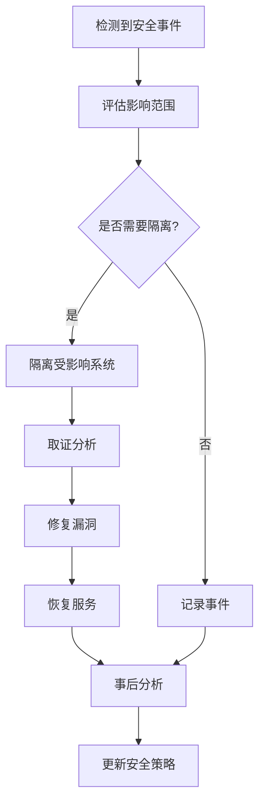

# 安全加固指南

本文档描述 ONE-DATA-STUDIO 平台的安全配置和最佳实践。

## 目录

1. [密钥管理](#密钥管理)
2. [TLS 配置](#tls-配置)
3. [RBAC 权限控制](#rbac-权限控制)
4. [网络策略](#网络策略)
5. [Pod 安全](#pod-安全)
6. [审计日志](#审计日志)
7. [合规性检查](#合规性检查)

---

## 密钥管理

### 策略

1. **不在代码中硬编码密钥** - 所有密钥通过环境变量或 Secret 管理
2. **使用密钥管理服务** - 生产环境推荐使用外部密钥管理
3. **定期轮换密钥** - 每 90 天轮换一次 TLS 证书

### 支持的密钥管理方案

| 方案 | 说明 | 推荐环境 |
|------|------|---------|
| Kubernetes Secrets | 原生支持 | 开发/测试 |
| Sealed Secrets | 加密存储 GitOps | 开发/生产 |
| External Secrets | 集成外部 KMS | 生产 |
| HashiCorp Vault | 企业级密钥管理 | 生产 |

### Sealed Secrets 配置

```bash
# 安装 Sealed Secrets
kubectl apply -f https://github.com/bitnami-labs/sealed-secrets/releases/download/v0.24.0/controller.yaml

# 创建 Sealed Secret
echo -n 'my-secret-password' | kubectl create secret generic mysql-password --dry-run=client --from-file=password=/dev/stdin -o yaml > secret.yaml
kubeseal -f secret.yaml -w sealed-secret.yaml

# 部署
kubectl apply -f sealed-secret.yaml
```

### External Secrets 配置

```yaml
apiVersion: external-secrets.io/v1beta1
kind: ExternalSecret
metadata:
  name: mysql-credentials
spec:
  refreshInterval: 1h
  secretStoreRef:
    name: aws-secrets-manager
    kind: SecretStore
  target:
    name: mysql-credentials
  data:
    - secretKey: password
      remoteRef:
        key: prod/mysql/password
```

---

## TLS 配置

### 证书管理

使用 `cert-manager` 自动管理 TLS 证书：

```bash
# 安装 cert-manager
kubectl apply -f https://github.com/cert-manager/cert-manager/releases/download/v1.13.0/cert-manager.yaml

# 配置 Let's Encrypt 邮箱
kubectl edit clusterissuer letsencrypt-prod
# 修改 email: admin@example.com
```

### 内部服务 mTLS

生产环境建议启用服务间 mTLS：

```yaml
apiVersion: security.istio.io/v1beta1
kind: PeerAuthentication
metadata:
  name: default
  namespace: one-data-alldata
spec:
  mtls:
    mode: STRICT
```

### TLS 配置检查清单

- [ ] 所有外部服务使用 Let's Encrypt 证书
- [ ] 内部服务使用自签名 CA 证书
- [ ] TLS 最低版本 1.3
- [ ] 禁用弱加密套件
- [ ] 配置证书自动轮换

---

## RBAC 权限控制

### 角色定义

| 角色 | 权限范围 | 适用对象 |
|------|---------|---------|
| `one-data:readonly` | 只读访问所有资源 | 所有用户默认 |
| `one-data:developer` | 完全访问应用命名空间 | 开发人员 |
| `one-data:ops` | 完全访问所有命名空间 + 节点 | 运维人员 |
| `one-data:admin` | 集群管理员 | 平台管理员 |

### 用户绑定示例

```bash
# 为开发者添加权限
kubectl create rolebinding developer-binding \
  --clusterrole=one-data:developer \
  --user=developer@example.com \
  --namespace=one-data-alldata

# 为运维人员添加权限
kubectl create clusterrolebinding ops-binding \
  --clusterrole=one-data:ops \
  --user=ops@example.com
```

### ServiceAccount 最佳实践

1. **禁用默认 ServiceAccount 的 token 自动挂载**
2. **为每个应用创建专用的 ServiceAccount**
3. **仅授予应用所需的最小权限**

```yaml
apiVersion: v1
kind: ServiceAccount
metadata:
  name: alldata-api
  namespace: one-data-alldata
automountServiceAccountToken: false  # 禁用自动挂载
```

---

## 网络策略

### 零信任模型

网络策略遵循零信任原则：

1. **默认拒绝所有入站流量**
2. **仅允许显式定义的流量**
3. **按服务最小化开放端口**

### 关键策略

| 策略 | 描述 |
|------|------|
| `default-deny-ingress` | 默认拒绝所有入站流量 |
| `alldata-api-policy` | Alldata API 的网络访问规则 |
| `milvus-policy` | Milvus 组件间通信规则 |
| `allow-dns` | 允许 DNS 查询 |

### 应用网络策略

```bash
# 应用所有安全策略
kubectl apply -f deploy/security/network-policies.yaml

# 验证策略
kubectl get networkpolicies --all-namespaces
```

### 网络策略测试

```bash
# 从 Pod 测试连接
kubectl run test-pod --image=nicolaka/netshoot -i --rm -- sh
# 在 Pod 中执行:
# nslookup alldata-api.one-data-alldata.svc.cluster.local
# nc -zv alldata-api.one-data-alldata.svc.cluster.local 8080
```

---

## Pod 安全

### Pod Security Standards

遵循 Kubernetes Pod Security Standards：

| 标准 | 描述 |
|------|------|
| `privileged` | 特权容器（禁止） |
| `baseline` | 基线安全 |
| `restricted` | 限制性安全（推荐） |

### 安全配置

```yaml
spec:
  securityContext:
    runAsNonRoot: true          # 必须非 root 运行
    runAsUser: 1000             # 指定用户 ID
    runAsGroup: 1000            # 指定组 ID
    fsGroup: 1000               # 文件系统组 ID
    seccompProfile:
      type: RuntimeDefault      # 使用默认 seccomp 配置
  containers:
  - name: api
    securityContext:
      allowPrivilegeEscalation: false  # 禁止权限提升
      readOnlyRootFilesystem: true      # 只读根文件系统
      capabilities:
        drop:
        - ALL                    # 删除所有 Linux 能力
```

### 容器镜像安全

1. **使用固定版本标签** - 禁止使用 `:latest`
2. **扫描镜像漏洞** - 使用 Trivy 或 similar
3. **使用最小化镜像** - Alpine 或 Distroless

```bash
# 扫描镜像漏洞
trivy image alldata-api:v1.0.0
```

---

## 审计日志

### 启用审计日志

配置 Kubernetes API Server 审计日志：

```yaml
# /etc/kubernetes/manifests/kube-apiserver.yaml
apiVersion: v1
kind: Pod
metadata:
  name: kube-apiserver
  namespace: kube-system
spec:
  containers:
  - name: kube-apiserver
    command:
    - kube-apiserver
    - --audit-log-path=/var/log/kubernetes/audit.log
    - --audit-log-maxage=30
    - --audit-log-maxbackup=10
    - --audit-log-maxsize=100
    - --audit-policy-file=/etc/kubernetes/audit-policy.yaml
    volumeMounts:
    - name: audit
      mountPath: /etc/kubernetes/audit-policy.yaml
      readOnly: true
    - name: audit-log
      mountPath: /var/log/kubernetes
  volumes:
  - name: audit
    hostPath:
      path: /etc/kubernetes/audit-policy.yaml
  - name: audit-log
    hostPath:
      path: /var/log/kubernetes
```

### 审计策略示例

```yaml
# /etc/kubernetes/audit-policy.yaml
apiVersion: audit.k8s.io/v1
kind: Policy
rules:
  # 记录所有修改操作
  - level: RequestResponse
    verbs: ["create", "update", "delete", "patch"]
    resources:
    - group: ""
      resources: ["pods", "services", "configmaps", "secrets"]

  # 记录 Secret 的读取
  - level: Metadata
    verbs: ["get", "list"]
    resources:
    - group: ""
      resources: ["secrets"]

  # 记录所有认证请求
  - level: Metadata
    userGroups: ["system:authenticated"]
```

### 应用审计日志

配置应用级审计日志：

```python
import logging
from logging.handlers import RotatingFileHandler

# 配置审计日志
audit_logger = logging.getLogger('audit')
audit_handler = RotatingFileHandler(
    '/var/log/audit.log',
    maxBytes=10*1024*1024,
    backupCount=10
)
audit_handler.setFormatter(
    logging.Formatter('%(asctime)s - %(user)s - %(action)s - %(resource)s')
)
audit_logger.addHandler(audit_handler)

# 记录审计事件
def audit_log(user, action, resource, result):
    audit_logger.info('', extra={
        'user': user,
        'action': action,
        'resource': resource,
        'result': result
    })
```

---

## 合规性检查

### CIS Benchmark

使用 kube-bench 进行 CIS Kubernetes Benchmark 检查：

```bash
# 安装 kube-bench
kubectl apply -f job.yaml

# 运行检查
kubectl -n kube-system job韭s/kube-bench

# 查看结果
kubectl logs -n kube-system job.batch/kube-bench
```

### 持续安全扫描

集成 Falco 进行运行时安全监控：

```yaml
apiVersion: v1
kind: ConfigMap
metadata:
  name: falco-rules
  namespace: falco
data:
  rules.yaml: |
    - macro: shell_binaries
      condition: >
        (proc.name in (bash, sh, zsh, dash, tcsh, csh))
    - rule: Shell in container
      desc: >
        A shell was spawned in a container with an attached terminal.
      condition: >
        shell_binaries and
        container and
        tty_exists
      output: >
        Shell spawned in container (user=%user.name container_id=%container.id container_name=%container.name shell=%proc.name parent=%proc.pname cmdline=%proc.cmdline)
      priority: WARNING
```

### 定期安全评估

| 检查项 | 频率 | 负责人 |
|--------|------|--------|
| 镜像漏洞扫描 | 每次构建 | DevOps |
| RBAC 权限审查 | 每月 | 安全团队 |
| 网络策略审计 | 每季度 | 安全团队 |
| 渗透测试 | 每半年 | 第三方 |
| 合规性评估 | 每年 | 合规团队 |

---

## 安全事件响应

### 响应流程



### 应急联系人

| 角色 | 姓名 | 联系方式 |
|------|------|---------|
| 安全负责人 | - | - |
| DevOps 负责人 | - | - |
| 法务代表 | - | - |

---

## 参考资源

- [CIS Kubernetes Benchmark](https://www.cisecurity.org/benchmark/kubernetes)
- [Kubernetes Security Best Practices](https://kubernetes.io/docs/concepts/security/security-checklist/)
- [NSA Kubernetes Hardening Guide](https://www.nsa.gov/News-Features/Feature-Stories/Article-View/Article/2716981/nsa-cisa-release-kubernetes-hardening-guidance)
- [OWASP Kubernetes Top Ten](https://owasp.org/www-project-kubernetes-top-ten/)
