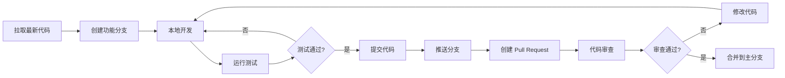
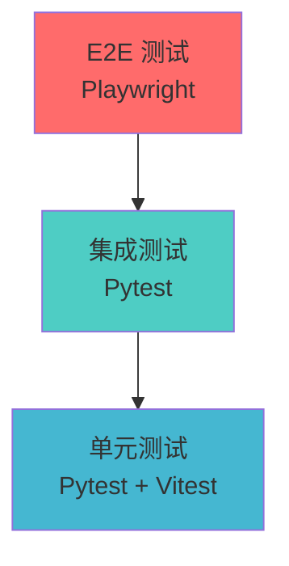

# ONE-DATA-STUDIO 贡献指南

欢迎贡献 ONE-DATA-STUDIO 项目！本文档介绍开发工作流程、可用脚本、环境配置和测试流程。

---

## 目录

- [开发工作流程](#开发工作流程)
- [环境准备](#环境准备)
- [可用脚本](#可用脚本)
- [测试流程](#测试流程)
- [代码规范](#代码规范)
- [提交规范](#提交规范)

---

## 开发工作流程

### 典型开发流程



### 分支策略

| 分支类型 | 命名规范 | 用途 |
|----------|----------|------|
| `master` | - | 主分支，保持稳定可发布状态 |
| `develop` | - | 开发分支，集成最新功能 |
| `feature/*` | `feature/功能名称` | 新功能开发 |
| `bugfix/*` | `bugfix/问题描述` | 缺陷修复 |
| `hotfix/*` | `hotfix/紧急问题` | 生产环境紧急修复 |

---

## 环境准备

### 系统要求

| 组件 | 最低要求 | 推荐配置 |
|------|----------|----------|
| 操作系统 | macOS/Linux | macOS/Linux |
| Python | 3.10+ | 3.11+ |
| Node.js | 18+ | 20+ |
| Docker | 20.10+ | 24+ |
| Docker Compose | 2.0+ | 2.20+ |
| 内存 | 8 GB | 16 GB+ |
| 磁盘 | 20 GB 可用空间 | 50 GB+ SSD |

### 1. 克隆项目

```bash
git clone https://github.com/your-org/one-data-studio.git
cd one-data-studio
```

### 2. Python 后端环境

```bash
# 创建虚拟环境
python3 -m venv .venv
source .venv/bin/activate  # Linux/macOS
# 或 .venv\Scripts\activate  # Windows

# 安装依赖
pip install -r requirements.txt
pip install -r requirements-test.txt

# 安装 pre-commit hooks
pre-commit install
```

### 3. 前端环境

```bash
cd web

# 安装依赖
npm install

# 验证安装
npm run typecheck
```

### 4. 配置环境变量

```bash
# 复制环境变量模板
cp .env.example .env
cp web/.env.example web/.env.development

# 编辑环境变量（根据实际环境修改）
vim .env
vim web/.env.development
```

### 5. 启动开发环境

```bash
# 使用 Makefile（推荐）
make dev

# 或使用 Docker Compose
docker-compose -f deploy/local/docker-compose.yml up -d

# 启动前端开发服务器
cd web && npm run dev
```

---

## 可用脚本

### Makefile 命令

项目根目录的 Makefile 提供了便捷的开发命令。

#### 开发环境命令

| 命令 | 说明 |
|------|------|
| `make dev` | 启动开发环境（等同于 `make dev-start`） |
| `make up` | 启动开发环境（别名） |
| `make down` | 停止开发环境（别名） |
| `make dev-start` | 启动所有开发服务 |
| `make dev-stop` | 停止所有开发服务 |
| `make dev-status` | 查看服务状态 |
| `make dev-logs` | 查看服务日志 |
| `make dev-db` | 数据库操作 |
| `make dev-clean` | 清理临时文件 |
| `make dev-reset` | 重置开发环境 |
| `make dev-shell` | 进入容器 Shell |
| `make dev-check` | 健康检查 |
| `make dev-seed` | 启动环境并导入种子数据 |

#### Docker Compose 命令

| 命令 | 说明 |
|------|------|
| `make docker-up` | 使用 Docker Compose 启动服务 |
| `make docker-down` | 停止 Docker Compose 服务 |

#### Kubernetes 命令

| 命令 | 说明 |
|------|------|
| `make kind-cluster` | 创建 Kind 本地 K8s 集群 |
| `make install` | 安装所有服务到 K8s |
| `make install-base` | 安装基础资源（命名空间、存储类） |
| `make install-infra` | 安装基础设施（MySQL、Redis、MinIO） |
| `make install-apps` | 安装应用服务 |
| `make status` | 查看 Pod 状态 |
| `make logs` | 查看所有服务日志 |
| `make logs-data` | 查看 Data API 日志 |
| `make logs-model` | 查看 Model 服务日志 |
| `make logs-agent` | 查看 Agent API 日志 |
| `make forward` | 启动端口转发（后台） |
| `make unforward` | 停止端口转发 |
| `make clean` | 删除 K8s 资源 |
| `make clean-all` | 删除 K8s 资源和 Kind 集群 |

#### Web 前端命令

| 命令 | 说明 |
|------|------|
| `make web-build` | 构建 Web Docker 镜像 |
| `make web-install` | 部署 Web 到 K8s |
| `make web-logs` | 查看 Web 日志 |
| `make web-forward` | 转发 Web 端口 |
| `make web-dev` | 启动本地开发服务器 |

#### 数据库命令

| 命令 | 说明 |
|------|------|
| `make init-db` | 运行数据库初始化 Job |
| `make seed` | 导入种子数据 |
| `make seed-dry-run` | 预览种子数据导入 |
| `make seed-force` | 强制导入种子数据 |

#### Helm 命令

| 命令 | 说明 |
|------|------|
| `make helm-lint` | 检查 Helm Charts |
| `make helm-package` | 打包 Helm Charts |

### 前端 npm 脚本

在 `web/` 目录下可用的 npm 脚本：

| 脚本 | 说明 |
|------|------|
| `npm run dev` | 启动 Vite 开发服务器 |
| `npm run build` | 构建生产版本 |
| `npm run build:strict` | 类型检查 + 构建 |
| `npm run typecheck` | TypeScript 类型检查 |
| `npm run typecheck:strict` | 严格类型检查 |
| `npm run preview` | 预览生产构建 |
| `npm run lint` | ESLint 代码检查 |
| `npm run format` | Prettier 代码格式化 |
| `npm run test` | 运行 Vitest 单元测试 |
| `npm run test:ui` | Vitest UI 模式 |
| `npm run test:watch` | 监听模式运行测试 |
| `npm run test:coverage` | 生成测试覆盖率报告 |

### Python 脚本

项目根目录可用的 Python 脚本：

| 脚本 | 说明 |
|------|------|
| `python scripts/seed.py` | 导入种子数据 |
| `python scripts/seed.py --dry-run` | 预览种子数据 |
| `python scripts/seed.py --force` | 强制导入 |
| `bash scripts/rotate-secrets.sh` | 密钥轮换 |
| `bash scripts/disaster-recovery.sh` | 灾难恢复 |

---

## 测试流程

### 测试金字塔



### 单元测试

#### Python 后端单元测试

```bash
# 运行所有单元测试
pytest tests/unit/ -v

# 运行特定模块测试
pytest tests/unit/test_data_administrator/ -v
pytest tests/unit/test_data_engineer/ -v
pytest tests/unit/test_ai_engineer/ -v
pytest tests/unit/test_business_user/ -v
pytest tests/unit/test_system_admin/ -v

# 运行 P0 优先级测试
pytest tests/unit/ -m p0 -v

# 生成覆盖率报告
pytest tests/unit/ --cov=services --cov-report=html

# 使用 Makefile
make test-unit
make test-unit-p0
make test-unit-data
make test-unit-agent
make test-unit-model
make test-unit-shared
```

#### 前端单元测试

```bash
cd web

# 运行测试
npm run test

# 监听模式
npm run test:watch

# UI 模式
npm run test:ui

# 覆盖率
npm run test:coverage
```

### 集成测试

```bash
# 运行所有集成测试
pytest tests/integration/ -v --with-db

# 按角色运行
make test-integration-dm      # 数据管理员
make test-integration-de      # 数据工程师
make test-integration-ae      # 算法工程师
make test-integration-bu      # 业务用户
make test-integration-sa      # 系统管理员
```

### E2E 测试

```bash
# 安装 Playwright 浏览器
cd tests/e2e
npx playwright install

# 运行所有 E2E 测试
npx playwright test

# 按角色运行
make test-e2e-data-administrator
make test-e2e-data-engineer
make test-e2e-ai-engineer
make test-e2e-business-user
make test-e2e-system-admin

# 运行特定测试
npx playwright test data-administrator.spec.ts

# 调试模式
npx playwright test --debug

# 生成报告
npx playwright show-report
```

### 性能测试

```bash
# 运行性能测试
pytest tests/performance/ -v --benchmark

# 使用 Locust 进行负载测试
locust -f tests/performance/locustfile.py --host=http://localhost:8080
```

### 测试覆盖率目标

| 测试类型 | 目标覆盖率 |
|----------|------------|
| 单元测试 | 80%+ |
| 集成测试 | 70%+ |
| E2E 测试 | 核心流程 100% |

---

## 代码规范

### Python 代码规范

项目遵循以下 Python 代码规范：

- **PEP 8**: Python 代码风格指南
- **类型注解**: 使用 `typing` 模块添加类型注解
- **Docstring**: 使用 Google 风格的文档字符串
- **日志**: 使用 `logging` 模块，避免 `print()`

```bash
# 代码格式化
black services/ tests/

# 导入排序
isort services/ tests/

# 代码检查
flake8 services/ tests/

# 类型检查
mypy services/
```

### TypeScript 代码规范

项目使用 ESLint 和 Prettier：

```bash
cd web

# 代码检查
npm run lint

# 代码格式化
npm run format

# 类型检查
npm run typecheck
```

### 命名约定

| 类型 | 约定 | 示例 |
|------|------|------|
| 变量 | snake_case | `user_name` |
| 常量 | UPPER_SNAKE_CASE | `MAX_RETRIES` |
| 函数 | snake_case | `get_user_data()` |
| 类 | PascalCase | `UserDataService` |
| 模块 | snake_case | `user_service.py` |
| 私有成员 | 前缀下划线 | `_internal_method` |

---

## 提交规范

### Commit Message 格式

遵循 [Conventional Commits](https://www.conventionalcommits.org/) 规范：

```
<type>(<scope>): <subject>

<body>

<footer>
```

### Type 类型

| Type | 说明 |
|------|------|
| `feat` | 新功能 |
| `fix` | 缺陷修复 |
| `docs` | 文档更新 |
| `style` | 代码格式（不影响功能） |
| `refactor` | 重构 |
| `perf` | 性能优化 |
| `test` | 测试相关 |
| `chore` | 构建/工具链相关 |
| `ci` | CI 配置 |

### 示例

```bash
# 新功能
git commit -m "feat(data-api): add data source validation"

# 缺陷修复
git commit -m "fix(agent-api): resolve memory leak in RAG pipeline"

# 文档更新
git commit -m "docs: update deployment guide for Kubernetes"

# 重构
git commit -m "refactor(shared): extract common auth logic"
```

---

## 本地开发工作流示例

### 开发新功能

```bash
# 1. 更新主分支
git checkout master
git pull origin master

# 2. 创建功能分支
git checkout -b feature/add-new-feature

# 3. 开发并提交
# ... 编写代码 ...
git add .
git commit -m "feat: add new feature"

# 4. 运行测试
make test-unit
npm run test

# 5. 推送分支
git push origin feature/add-new-feature

# 6. 创建 Pull Request
# 在 GitHub 上创建 PR
```

### 修复缺陷

```bash
# 1. 创建修复分支
git checkout -b bugfix/fix-issue-description

# 2. 修复并测试
# ... 修复代码 ...
make test-unit

# 3. 提交
git commit -m "fix: resolve issue with ..."

# 4. 推送并创建 PR
git push origin bugfix/fix-issue-description
```

---

## 发布流程

发布流程固定在 `/release` 文件夹中：

```
release/
├── backend/      # 后端发布
├── frontend/     # 前端发布
└── charts/       # Helm Charts
```

发布的成果物必须以生产环境为标准，包含所有发布生产所应该包含的文件或数据。

---

## 获取帮助

- **项目文档**: `/docs` 目录
- **API 文档**: `/docs/02-integration/api-reference.md`
- **故障排查**: `/docs/07-operations/troubleshooting.md`
- **GitHub Issues**: https://github.com/your-org/one-data-studio/issues

---

**更新时间**: 2026-02-04
