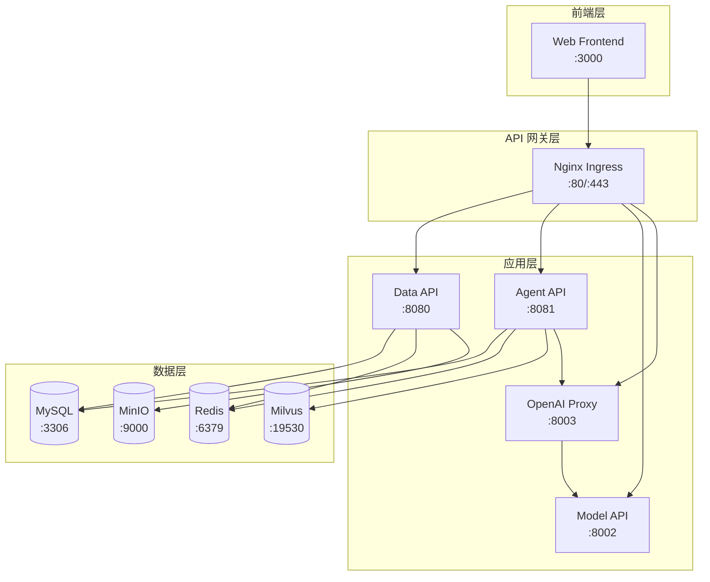
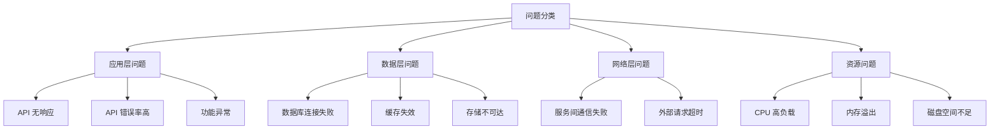
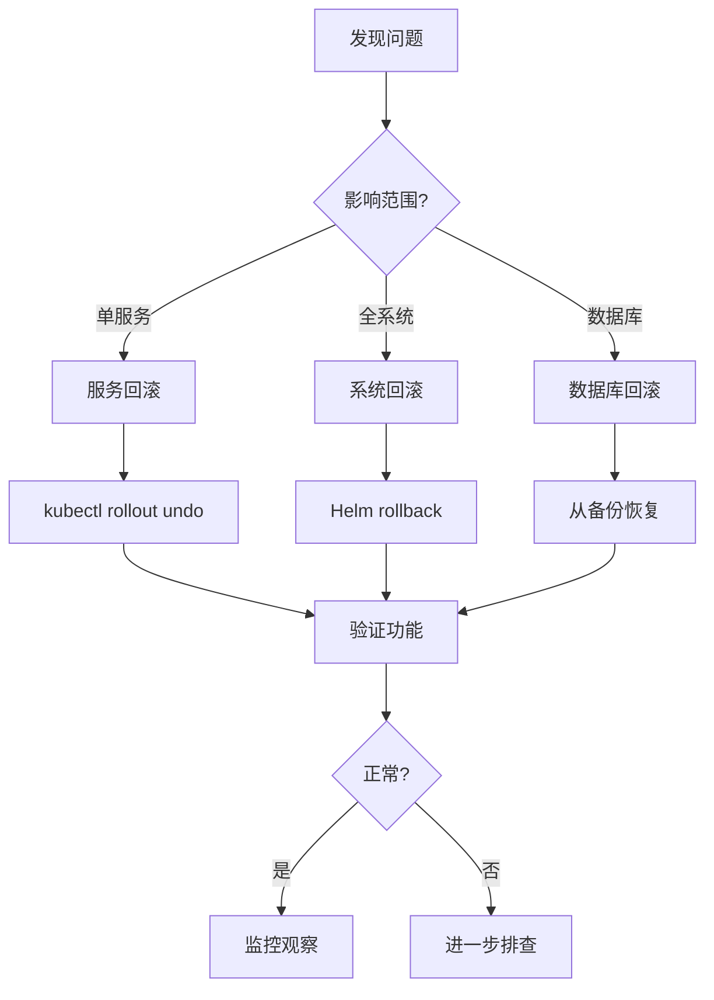

# ONE-DATA-STUDIO 运维手册 (RUNBOOK)

本文档为 ONE-DATA-STUDIO 平台的运维手册，包含部署流程、监控告警、常见问题处理和回滚流程。

---

## 目录

- [部署流程](#部署流程)
- [服务架构](#服务架构)
- [监控告警](#监控告警)
- [常见问题处理](#常见问题处理)
- [回滚流程](#回滚流程)
- [备份恢复](#备份恢复)
- [性能调优](#性能调优)
- [安全加固](#安全加固)

---

## 部署流程

### 环境要求

#### 硬件要求

| 环境 | CPU | 内存 | 存储 | 网络 |
|------|-----|------|------|------|
| 开发环境 | 4 核 | 16 GB | 100 GB SSD | 100 Mbps |
| 测试环境 | 8 核 | 32 GB | 200 GB SSD | 1 Gbps |
| 生产环境 | 16 核+ | 64 GB+ | 500 GB SSD | 10 Gbps |

#### 软件要求

| 软件 | 版本要求 | 说明 |
|------|----------|------|
| Docker | 20.10+ | 容器运行时 |
| Docker Compose | 2.0+ | 本地开发 |
| Kubernetes | 1.25+ | 容器编排 |
| Helm | 3.10+ | 包管理 |
| Python | 3.10+ | 后端开发 |
| Node.js | 18+ | 前端构建 |

### Docker Compose 部署

适用于开发和小规模部署。

```bash
# 1. 克隆代码
git clone https://github.com/your-org/one-data-studio.git
cd one-data-studio

# 2. 配置环境变量
cp .env.example .env
vim .env  # 修改必要配置

# 3. 启动服务
make docker-up
# 或
docker-compose -f deploy/local/docker-compose.yml up -d

# 4. 验证部署
curl http://localhost:8080/api/v1/health  # Data API
curl http://localhost:8081/api/v1/health  # Agent API
curl http://localhost:8003/api/v1/health  # OpenAI Proxy
```

### Kubernetes 部署

适用于生产环境。

#### 1. 创建命名空间和基础资源

```bash
# 创建命名空间
kubectl create namespace one-data-infra
kubectl create namespace one-data-data
kubectl create namespace one-data-model
kubectl create namespace one-data-agent
kubectl create namespace one-data-web

# 或使用 Makefile
make install-base
```

#### 2. 部署基础设施

```bash
# 部署 MySQL
kubectl apply -f deploy/kubernetes/infrastructure/databases/mysql/standalone.yaml

# 部署 Redis
kubectl apply -f deploy/kubernetes/infrastructure/databases/redis/standalone.yaml

# 部署 MinIO
kubectl apply -f deploy/kubernetes/infrastructure/databases/minio.yaml

# 等待就绪
kubectl wait --for=condition=ready pod -l app=mysql -n one-data-infra --timeout=300s
kubectl wait --for=condition=ready pod -l app=redis -n one-data-infra --timeout=300s
kubectl wait --for=condition=ready pod -l app=minio -n one-data-infra --timeout=300s
```

#### 3. 配置密钥

```bash
# 创建数据库密钥
kubectl create secret generic mysql-credentials \
  --from-literal=username=one_data \
  --from-literal=password=<your-password> \
  -n one-data-infra

# 创建 JWT 密钥
kubectl create secret generic jwt-secret \
  --from-literal=secret-key=$(openssl rand -base64 32) \
  -n one-data-data

# 创建 OpenAI API 密钥
kubectl create secret generic openai-credentials \
  --from-literal=api-key=<your-api-key> \
  -n one-data-agent
```

#### 4. 部署应用服务

```bash
# Data API
kubectl apply -f deploy/kubernetes/applications/data-api/deployment.yaml

# Model API (vLLM)
kubectl apply -f deploy/kubernetes/applications/vllm-serving/deployment.yaml

# Agent API
kubectl apply -f deploy/kubernetes/applications/agent-api/deployment.yaml

# Web Frontend
kubectl apply -f deploy/kubernetes/applications/web-frontend/deployment.yaml

# 等待就绪
kubectl wait --for=condition=ready pod -l app=data-api -n one-data-data --timeout=120s
kubectl wait --for=condition=ready pod -l app=agent-api -n one-data-agent --timeout=120s
kubectl wait --for=condition=ready pod -l app=web-frontend -n one-data-web --timeout=120s
```

#### 5. 配置 Ingress

```bash
# 部署 Ingress
kubectl apply -f deploy/kubernetes/applications/ingress.yaml

# 验证
kubectl get ingress -A
```

### Helm 部署

```bash
# 添加 values 覆盖
cat > values-production.yaml <<EOF
mysql:
  auth:
    password: <your-password>

redis:
  auth:
    password: <your-password>

openai:
  apiKey: <your-api-key>

ingress:
  enabled: true
  host: one-data.example.com
EOF

# 安装
helm install one-data deploy/helm/charts/one-data \
  --namespace one-data-system \
  --create-namespace \
  -f values-production.yaml

# 升级
helm upgrade one-data deploy/helm/charts/one-data \
  --namespace one-data-system \
  -f values-production.yaml

# 卸载
helm uninstall one-data --namespace one-data-system
```

### ArgoCD GitOps 部署

```bash
# 安装 ArgoCD Application
kubectl apply -f deploy/argocd/applications/

# 同步状态
argocd app get one-data
argocd app sync one-data
```

---

## 服务架构

### 服务拓扑



### 服务端口映射

| 服务 | 内部端口 | 外部端口 | 协议 |
|------|----------|----------|------|
| Web Frontend | 80 | 3000 | HTTP |
| Data API | 8080 | 8080 | HTTP |
| Agent API | 8081 | 8081 | HTTP |
| Model API | 8000 | 8002 | HTTP |
| OpenAI Proxy | 8000 | 8003 | HTTP |
| MySQL | 3306 | - | TCP |
| Redis | 6379 | - | TCP |
| MinIO API | 9000 | 9001 | HTTP |
| MinIO Console | 9001 | 9001 | HTTP |
| Milvus | 19530 | - | TCP |
| Prometheus | 9090 | 9090 | HTTP |
| Grafana | 3000 | 3001 | HTTP |

### 健康检查端点

每个服务都提供健康检查端点：

```bash
# Data API
curl http://localhost:8080/api/v1/health

# Agent API
curl http://localhost:8081/api/v1/health

# Model API
curl http://localhost:8002/api/v1/health

# OpenAI Proxy
curl http://localhost:8003/health
```

预期响应：
```json
{
  "code": 0,
  "message": "healthy",
  "service": "data-api",
  "version": "1.0.0"
}
```

---

## 监控告警

### Prometheus 指标

#### 核心 HTTP 指标

| 指标名称 | 类型 | 说明 |
|----------|------|------|
| `http_request_duration_seconds` | Histogram | HTTP 请求延迟 |
| `http_requests_total` | Counter | HTTP 请求总数 |
| `http_requests_in_progress` | Gauge | 当前进行中的请求数 |
| `http_response_size_bytes` | Histogram | 响应大小分布 |

#### 数据库指标

| 指标名称 | 类型 | 说明 |
|----------|------|------|
| `db_connections_total` | Gauge | 数据库连接总数 |
| `db_connections_in_use` | Gauge | 当前连接使用数 |
| `db_connection_duration_seconds` | Histogram | 数据库连接延迟 |

#### AI 服务指标

| 指标名称 | 类型 | 说明 |
|----------|------|------|
| `ai_requests_total` | Counter | AI 请求总数 |
| `ai_request_duration_seconds` | Histogram | AI 请求延迟 |
| `ai_request_tokens_total` | Counter | Token 使用统计 |
| `ai_cache_hits_total` | Counter | 缓存命中数 |
| `ai_cache_misses_total` | Counter | 缓存未命中数 |

#### RAG 指标

| 指标名称 | 类型 | 说明 |
|----------|------|------|
| `rag_retrieval_duration_seconds` | Histogram | RAG 检索延迟 |
| `rag_retrieval_count` | Counter | RAG 检索次数 |
| `vector_search_score` | Gauge | 向量搜索分数 |

### Grafana 仪表板

预配置的仪表板位于 `deploy/monitoring/grafana/dashboards/`：

1. **API 性能仪表板** - `api-performance.json`
2. **系统资源仪表板** - `system-resources.json`
3. **业务指标仪表板** - `business-metrics.json`
4. **AI 服务仪表板** - `ai-services.json`

访问方式：
```bash
# 端口转发
kubectl port-forward -n one-data-infra svc/grafana 3001:3000

# 浏览器访问
open http://localhost:3001
```

### 告警规则

#### 服务可用性告警

```yaml
# 服务不可用
- alert: ServiceDown
  expr: up{job=~"data-api|agent-api|openai-proxy"} == 0
  for: 1m
  labels:
    severity: critical
  annotations:
    summary: "服务 {{ $labels.job }} 不可用"
```

#### 性能告警

```yaml
# 高延迟告警
- alert: HighLatency
  expr: histogram_quantile(0.95, rate(http_request_duration_seconds_bucket[5m])) > 0.5
  for: 5m
  labels:
    severity: warning
  annotations:
    summary: "服务 {{ $labels.job }} P95 延迟超过 500ms"

# 高错误率告警
- alert: HighErrorRate
  expr: rate(http_request_errors_total[5m]) / rate(http_requests_total[5m]) > 0.05
  for: 5m
  labels:
    severity: warning
  annotations:
    summary: "服务 {{ $labels.job }} 错误率超过 5%"
```

#### 资源告警

```yaml
# CPU 高使用率
- alert: HighCPUUsage
  expr: rate(container_cpu_usage_seconds_total[5m]) > 0.8
  for: 10m
  labels:
    severity: warning
  annotations:
    summary: "容器 {{ $labels.container }} CPU 使用率超过 80%"

# 内存高使用率
- alert: HighMemoryUsage
  expr: container_memory_usage_bytes / container_spec_memory_limit_bytes > 0.85
  for: 10m
  labels:
    severity: warning
  annotations:
    summary: "容器 {{ $labels.container }} 内存使用率超过 85%"
```

#### 数据库告警

```yaml
# 数据库连接池耗尽
- alert: DatabasePoolExhausted
  expr: db_connections_in_use / db_connections_total > 0.9
  for: 5m
  labels:
    severity: critical
  annotations:
    summary: "数据库连接池使用率超过 90%"

# Redis 连接失败
- alert: RedisConnectionFailed
  expr: redis_up == 0
  for: 1m
  labels:
    severity: critical
  annotations:
    summary: "Redis 连接失败"
```

### 告警通知

配置 AlertManager 发送告警通知：

```yaml
# 邮件通知
receivers:
  - name: 'email-alerts'
    email_configs:
      - to: 'ops@your-company.com'
        from: 'alertmanager@your-company.com'
        smarthost: 'smtp.your-company.com:587'
        auth_username: 'alertmanager@your-company.com'
        auth_password: '<password>'

# 钉钉通知
receivers:
  - name: 'dingtalk-alerts'
    webhook_configs:
      - url: 'https://oapi.dingtalk.com/robot/send?access_token=<token>'
```

---

## 常见问题处理

### 问题分类



### 应用层问题

#### 1. API 服务无响应

**症状**:
- 健康检查失败
- 请求超时

**排查步骤**:

```bash
# 1. 检查 Pod 状态
kubectl get pods -n one-data-data
kubectl get pods -n one-data-agent

# 2. 检查 Pod 日志
kubectl logs -f deployment/data-api -n one-data-data --tail=100
kubectl logs -f deployment/agent-api -n one-data-agent --tail=100

# 3. 检查资源使用
kubectl top pods -n one-data-data
kubectl top pods -n one-data-agent

# 4. 检查事件
kubectl get events -n one-data-data --sort-by='.lastTimestamp'
```

**解决方案**:

```bash
# 重启 Pod
kubectl rollout restart deployment/data-api -n one-data-data
kubectl rollout restart deployment/agent-api -n one-data-agent

# 扩容
kubectl scale deployment/data-api --replicas=3 -n one-data-data

# 调整资源限制
kubectl set resources deployment/data-api \
  --limits=cpu=2000m,memory=2Gi \
  --requests=cpu=500m,memory=512Mi \
  -n one-data-data
```

#### 2. API 错误率高

**症状**:
- 5xx 错误率 > 5%
- 大量超时

**排查步骤**:

```bash
# 1. 查看错误日志
kubectl logs deployment/data-api -n one-data-data | grep -i error

# 2. 检查下游服务
curl http://mysql.one-data-infra.svc.cluster.local:3306
curl http://redis.one-data-infra.svc.cluster.local:6379

# 3. 检查数据库连接
kubectl exec -it deployment/data-api -n one-data-data -- \
  python -c "from services.shared.database import engine; print(engine.execute('SELECT 1'))"
```

**解决方案**:

```bash
# 检查并修复数据库连接
kubectl exec -it mysql-0 -n one-data-infra -- mysql -u root -p

# 重启依赖服务
kubectl rollout restart statefulset/mysql -n one-data-infra
```

#### 3. RAG 检索失败

**症状**:
- 向量检索报错
- Milvus 连接失败

**排查步骤**:

```bash
# 1. 检查 Milvus 状态
kubectl get pods -l app=milvus -n one-data-infra

# 2. 检查 Milvus 日志
kubectl logs -f deployment/milvus -n one-data-infra

# 3. 测试连接
kubectl exec -it deployment/agent-api -n one-data-agent -- \
  python -c "from pymilvus import connections; connections.connect('default', host='milvus', port='19530'); print(connections.has_collection('test'))"
```

**解决方案**:

```bash
# 重启 Milvus
kubectl rollout restart deployment/milvus -n one-data-infra

# 检查集合状态
kubectl exec -it deployment/agent-api -n one-data-agent -- \
  python -c "from pymilvus import utility; print(utility.list_collections())"
```

### 数据层问题

#### 1. MySQL 连接失败

**症状**:
- 数据库连接错误
- 连接池耗尽

**排查步骤**:

```bash
# 1. 检查 MySQL 状态
kubectl get pods -l app=mysql -n one-data-infra
kubectl exec -it mysql-0 -n one-data-infra -- mysql -u root -p -e "SHOW PROCESSLIST;"

# 2. 检查连接数
kubectl exec -it mysql-0 -n one-data-infra -- mysql -u root -p -e "SHOW STATUS LIKE 'Threads_connected';"

# 3. 检查慢查询
kubectl exec -it mysql-0 -n one-data-infra -- mysql -u root -p -e "SHOW FULL PROCESSLIST;" | grep -v Sleep
```

**解决方案**:

```bash
# 调整连接池大小
# 修改 ConfigMap 或环境变量
DB_POOL_SIZE=20
DB_MAX_OVERFLOW=40

# 重启应用
kubectl rollout restart deployment/data-api -n one-data-data
kubectl rollout restart deployment/agent-api -n one-data-agent
```

#### 2. Redis 缓存失效

**症状**:
- 缓存命中率下降
- 响应变慢

**排查步骤**:

```bash
# 1. 检查 Redis 状态
kubectl get pods -l app=redis -n one-data-infra

# 2. 检查 Redis 信息
kubectl exec -it redis-0 -n one-data-infra -- redis-cli INFO

# 3. 检查缓存命中率
kubectl exec -it redis-0 -n one-data-infra -- redis-cli INFO STATS | grep hits
```

**解决方案**:

```bash
# 清理过期缓存
kubectl exec -it redis-0 -n one-data-infra -- redis-cli FLUSHDB

# 重启 Redis
kubectl rollout restart statefulset/redis -n one-data-infra
```

#### 3. MinIO 存储问题

**症状**:
- 文件上传失败
- 存储不可达

**排查步骤**:

```bash
# 1. 检查 MinIO 状态
kubectl get pods -l app=minio -n one-data-infra

# 2. 检查存储空间
kubectl exec -it minio-0 -n one-data-infra -- df -h

# 3. 检查 Bucket
kubectl exec -it minio-0 -n one-data-infra -- mc ls myminio/
```

**解决方案**:

```bash
# 扩容 PVC
kubectl edit pvc minio-data -n one-data-infra

# 或创建新 Bucket
kubectl exec -it minio-0 -n one-data-infra -- mc mb myminio/new-bucket
```

### 网络层问题

#### 1. 服务间通信失败

**症状**:
- 超时错误
- DNS 解析失败

**排查步骤**:

```bash
# 1. 检查 Service
kubectl get svc -A

# 2. 测试 DNS
kubectl run -it --rm debug --image=busybox --restart=Never -- \
  nslookup mysql.one-data-infra.svc.cluster.local

# 3. 测试连通性
kubectl run -it --rm debug --image=busybox --restart=Never -- \
  wget -O- http://data-api.one-data-data.svc.cluster.local:8080/api/v1/health
```

**解决方案**:

```bash
# 检查 NetworkPolicy
kubectl get networkpolicy -A

# 删除限制性策略
kubectl delete networkpolicy restrictive-policy -n one-data-data
```

#### 2. 外部请求超时

**症状**:
- OpenAI API 调用超时
- 模型服务响应慢

**排查步骤**:

```bash
# 1. 测试外部连通性
kubectl run -it --rm debug --image=busybox --restart=Never -- \
  wget -O- https://api.openai.com/v1/models --timeout=10

# 2. 检查代理配置
kubectl get configmap proxy-config -n one-data-agent -o yaml
```

**解决方案**:

```bash
# 调整超时时间
OPENAI_TIMEOUT=60

# 或使用代理
HTTP_PROXY=http://proxy.example.com:8080
HTTPS_PROXY=http://proxy.example.com:8080
```

### 资源问题

#### 1. CPU 高负载

**症状**:
- Pod 节流
- 响应变慢

**排查步骤**:

```bash
# 1. 查看资源使用
kubectl top pods -A

# 2. 查看节点资源
kubectl top nodes

# 3. 查看 Pod 详情
kubectl describe pod <pod-name> -n <namespace>
```

**解决方案**:

```bash
# 增加资源限制
kubectl set resources deployment/data-api \
  --limits=cpu=4000m \
  --requests=cpu=1000m \
  -n one-data-data

# 扩容
kubectl scale deployment/data-api --replicas=5 -n one-data-data

# 配置 HPA
kubectl autoscale deployment data-api \
  --cpu-percent=70 \
  --min=2 --max=10 \
  -n one-data-data
```

#### 2. 内存溢出

**症状**:
- Pod OOMKilled
- 内存持续增长

**排查步骤**:

```bash
# 1. 查看 Pod 事件
kubectl describe pod <pod-name> -n <namespace> | grep -i oom

# 2. 检查内存使用
kubectl exec -it <pod-name> -n <namespace> -- free -h

# 3. 查看进程内存
kubectl exec -it <pod-name> -n <namespace> -- ps aux --sort=-%mem | head
```

**解决方案**:

```bash
# 增加内存限制
kubectl set resources deployment/data-api \
  --limits=memory=4Gi \
  --requests=memory=1Gi \
  -n one-data-data

# 或检查内存泄漏
kubectl exec -it <pod-name> -n <namespace> -- \
  python -m memory_profiler app.py
```

#### 3. 磁盘空间不足

**症状**:
- Pod 无法启动
- 写入失败

**排查步骤**:

```bash
# 1. 检查节点磁盘
kubectl get nodes -o custom-columns=NAME:.metadata.name,DISK:.status.capacity.storage

# 2. 检查 PVC 状态
kubectl get pvc -A

# 3. 检查 Pod 磁盘使用
kubectl exec -it <pod-name> -n <namespace> -- df -h
```

**解决方案**:

```bash
# 清理日志
kubectl logs <deployment> -n <namespace> --tail=0 --log-file=/dev/null

# 清理旧数据
kubectl exec -it <pod-name> -n <namespace> -- rm -rf /tmp/*

# 扩容 PVC（仅支持扩容）
kubectl patch pvc data-pvc -n one-data-data -p '{"spec":{"resources":{"requests":{"storage":"200Gi"}}}}'
```

---

## 回滚流程

### Kubernetes 回滚

```bash
# 1. 查看部署历史
kubectl rollout history deployment/data-api -n one-data-data

# 2. 回滚到上一版本
kubectl rollout undo deployment/data-api -n one-data-data

# 3. 回滚到指定版本
kubectl rollout undo deployment/data-api -n one-data-data --to-revision=3

# 4. 查看回滚状态
kubectl rollout status deployment/data-api -n one-data-data
```

### Helm 回滚

```bash
# 1. 查看发布历史
helm history one-data -n one-data-system

# 2. 回滚到上一版本
helm rollback one-data -n one-data-system

# 3. 回滚到指定版本
helm rollback one-data 2 -n one-data-system

# 4. 查看状态
helm status one-data -n one-data-system
```

### 数据库回滚

```bash
# 使用备份恢复
kubectl exec -it mysql-0 -n one-data-infra -- \
  mysql -u root -p one_data_studio < backup_20260103.sql

# 或使用事务回滚（应用层）
```

### 回滚决策流程



---

## 备份恢复

### 备份策略

| 数据类型 | 备份频率 | 保留时间 | 备份方式 |
|----------|----------|----------|----------|
| MySQL 数据库 | 每日 | 30 天 | mysqldump |
| MinIO 对象 | 每日 | 30 天 | mc mirror |
| Milvus 向量 | 每周 | 4 周 | milvus-backup |
| 配置文件 | 变更时 | 永久 | Git |

### MySQL 备份

```bash
# 手动备份
kubectl exec mysql-0 -n one-data-infra -- \
  mysqldump -u root -p${MYSQL_ROOT_PASSWORD} \
  --all-databases --single-transaction \
  > backup_mysql_$(date +%Y%m%d).sql

# 定时备份（CronJob）
cat > backup-cronjob.yaml <<EOF
apiVersion: batch/v1
kind: CronJob
metadata:
  name: mysql-backup
  namespace: one-data-infra
spec:
  schedule: "0 2 * * *"
  jobTemplate:
    spec:
      template:
        spec:
          containers:
          - name: backup
            image: mysql:8.0
            command:
            - mysqldump
            - -hmysql
            - -uroot
            - -p${MYSQL_ROOT_PASSWORD}
            - --all-databases
            volumeMounts:
            - name: backup
              mountPath: /backup
          volumes:
          - name: backup
            persistentVolumeClaim:
              claimName: backup-pvc
          restartPolicy: OnFailure
EOF

kubectl apply -f backup-cronjob.yaml
```

### MinIO 备份

```bash
# 使用 mc 工具
kubectl exec minio-0 -n one-data-infra -- \
  mc mirror /data /backup/minio/

# 或使用外部备份服务器
mc mirror myminio/one-data-studio /backup/one-data-studio
```

### Milvus 备份

```bash
# 使用 Milvus 备份工具
kubectl exec -it milvus-0 -n one-data-infra -- \
  milvus-backup create -n backup_$(date +%Y%m%d)

# 列出备份
kubectl exec -it milvus-0 -n one-data-infra -- \
  milvus-backup list
```

### 恢复流程

```bash
# MySQL 恢复
kubectl exec -i mysql-0 -n one-data-infra -- \
  mysql -u root -p${MYSQL_ROOT_PASSWORD} < backup_mysql_20260103.sql

# MinIO 恢复
kubectl exec minio-0 -n one-data-infra -- \
  mc mirror /backup/minio/ /data

# Milvus 恢复
kubectl exec -it milvus-0 -n one-data-infra -- \
  milvus-backup restore -n backup_20260103
```

---

## 性能调优

### 数据库调优

```sql
-- MySQL 配置优化
SET GLOBAL max_connections = 500;
SET GLOBAL innodb_buffer_pool_size = 2147483648;  -- 2GB
SET GLOBAL query_cache_size = 268435456;  -- 256MB
SET GLOBAL slow_query_log = 'ON';
SET GLOBAL long_query_time = 2;

-- 查看慢查询
SHOW VARIABLES LIKE 'slow_query%';
SELECT * FROM mysql.slow_log ORDER BY start_time DESC LIMIT 10;
```

### 缓存调优

```bash
# Redis 配置优化
maxmemory 1gb
maxmemory-policy allkeys-lru
save 900 1
save 300 10
save 60 10000
```

### 应用调优

```python
# 连接池配置
DB_POOL_SIZE = 20
DB_MAX_OVERFLOW = 40
DB_POOL_TIMEOUT = 30
DB_POOL_RECYCLE = 3600

# 缓存 TTL
CACHE_METADATA_TTL = 300  # 5分钟
CACHE_MODEL_LIST_TTL = 600  # 10分钟
CACHE_WORKFLOW_TTL = 180  # 3分钟
```

---

## 安全加固

### 密钥管理

```bash
# 定期轮换密钥
./scripts/rotate-secrets.sh

# 轮换 JWT 密钥
NEW_KEY=$(openssl rand -base64 32)
kubectl patch secret jwt-secret -n one-data-data \
  -p='{"data":{"JWT_SECRET_KEY":"'$(echo -n $NEW_KEY | base64)'"}}'

# 重启服务
kubectl rollout restart deployment/data-api -n one-data-data
```

### 网络策略

```yaml
apiVersion: networking.k8s.io/v1
kind: NetworkPolicy
metadata:
  name: api-network-policy
  namespace: one-data-data
spec:
  podSelector:
    matchLabels:
      app: data-api
  ingress:
  - from:
    - podSelector:
        matchLabels:
          app: web-frontend
    ports:
    - protocol: TCP
      port: 8080
```

### 审计日志

```bash
# 查看审计日志
kubectl get events -n one-data-data --sort-by='.lastTimestamp'

# 查看应用审计日志
kubectl logs deployment/data-api -n one-data-data | grep AUDIT
```

---

## 附录

### 常用命令速查

```bash
# 查看所有资源
kubectl get all -A

# 查看命名空间资源
kubectl get all -n one-data-data

# 查看日志
kubectl logs -f deployment/<name> -n <namespace>

# 进入 Pod
kubectl exec -it <pod-name> -n <namespace> -- /bin/bash

# 端口转发
kubectl port-forward svc/<service-name> <local-port>:<remote-port> -n <namespace>

# 查看事件
kubectl get events -n <namespace> --sort-by='.lastTimestamp'

# 查看资源使用
kubectl top nodes
kubectl top pods -n <namespace>

# 扩缩容
kubectl scale deployment/<name> --replicas=<n> -n <namespace>

# 重启
kubectl rollout restart deployment/<name> -n <namespace>

# 编辑资源
kubectl edit deployment/<name> -n <namespace>

# 描述资源
kubectl describe pod/<pod-name> -n <namespace>
```

### 联系方式

- 技术支持：support@example.com
- 紧急热线：+86-xxx-xxxx-xxxx
- 文档地址：https://docs.one-data-studio.com

---

**更新时间**: 2026-02-03
