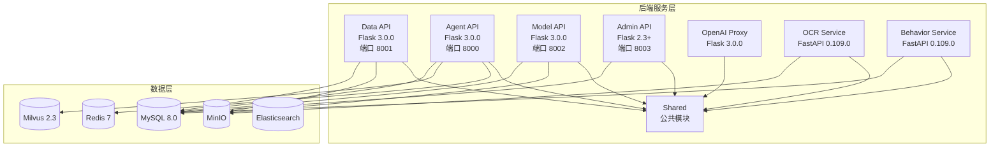
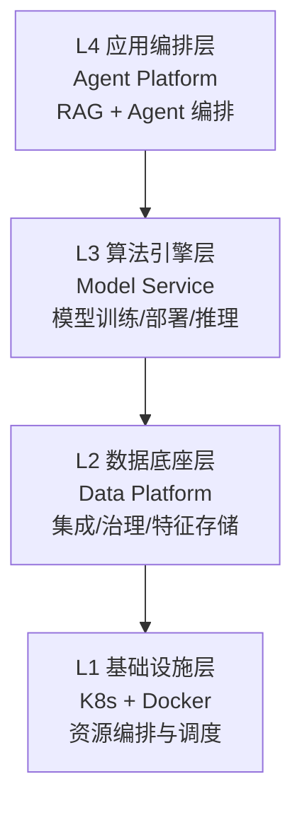
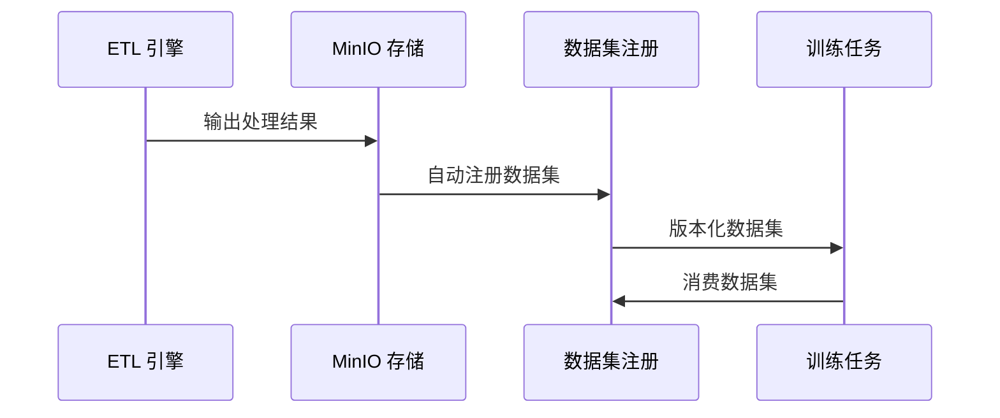
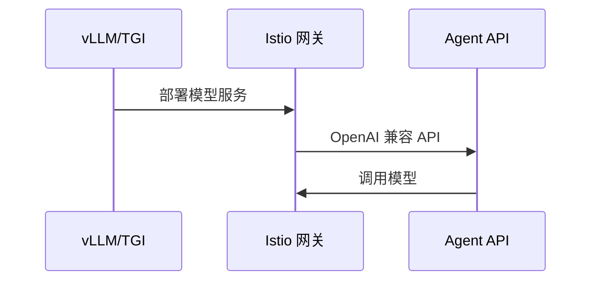
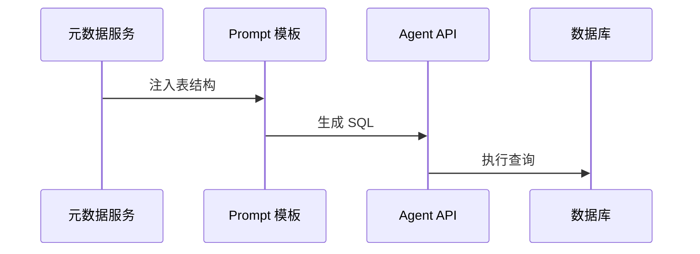

# ONE-DATA-STUDIO 技术栈梳理

## 概述

ONE-DATA-STUDIO 是一个**企业级 DataOps + MLOps + LLMOps 融合平台**，采用微服务架构，支持 Docker 和 Kubernetes 部署。

**代码规模：**
- Python 后端：274 文件，约 142,887 行
- TypeScript 前端：216 文件，约 120,334 行
- 测试代码：143+ 文件，约 32,500+ 行

---

## 一、后端技术栈

### 1.1 Web 框架

| 框架 | 版本 | 使用服务 | 说明 |
|------|------|----------|------|
| **Flask** | 3.0.0 | Data API, Agent API, Model API, Admin API, OpenAI Proxy, Shared | 主要 Web 框架 |
| **FastAPI** | 0.109.0 | OCR Service, Behavior Service | 高性能异步 API |
| **Werkzeug** | 3.0.1 | Flask 服务 | WSGI 工具包 |
| **Uvicorn** | 0.27.0 | FastAPI 服务 | ASGI 服务器 |

### 1.2 数据库与 ORM

| 技术 | 版本 | 用途 |
|------|------|------|
| **SQLAlchemy** | 2.0.23 | ORM 框架（所有服务） |
| **PyMySQL** | 1.1.0 | MySQL 驱动 |
| **Alembic** | 1.13.0 | 数据库迁移工具 |
| **MySQL** | 8.0 | 主数据库 |

### 1.3 AI/LLM 集成

| 技术 | 版本 | 用途 |
|------|------|------|
| **openai** | 1.12.0 | OpenAI API 客户端 |
| **tiktoken** | 0.6.0 | Token 计数 |
| **langchain** | 0.1.14 | LLM 应用框架 |
| **pymilvus** | 2.3.7 | 向量数据库客户端 |
| **transformers** | 4.37.2 | Hugging Face 模型 |
| **huggingface-hub** | 0.20.3 | 模型下载 |

### 1.4 文档处理

| 技术 | 版本 | 用途 |
|------|------|------|
| **PaddleOCR** | 2.7.0.3 | OCR 引擎（中文支持） |
| **pytesseract** | 0.3.10 | 备用 OCR |
| **pymupdf** | 1.23.8 | PDF 处理 |
| **pdf2image** | 1.16.3 | PDF 转图片 |
| **pdfplumber** | 0.10.3 | PDF 解析 |
| **PyPDF2** | 3.0.1 | PDF 处理 |
| **python-docx** | 1.1.0 | Word 处理 |
| **openpyxl** | 3.1.2 | Excel 处理 |
| **camelot-py** | 0.11.0 | 表格提取 |
| **tabula-py** | 2.9.0 | PDF 表格提取 |

### 1.5 缓存与消息队列

| 技术 | 版本 | 用途 |
|------|------|------|
| **redis** | 5.0.1 | 缓存、会话 |
| **kafka-python** | 2.0.2 | Kafka 客户端 |
| **confluent-kafka** | 2.3.0 | Kafka 高级客户端 |

### 1.6 HTTP 客户端

| 技术 | 版本 | 用途 |
|------|------|------|
| **requests** | 2.31.0 | 同步 HTTP |
| **httpx** | 0.25.2 | 异步 HTTP |
| **aiohttp** | 3.9.5 | 异步 HTTP |

### 1.7 任务调度

| 技术 | 版本 | 用途 |
|------|------|------|
| **APScheduler** | 3.10.4 | 定时任务 |
| **Celery** | 5.3.4 | 分布式任务队列 |

### 1.8 监控与追踪

| 技术 | 版本 | 用途 |
|------|------|------|
| **prometheus-client** | 0.19.0 | 指标收集 |
| **prometheus-flask-exporter** | 0.23.1 | Flask 集成 |
| **opentelemetry** | 1.22.0 | 分布式追踪 |

### 1.9 认证与安全

| 技术 | 版本 | 用途 |
|------|------|------|
| **PyJWT** | 2.8.0 | JWT 处理 |
| **bcrypt** | 4.0.0 | 密码加密 |
| **cryptography** | 41.0.7 | 加密库 |

### 1.10 数据处理

| 技术 | 版本 | 用途 |
|------|------|------|
| **pandas** | 2.1.4 | 数据分析 |
| **numpy** | 1.26.2 | 数值计算 |
| **scikit-learn** | 1.3.2 | 机器学习 |

---

## 二、前端技术栈

### 2.1 核心框架

| 技术 | 版本 | 说明 |
|------|------|------|
| **React** | 18.3.1 | UI 框架 |
| **TypeScript** | 5.4.0 | 类型系统 |
| **Vite** | 5.1.0 | 构建工具 |

### 2.2 状态管理

| 技术 | 版本 | 用途 |
|------|------|------|
| **Zustand** | 4.5.0 | 轻量级状态管理 |
| **@tanstack/react-query** | 5.24.0 | 服务端状态 |
| **React Context** | - | 全局状态 |

### 2.3 UI 组件

| 技术 | 版本 | 说明 |
|------|------|------|
| **Ant Design** | 5.14.0 | 主要 UI 库 |
| **@ant-design/icons** | 5.3.0 | 图标库 |

### 2.4 路由与 HTTP

| 技术 | 版本 | 用途 |
|------|------|------|
| **React Router DOM** | 6.22.0 | 客户端路由 |
| **Axios** | 1.6.7 | HTTP 客户端 |

### 2.5 可视化

| 技术 | 版本 | 用途 |
|------|------|------|
| **ReactFlow** | 11.10.0 | 工作流可视化 |
| **Cytoscape** | 3.33.1 | 图谱可视化 |

### 2.6 代码编辑器

| 技术 | 版本 | 用途 |
|------|------|------|
| **@uiw/react-codemirror** | 4.21.0 | 代码编辑器 |
| **@codemirror/lang-sql** | 6.6.0 | SQL 语法支持 |

### 2.7 国际化

| 技术 | 版本 | 说明 |
|------|------|------|
| **i18next** | 25.8.0 | i18n 框架 |
| **react-i18next** | 16.5.3 | React 集成 |

### 2.8 测试

| 技术 | 版本 | 用途 |
|------|------|------|
| **Vitest** | 1.3.1 | 单元测试 |
| **@testing-library/react** | 14.2.1 | React 测试 |
| **jsdom** | 24.0.0 | DOM 环境 |

---

## 三、基础设施技术栈

### 3.1 容器与编排

| 技术 | 说明 |
|------|------|
| **Docker** | 容器化 |
| **Docker Compose** | 本地开发 |
| **Kubernetes** | 生产编排 |
| **Kind** | 本地 K8s |
| **Helm** | 包管理 |

### 3.2 服务网格

| 技术 | 说明 |
|------|------|
| **Istio** | 服务网格（生产） |
| **Nginx** | 反向代理（开发） |

### 3.3 存储服务

| 技术 | 版本 | 用途 |
|------|------|------|
| **MinIO** | latest | 对象存储（S3 兼容） |
| **MySQL** | 8.0 | 关系数据库 |
| **Redis** | 7-alpine | 缓存 |
| **Milvus** | 2.3.0 | 向量数据库 |
| **Elasticsearch** | 8.10.2 | 全文搜索 |
| **PostgreSQL** | - | 辅助数据库 |

### 3.4 消息中间件

| 技术 | 版本 | 用途 |
|------|------|------|
| **Pulsar** | - | 消息队列 |
| **Zookeeper** | 3.5.5 | 协调服务 |

### 3.5 监控与日志

| 技术 | 用途 |
|------|------|
| **Prometheus** | 指标收集 |
| **Grafana** | 可视化 |
| **Loki** | 日志聚合 |
| **Jaeger** | 链路追踪 |

### 3.6 AI/ML 平台

| 技术 | 用途 |
|------|------|
| **vLLM** | LLM 推理引擎 |
| **Ollama** | 本地模型运行 |
| **JupyterHub** | 交互式开发 |

### 3.7 数据处理

| 技术 | 版本 | 用途 |
|------|------|------|
| **Pentaho Kettle** | 0.9.0.27 | ETL 引擎 |
| **Apache Hop** | 2.8.0 | ETL 替代 |
| **Apache SeaTunnel** | 2.3.3 | 数据集成 |

### 3.8 工作流调度

| 技术 | 用途 |
|------|------|
| **Apache DolphinScheduler** | 3.2.0 | DAG 工作流 |

### 3.9 元数据与治理

| 技术 | 版本 | 用途 |
|------|------|------|
| **OpenMetadata** | 1.3.1 | 元数据管理 |
| **Great Expectations** | 0.18.8 | 数据质量 |
| **Label Studio** | - | 数据标注 |

### 3.10 BI 与可视化

| 技术 | 用途 |
|------|------|
| **Apache Superset** | BI 平台 |

### 3.11 安全认证

| 技术 | 版本 | 用途 |
|------|------|------|
| **Keycloak** | 23.0 | SSO/OAuth2 |

---

## 四、后端服务架构



### 服务职责

| 服务 | 端口 | 技术栈 | 主要功能 |
|------|------|--------|----------|
| Data API | 8001 | Flask | 数据集成、ETL、治理 |
| Agent API | 8000 | Flask | RAG、Agent 编排 |
| Model API | 8002 | Flask | 模型训练、部署 |
| Admin API | 8003 | Flask | 用户管理 |
| OpenAI Proxy | - | Flask | API 代理 |
| OCR Service | - | FastAPI | 文档识别 |
| Behavior Service | - | FastAPI | 行为分析 |

---

## 五、前端架构

### 5.1 目录结构

```
src/
├── components/          # 可复用组件
│   ├── layout/         # 布局组件
│   ├── workflow/       # 工作流组件
│   ├── data/           # 数据管理组件
│   ├── metadata/       # 元数据组件
│   ├── BI/             # BI 组件
│   ├── scheduler/      # 调度组件
│   ├── common/         # 通用组件
│   └── portal/         # 门户组件
├── pages/              # 页面组件
│   ├── admin/          # 管理页面
│   ├── data/           # 数据模块
│   ├── model/          # 模型模块
│   ├── agent-platform/ # Agent 平台
│   ├── workflows/      # 工作流
│   └── metadata/       # 元数据
├── services/           # API 服务
├── contexts/          # React Context
├── store/              # Zustand store
├── i18n/              # 国际化
└── types/             # TypeScript 类型
```

### 5.2 主要模块

1. **Data 模块** - 数据治理与开发
2. **Model 模块** - MLOps 模型管理
3. **Agent 模块** - LLM 应用开发
4. **Admin 模块** - 用户管理
5. **Workflow 模块** - 工作流编排
6. **Metadata 模块** - 元数据管理

---

## 六、部署架构

### 6.1 四层架构



### 6.2 部署方式

| 环境 | 方式 |
|------|------|
| 开发环境 | Docker Compose |
| 生产环境 | Kubernetes + Helm |

### 6.3 网络配置

- 独立 Docker 网络
- Istio 服务网格
- Ingress 统一入口

---

## 七、关键集成点

### 7.1 Data → Model



- 统一存储协议
- 数据集版本化
- MinIO/HDFS 存储

### 7.2 Model → Agent



- OpenAI 兼容 API
- vLLM/TGI 部署
- Istio 网关暴露

### 7.3 Data → Agent



- 元数据注入
- Text-to-SQL
- 表结构关系

---

## 八、开发规范

| 项目 | 规范 |
|------|------|
| 文档语言 | 中文 |
| 代码语言 | 英文 |
| 日志方式 | Python: logging / TS: console.error |
| 测试覆盖 | 80%+ |
| 图表格式 | Mermaid |
| 文档位置 | `docs/` 目录 |

---

## 九、Docker Compose 配置文件

### 配置文件路径
- 主配置：`deploy/local/docker-compose.yml` (1018 行)
- 环境配置：`deploy/local/.env`

### 可用 Profile

| Profile | 包含服务 |
|---------|----------|
| default | 核心服务（API + 数据库） |
| ai | vLLM, Ollama |
| security | ShardingSphere |
| etl | Apache Hop |

---

## 十、测试框架

### 10.1 测试类型

| 类型 | 框架 | 覆盖率要求 |
|------|------|-----------|
| 单元测试 | pytest / Vitest | 80%+ |
| 集成测试 | pytest | 70%+ |
| E2E 测试 | Playwright | 核心流程 |
| 性能测试 | pytest-benchmark | - |

### 10.2 测试标记

```python
# 角色标记
@pytest.mark.data_administrator
@pytest.mark.data_engineer
@pytest.mark.data_scientist
@pytest.mark.data_analyst

# 优先级标记
@pytest.mark.p0  # 核心功能
@pytest.mark.p1  # 重要功能
@pytest.mark.p2  # 一般功能

# 依赖标记
@pytest.mark.requires_db
@pytest.mark.requires_redis
@pytest.mark.requires_milvus
```

---

## 总结

ONE-DATA-STUDIO 是一个**云原生、AI 原生**的企业级数据平台，技术栈特点：

1. **微服务架构** - 8 个独立服务，职责清晰
2. **容器化部署** - Docker + Kubernetes 全覆盖
3. **AI 生态完善** - OpenAI、LangChain、Hugging Face 集成
4. **数据全链路** - ETL、治理、训练、部署一站式
5. **可观测性强** - Prometheus、Grafana、Jaeger 完整监控
6. **国际化支持** - 中英文双语
7. **测试驱动** - 80%+ 测试覆盖率要求

---

**文档创建时间**: 2026-02-06
**文档维护**: 如有技术栈变更，请及时更新此文档
**文档状态**: 已完成
