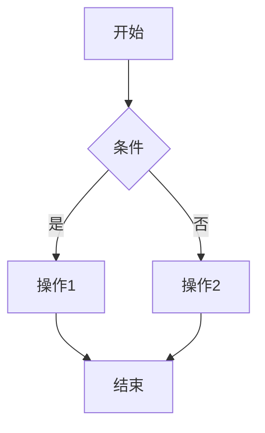
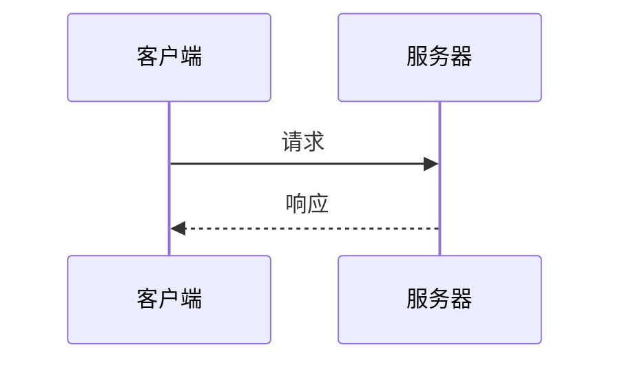
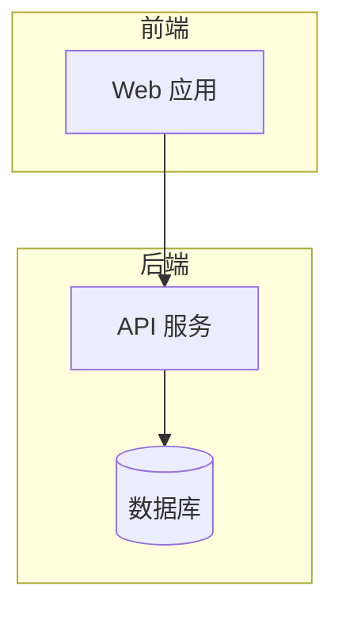

# 文档结构规范

> 本文档定义项目中各类文档的内容结构规范。

---

## 一、通用结构

每个文档应包含以下基本结构：

```markdown
# 文档标题

> 简要描述或元信息（如更新日期）

---

## 一、章节一

### 1.1 小节一

内容...

### 1.2 小节二

内容...

---

## 二、章节二

...

---

> 更新时间：YYYY-MM-DD
```

---

## 二、进度文档结构

**位置**：`/docs/progress/`

```markdown
# {功能名称} 实现进度

> 开始日期：YYYY-MM-DD
> 最后更新：YYYY-MM-DD
> 状态：进行中 / 待验收 / 已暂停

---

## 一、任务概述

简要描述本次修改的目标和范围。

---

## 二、进度记录

### YYYY-MM-DD HH:MM

- 完成：xxx
- 进行中：xxx
- 阻塞：xxx（原因）

### YYYY-MM-DD HH:MM

...

---

## 三、修改文件清单

| 文件路径 | 操作 | 说明 |
|----------|------|------|
| `path/to/file.py` | 修改 | 简要说明 |

---

## 四、待办事项

- [ ] 任务 1
- [ ] 任务 2
- [x] 已完成任务

---

## 五、问题与风险

| 问题 | 影响 | 状态 |
|------|------|------|
| 问题描述 | 影响范围 | 解决中/待解决 |

---

> 更新时间：YYYY-MM-DD
```

---

## 三、完成报告结构

**位置**：`/docs/reports/completed/`

```markdown
# {功能名称} 完成报告

> 完成日期：YYYY-MM-DD
> 版本：v1.x.x

---

## 一、修改概述

简要描述本次修改的内容和目标。

---

## 二、修改详情

### 2.1 修改文件清单

| 文件路径 | 操作 | 说明 |
|----------|------|------|
| `path/to/file.py` | 修改 | 简要说明 |

### 2.2 关键代码变更

描述关键的代码变更...

---

## 三、测试验证

### 3.1 测试结果

| 测试类型 | 通过/失败 | 说明 |
|----------|-----------|------|
| 单元测试 | ✅ 通过 | 全部通过 |
| 集成测试 | ✅ 通过 | 全部通过 |

### 3.2 验证步骤

1. 步骤 1
2. 步骤 2

---

## 四、影响范围

描述本次修改的影响范围...

---

## 五、后续计划

如有后续工作，在此说明。

---

> 更新时间：YYYY-MM-DD
```

---

## 四、项目状态报告结构

**位置**：`/docs/reports/`

```markdown
# ONE-DATA-STUDIO 项目进展报告

> 日期：YYYY-MM-DD
> 版本：v1.x.x

---

## 一、项目概况

| 指标 | 数值 |
|------|------|
| 版本 | v1.x.x |
| 整体完成度 | xx% |
| 代码行数 | xxx,xxx |

---

## 二、模块完成度

| 模块 | 完成度 | 状态 |
|------|--------|------|
| 模块 1 | xx% | ✅/🟡/⚪ |

---

## 三、测试覆盖

| 测试类型 | 文件数 | 通过率 |
|----------|--------|--------|
| 单元测试 | xx | xx% |

---

## 四、技术债务

| 类别 | 数量 |
|------|------|
| P0 | x |
| P1 | x |
| P2 | x |

---

## 五、本次更新

- 更新项 1
- 更新项 2

---

> 更新时间：YYYY-MM-DD
```

---

## 五、Mermaid 图表规范

### 5.1 流程图

```markdown


### 5.2 时序图

```markdown


### 5.3 架构图

```markdown


---

## 六、表格规范

### 6.1 基本表格

```markdown
| 列1 | 列2 | 列3 |
|-----|-----|-----|
| 值1 | 值2 | 值3 |
```

### 6.2 状态标记

- ✅ 已完成
- 🟡 进行中
- ⚪ 未开始
- ❌ 已取消

---

> 更新时间：2026-01-30
