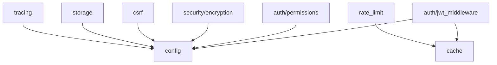

# Shared Module

ONE-DATA-STUDIO 共享模块，提供跨服务的通用功能。

## 模块结构

```
services/shared/
├── auth/                    # 认证授权模块
│   ├── jwt_middleware.py    # JWT 验证中间件
│   ├── permissions.py       # RBAC 权限管理
│   └── token_refresh.py     # Token 刷新逻辑
├── security/                # 安全模块
│   ├── encryption.py        # 加密工具
│   └── tls.py               # TLS 配置
├── models/                  # 数据模型
│   ├── rbac.py              # RBAC 模型定义
│   └── audit.py             # 审计日志模型
├── cache.py                 # 缓存管理（Redis + 内存回退）
├── config.py                # 配置管理
├── cors.py                  # CORS 中间件
├── csrf.py                  # CSRF 防护
├── headers.py               # 安全响应头
├── rate_limit.py            # 速率限制
├── multitenancy.py          # 多租户支持
├── sql_sandbox.py           # SQL 沙箱执行
├── storage.py               # MinIO 对象存储客户端
├── tracing.py               # 分布式追踪（OpenTelemetry）
├── circuit_breaker.py       # 熔断器模式
├── api_versioning.py        # API 版本控制
├── validation.py            # 输入验证
├── celery_app.py            # Celery 应用配置
├── celery_tasks.py          # 异步任务定义
└── audit.py                 # 审计服务
```

## 使用方式

### 认证中间件

```python
from services.shared.auth.jwt_middleware import require_jwt, require_role
from services.shared.auth.permissions import require_permission, Resource, Operation

# JWT 认证
@app.route("/api/v1/protected")
@require_jwt()
def protected_endpoint():
    return {"user": g.user}

# 角色验证
@app.route("/api/v1/admin")
@require_jwt()
@require_role("admin")
def admin_endpoint():
    return {"status": "ok"}

# 权限验证
@app.route("/api/v1/datasets", methods=["POST"])
@require_jwt()
@require_permission(Resource.DATASET, Operation.CREATE)
def create_dataset():
    return {"created": True}
```

### 缓存

```python
from services.shared.cache import get_cache, cached

# 直接使用
cache = get_cache()
cache.set("key", "value", ttl=300)
value = cache.get("key")

# 装饰器方式
@cached(ttl=300, key_prefix="user")
def get_user(user_id):
    return db.query(User).get(user_id)
```

### 安全头

```python
from services.shared.headers import add_security_headers

app = Flask(__name__)
add_security_headers(app)
```

### CORS 配置

```python
from services.shared.cors import configure_cors

app = Flask(__name__)
configure_cors(app)
```

### CSRF 防护

```python
from services.shared.csrf import CSRFProtection

app = Flask(__name__)
csrf = CSRFProtection(app)

# 豁免特定端点
@csrf.exempt
@app.route("/webhook", methods=["POST"])
def webhook():
    return {"received": True}
```

### 速率限制

```python
from services.shared.rate_limit import rate_limit

@app.route("/api/v1/search")
@rate_limit(limit=100, window=60)  # 每分钟 100 次
def search():
    return {"results": []}
```

### SQL 沙箱

```python
from services.shared.sql_sandbox import SQLSandbox

sandbox = SQLSandbox(
    max_rows=1000,
    timeout=30,
    allowed_operations=['SELECT']
)
result = sandbox.execute(connection, "SELECT * FROM users LIMIT 10")
```

### 对象存储

```python
from services.shared.storage import get_minio_client

client = get_minio_client()
client.upload_file("bucket", "key", file_data)
url = client.get_presigned_url("bucket", "key")
```

## 环境变量

### 认证配置

| 变量名 | 描述 | 默认值 |
|--------|------|--------|
| `AUTH_MODE` | 认证模式 (true/false) | `true` |
| `JWT_SECRET_KEY` | JWT 签名密钥 | *必需* |
| `JWT_KEY_ROTATION_PERIOD` | JWT 密钥轮换周期 | `86400` |
| `KEYCLOAK_URL` | Keycloak 服务地址 | `http://keycloak:8080` |
| `KEYCLOAK_REALM` | Keycloak Realm | `one-data` |

### 安全配置

| 变量名 | 描述 | 默认值 |
|--------|------|--------|
| `VERIFY_SSL` | 是否验证 SSL 证书 | `true` (生产环境) |
| `CSRF_SECRET_KEY` | CSRF Token 密钥 | *必需* |
| `CACHE_SIGNING_KEY` | 缓存签名密钥 | *可选* |
| `SECURITY_FORCE_HTTPS` | 强制 HTTPS | `false` |
| `SECURITY_HSTS_ENABLED` | 启用 HSTS | `true` |
| `SECURITY_HSTS_MAX_AGE` | HSTS 最大期限 | `31536000` |

### 缓存配置

| 变量名 | 描述 | 默认值 |
|--------|------|--------|
| `REDIS_URL` | Redis 连接 URL | `redis://localhost:6379/0` |
| `REDIS_HOST` | Redis 主机 | `localhost` |
| `REDIS_PORT` | Redis 端口 | `6379` |
| `REDIS_PASSWORD` | Redis 密码 | *可选* |

### CORS 配置

| 变量名 | 描述 | 默认值 |
|--------|------|--------|
| `CORS_ALLOWED_ORIGINS` | 允许的源列表（逗号分隔） | `*` |
| `CORS_ALLOW_CREDENTIALS` | 允许凭据 | `true` |

### 存储配置

| 变量名 | 描述 | 默认值 |
|--------|------|--------|
| `MINIO_ENDPOINT` | MinIO 端点 | `localhost:9000` |
| `MINIO_ACCESS_KEY` | MinIO 访问密钥 | *必需* |
| `MINIO_SECRET_KEY` | MinIO 密钥 | *必需* |
| `MINIO_SECURE` | 使用 HTTPS | `false` |

### 追踪配置

| 变量名 | 描述 | 默认值 |
|--------|------|--------|
| `OTEL_EXPORTER_OTLP_ENDPOINT` | OpenTelemetry 端点 | `http://jaeger:4317` |
| `OTEL_SERVICE_NAME` | 服务名称 | `one-data-studio` |

## 依赖关系



## 测试

```bash
# 运行共享模块测试
pytest tests/unit/test_cache.py
pytest tests/unit/test_cors.py
pytest tests/unit/test_csrf.py
pytest tests/unit/test_security_headers.py
pytest tests/unit/test_jwt_middleware.py
pytest tests/unit/test_permissions.py
```
