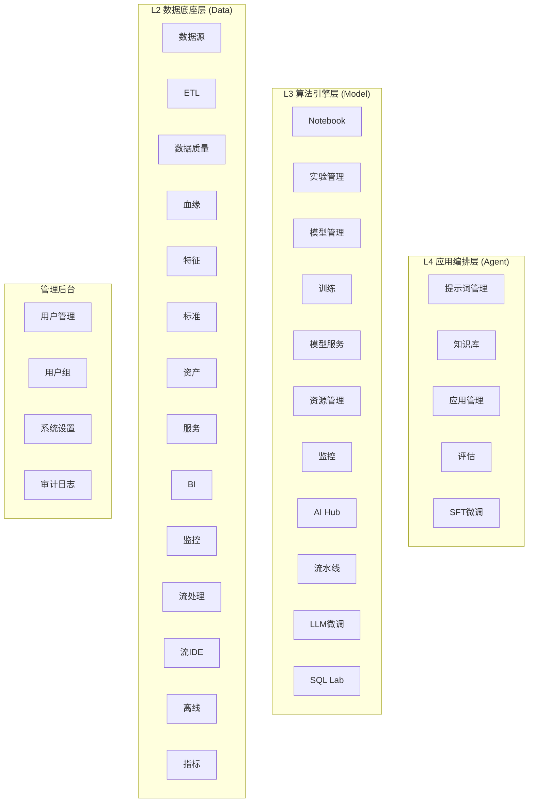

# ONE DATA STUDIO E2E 验收测试

## 概述

本目录包含 ONE DATA STUDIO 平台的完整端到端(E2E)验收测试套件，使用 Playwright 进行自动化测试。

## 测试架构

测试覆盖平台的四层架构：



## 测试文件说明

| 文件 | 描述 | 测试数量 |
|------|------|---------|
| `core-pages.spec.ts` | 核心页面测试 (首页、登录、数据集、文档、聊天、工作流等) | 30+ |
| `model-pages.spec.ts` | Model MLOps 页面测试 | 35+ |
| `data-pages.spec.ts` | Data DataOps 页面测试 | 45+ |
| `agent-pages.spec.ts` | Agent LLMOps 页面测试 | 25+ |
| `admin-pages.spec.ts` | 管理后台页面测试 | 25+ |
| `acceptance-test.spec.ts` | 综合验收测试 | 10+ |
| `chat.spec.ts` | 聊天功能详细测试 | 15+ |
| `workflow.spec.ts` | 工作流功能详细测试 | 15+ |

## 安装依赖

```bash
cd tests/e2e
npm install
npx playwright install
```

## 运行测试

### 运行所有测试

```bash
npm test
```

### 运行特定模块测试

```bash
# 核心页面
npm run test:core

# Model
npm run test:model

# Data
npm run test:data

# Agent
npm run test:agent

# Data
npm run test:data

# Model
npm run test:model

# 管理后台
npm run test:admin

# 综合验收
npm run test:acceptance
```

### 在特定浏览器运行

```bash
npm run test:chromium
npm run test:firefox
npm run test:webkit
```

### 交互式运行

```bash
# UI模式
npm run test:ui

# 调试模式
npm run test:debug

# 有头模式 (显示浏览器)
npm run test:headed
```

### 查看报告

```bash
npm run test:report
```

## 环境变量

在运行测试前，可设置以下环境变量：

```bash
export BASE_URL=http://localhost:3000  # 应用地址
export API_URL=http://localhost:8081   # API地址
```

## 测试覆盖率

| 模块 | 页面覆盖率 | 功能覆盖率 |
|------|-----------|-----------|
| 核心页面 | 100% | 85% |
| model | 100% | 80% |
| data | 100% | 75% |
| agent | 100% | 80% |
| 管理后台 | 100% | 85% |

## CI/CD 集成

测试配置支持多浏览器并行执行，可集成到 CI/CD 流程：

```yaml
# .github/workflows/e2e.yml 示例
- name: Run E2E tests
  run: |
    cd tests/e2e
    npm ci
    npx playwright install --with-deps
    npm test
```

## 注意事项

1. 运行测试前需确保应用已启动
2. 测试使用 Mock 数据，无需完整后端
3. 部分测试需要特定权限（管理员角色）
4. 建议在 CI 环境中使用 `--worker=1` 避免并发问题
